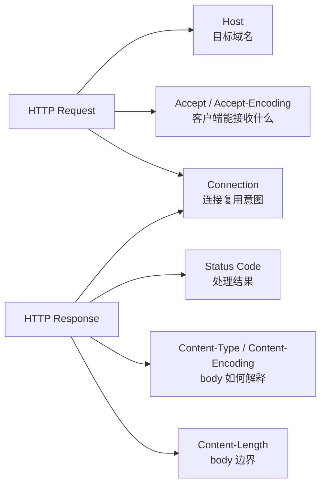
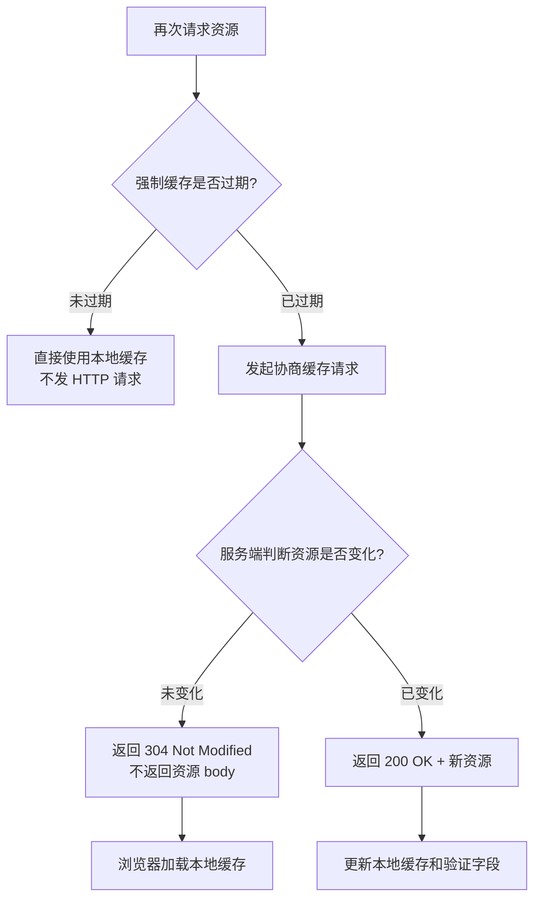
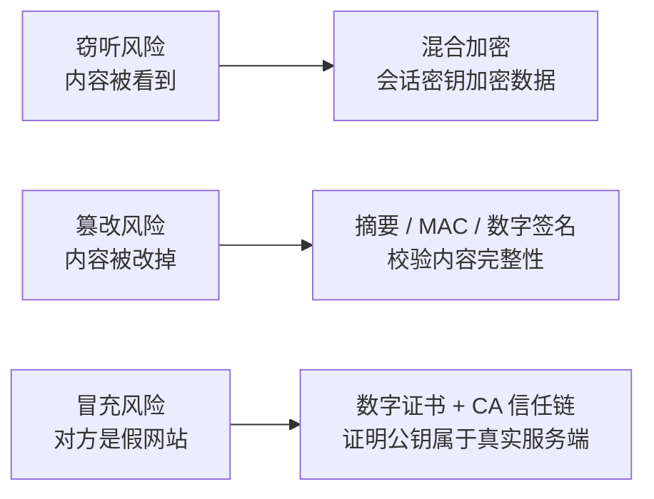
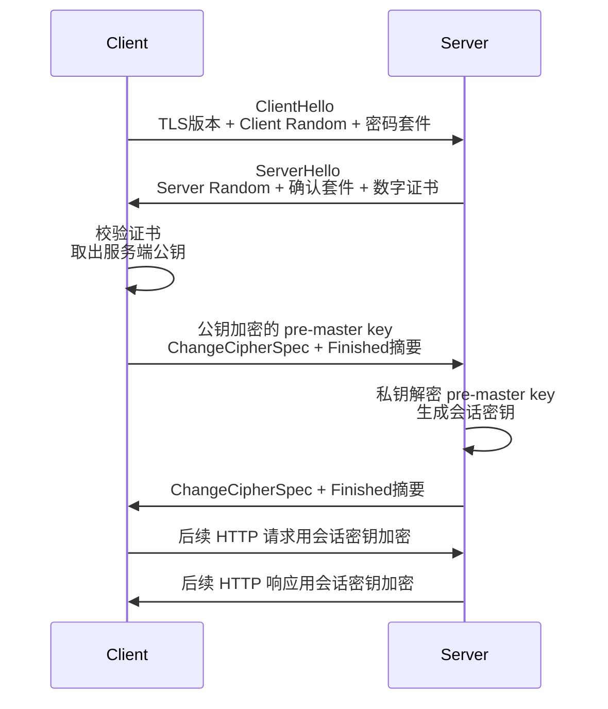
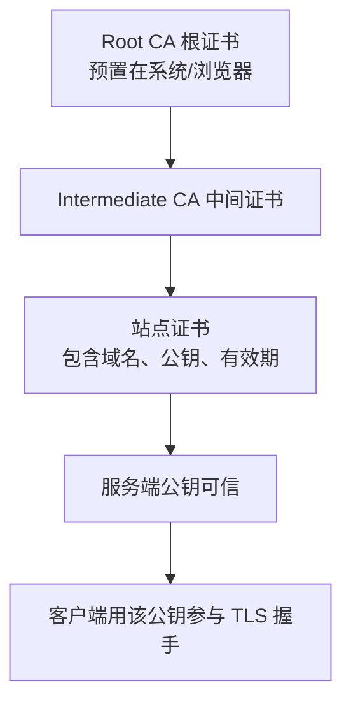
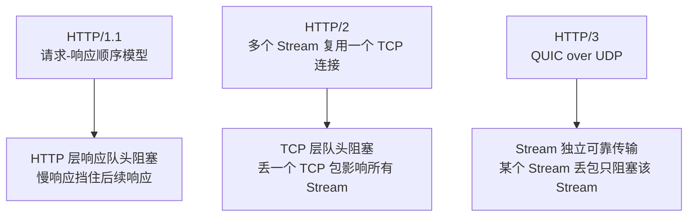
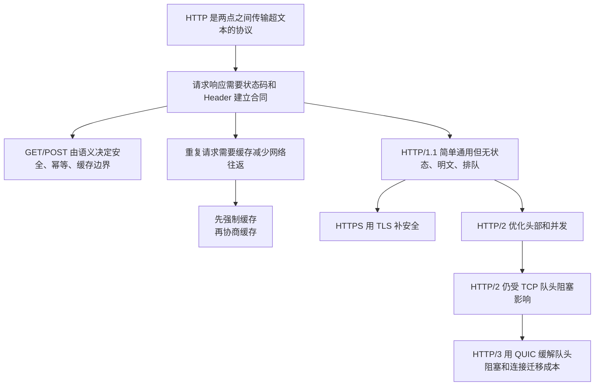
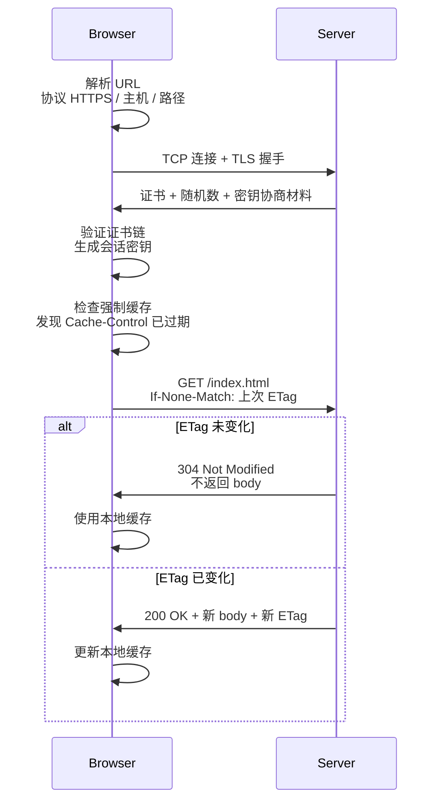
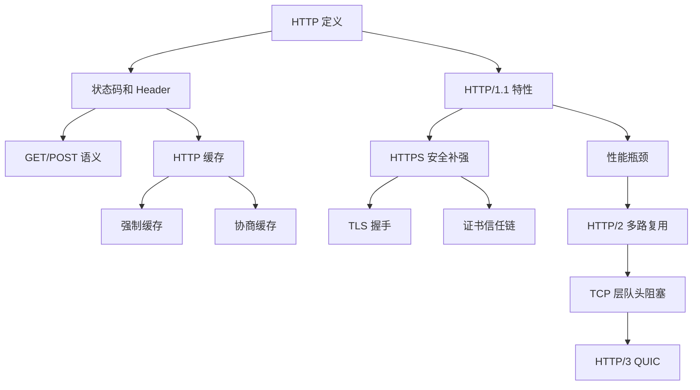

# HTTP 常见面试题

### 1. Topic Overview

- **What this is about**: 这章按原文顺序覆盖 HTTP 面试高频问题：HTTP 基本概念 -> GET 与 POST -> HTTP 缓存 -> HTTP/1.1 特性 -> HTTP 与 HTTPS -> HTTP/1.1、HTTP/2、HTTP/3 演变 -> 读者问答中的 TLS/SSL 边界。
- **Why it matters**: HTTP 面试题容易变成背清单。真正要掌握的是每个机制解决什么问题、在哪一层解决、还有什么边界没解决。
- **Difficulty level**: 中等偏高。基本概念不难，难点集中在缓存优先级、GET/POST 语义边界、HTTPS 三类安全机制、TLS 握手、HTTP/2 与 HTTP/3 的队头阻塞层次。
- **Prerequisites**: TCP/IP 四层模型、TCP 字节流和连接复用、基础加密概念（对称加密、非对称加密、哈希）、浏览器缓存的基本直觉。
- **Visual-needs scan**: 本章中“缓存决策流程”“HTTPS 三目标到三机制”“TLS 握手时序”“证书信任链”“HTTP 演进中的队头阻塞层次”比纯文字更适合用图压缩，已在对应概念处加入 Mermaid 视觉模型。

### 2. Core Concepts

> 这章的 Core Concepts 按原文推进，但每个小节都写成可复用 schema，而不是松散事实列表。

#### 2.1 Schema: 用“协议 + 传输 + 超文本”定义 HTTP

- **Definition**: HTTP 是一个在计算机世界里，专门在两点之间传输文字、图片、音频、视频等超文本数据的约定和规范。
- **Intuition**:
  - **协议**: 至少两个参与者之间的行为约定和错误处理规范。
  - **传输**: 数据可以从 A 到 B，也可以从 B 到 A；中间还允许有代理、网关、缓存等中转者。
  - **超文本**: 不只是普通文字，还包括 HTML、图片、视频、压缩包、链接组织起来的混合资源。
- **Example**: 浏览器请求网页是 HTTP；服务端之间调用接口也可以用 HTTP。所以“HTTP 是从互联网服务器传输超文本到本地浏览器的协议”不准确，原文强调应使用“两点之间”的描述。
- **Common mistakes**: 只背“超文本传输协议”；把 HTTP 理解成单向下载；把超文本只理解成 HTML；忽略中间人也必须遵守 HTTP 协议。

#### 2.2 Schema: 用状态码和字段读懂“请求-响应合同”

- **Definition**: 状态码说明服务器对请求的处理结果；Header 字段说明这次报文要发给谁、怎么解释 body、如何判断报文边界、能否复用连接、能否压缩。
- **Intuition**: 状态码像窗口业务办理结果，Header 像表单上的说明栏。HTTP 报文是文本格式，但它必须靠明确边界让接收方知道“头到哪里结束，body 到哪里结束”。
- **Example**:
  - `1xx`: 提示信息，例如 `101 Switching Protocols` 表示协议切换。
  - `2xx`: 成功，例如 `200 OK`、`204 No Content`、`206 Partial Content`。
  - `3xx`: 重定向或缓存相关，例如 `301`、`302`、`304 Not Modified`。其中 `304` 不表示跳转，而是告诉客户端资源没改，可以继续用缓存。
  - `4xx`: 客户端侧问题，例如 `400`、`403`、`404`。
  - `5xx`: 服务端侧问题，例如 `500`、`501`、`502`、`503`。
  - `Host`: 指定域名，让同一台服务器可以承载多个网站。
  - `Content-Length`: 标明 body 长度，配合 header 后的空行，解决 HTTP 在 TCP 字节流上的报文边界问题。
  - `Connection`: 常用于 HTTP 长连接复用；HTTP/1.1 默认长连接。
  - `Content-Type` / `Accept`: 返回格式与可接受格式。
  - `Content-Encoding` / `Accept-Encoding`: 返回压缩方式与可接受压缩方式。

#### Visual Model: HTTP 报文靠哪些字段建立“解释合同”？

- **How to read**: 先看请求和响应分别携带什么约定，再看这些约定解决的是“目标、结果、格式、边界、连接复用”五类问题。
- **Source anchor**: `materials/network/2_http/http_interview.md`，`HTTP 常见的状态码有哪些？` 与 `HTTP 常见字段有哪些？`
- **Boundary**: 这张图只压缩本章列出的常见字段，不覆盖所有 HTTP Header。

- **Common mistakes**: 把 `304` 当普通跳转；以为 `Content-Length` 是 TCP 分包大小；混淆 HTTP Keep-Alive 和 TCP Keepalive；只背字段名，不知道字段解决什么具体问题。

#### 2.3 Schema: GET/POST 先看 RFC 语义，再看现实实现

- **Definition**: 按 RFC 语义，GET 是获取指定资源；POST 是根据请求负荷（body）对指定资源做处理。
- **Intuition**: GET 像“取资料”，POST 像“提交材料让服务器处理”。二者常见数据位置不同，但本质边界是语义，不是 URL/body 外形。
- **Example**:
  - GET 参数通常放 URL，浏览器会限制 URL 长度，HTTP 协议本身不规定 URL 长度；URL 只适合表达 ASCII。
  - POST 数据通常放 body，body 可以是任意格式，只要客户端和服务端约定好。
  - 按规范语义，GET 是安全、幂等、可缓存、可保存为书签；POST 通常会修改资源，不安全、不幂等，一般不可缓存。
  - 现实开发可能用 GET 删除数据，也可能用 POST 查询数据；这时实际安全性和幂等性取决于实现，而不是方法名本身。
- **Common mistakes**: 说“POST 比 GET 安全”。原文明确指出 HTTP 明文下 POST body 抓包也能看到；传输安全要靠 HTTPS，而不是靠参数放在 body 里。另一个常见错误是说 GET 一定不能带 body；RFC 没有禁止，只是 GET 语义通常不需要 body。

#### 2.4 Schema: HTTP 缓存是“先强制缓存，后协商缓存”

- **Definition**: HTTP 缓存有强制缓存和协商缓存。强制缓存由浏览器根据本地缓存有效期判断；强制缓存过期后，才发请求让服务端协商资源是否变化。
- **Intuition**: 强制缓存像“保质期内直接用”；协商缓存像“过期后问服务端还能不能继续用”。
- **Example**:
  - 强制缓存字段：`Cache-Control` 是相对时间，`Expires` 是绝对时间；二者同时存在时，`Cache-Control` 优先级更高。
  - 协商缓存字段组一：`Last-Modified` + `If-Modified-Since`，基于最后修改时间。
  - 协商缓存字段组二：`ETag` + `If-None-Match`，基于资源唯一标识。
  - `ETag` 优先级更高，因为它能避免“时间变了但内容没变”“1 秒内多次修改”“服务器无法精确获取修改时间”等问题。

#### Visual Model: 浏览器第二次请求时如何决定用不用缓存？

- **How to read**: 先走浏览器本地判断；只有强制缓存过期，才进入服务端协商。
- **Source anchor**: `materials/network/2_http/http_interview.md`，`HTTP 缓存技术`
- **Boundary**: 图里用 `ETag`/`304` 代表协商缓存主线；`Last-Modified` 是另一条同类验证路径。

- **Common mistakes**: 以为协商缓存可以脱离强制缓存字段单独工作；以为 `304` 会返回完整 body；分不清 `Cache-Control`、`ETag`、`If-None-Match` 分别属于哪一步。

#### 2.5 Schema: HTTP/1.1 是简单可扩展，但被无状态、明文和请求-响应排队限制

- **Definition**: HTTP/1.1 的优点是简单、灵活易扩展、应用广泛跨平台；缺点是无状态、明文传输、不安全，以及请求-响应模型带来的性能瓶颈。
- **Intuition**: HTTP/1.1 像一套普及度极高的通用表格：字段简单、容易扩展，但它自己不记身份、不加密，而且按请求-响应排队会慢。
- **Example**:
  - 无状态的好处：服务器不用记录每个客户端状态，负载轻。
  - 无状态的坏处：登录、购物车、下单、支付等关联操作必须识别同一用户；Cookie 用“客户端携带小贴纸”的方式补状态。
  - 明文的好处：抓包调试方便；坏处：窃听、篡改、冒充风险。
  - 长连接减少 HTTP/1.0 每次请求都新建 TCP 连接的开销。
  - 管道化允许同一 TCP 连接连续发多个请求，但服务端必须按请求顺序响应，所以只缓解请求侧等待，没有解决响应侧队头阻塞；原文还强调浏览器基本不启用管道化。
- **Common mistakes**: 只说“HTTP 无状态”但说不出 Cookie 为什么出现；以为长连接等于没有队头阻塞；忽略管道化不是默认主流实践。

#### 2.6 Schema: HTTPS 用“三个安全目标”对应“三类机制”

- **Definition**: HTTPS 在 HTTP 和 TCP 之间加入 SSL/TLS，用机密性、完整性、身份认证分别解决 HTTP 的窃听、篡改、冒充风险。
- **Intuition**: 安全通信至少要回答三件事：别人看不懂，别人改不了，对方确实是它声称的那个人。
- **Example**:
  - 窃听风险 -> 混合加密。握手阶段用非对称加密交换会话密钥，通信阶段用对称加密传输数据。
  - 篡改风险 -> 摘要算法、MAC、数字签名等完整性机制。
  - 冒充风险 -> 数字证书和 CA 信任链，把服务端公钥和真实身份绑定起来。

#### Visual Model: HTTPS 的三类风险分别由什么机制解决？

- **How to read**: 从左侧三类 HTTP 明文风险读到右侧三类 TLS 补强机制。
- **Source anchor**: `materials/network/2_http/http_interview.md`，`HTTPS 解决了 HTTP 的哪些问题？`
- **Boundary**: 摘要算法本身只能证明内容是否变化，不能证明消息来自谁；来源证明还需要数字签名和证书。

- **Common mistakes**: 说 HTTPS 只是“多了对称加密”；把哈希、数字签名、数字证书混成一个概念；不知道为什么只哈希还不能防中间人替换。

#### 2.7 Schema: TLS 握手是在“验证公钥 + 协商会话密钥”

- **Definition**: TLS 握手主要做三件事：客户端索要并验证服务端公钥，双方协商生成会话密钥，后续用会话密钥加密 HTTP 数据。
- **Intuition**: 真正传大量数据前，双方先确认“你是谁”以及“之后用哪把临时钥匙说话”。
- **Example**:
  1. `ClientHello`: 客户端发送支持的 TLS 版本、`Client Random`、密码套件列表。
  2. `ServerHello`: 服务端确认版本和密码套件，发送 `Server Random` 和数字证书。
  3. 客户端校验证书，从证书取服务端公钥，生成 `pre-master key`，用服务端公钥加密后发送，同时发送加密通信算法改变通知和握手结束摘要。
  4. 服务端用私钥解出 `pre-master key`，双方用 `Client Random + Server Random + pre-master key` 生成会话密钥，服务端也发送算法改变通知和握手结束摘要。

#### Visual Model: 基于 RSA 的 TLS 握手交换了什么？

- **How to read**: 重点看三个随机数在哪里出现，以及什么时候从非对称加密切换到会话密钥加密。
- **Source anchor**: `materials/network/2_http/http_interview.md`，`HTTPS 是如何建立连接的？其间交互了什么？`
- **Boundary**: 这是原文用于讲解的 RSA 握手主线；原文同时指出现代网站更多使用 ECDHE，因为 RSA 握手不具备前向安全。

- **Common mistakes**: 以为 HTTPS 全程都用非对称加密；忘记三个随机数共同生成会话密钥；把 TCP 三次握手和 TLS 握手混为一谈；不知道 TLS 1.2 和 TLS 1.3 往返次数不同。

#### 2.8 Schema: 证书信任链解决“公钥到底是谁的”

- **Definition**: 数字证书把服务端身份、公钥、用途、有效期等信息打包，由 CA 签名；客户端通过本地预置的根证书和中间证书链验证该证书是否可信。
- **Intuition**: 数字签名能证明“签名者持有某个私钥”，但如果公钥本身是假的，验证也会被骗。证书和 CA 信任链就是用权威机构证明“这个公钥确实属于这个服务端”。
- **Example**:
  - CA 对证书内容做 Hash，再用 CA 私钥加密 Hash，形成 Certificate Signature。
  - 客户端用同样 Hash 算法得到 H1，再用 CA 公钥解开签名得到 H2；H1 与 H2 相同，则证书内容未被篡改且签名可信。
  - 现实证书通常不是根 CA 直接签发，而是由中间 CA 签发。客户端先信任根证书，再逐级验证中间证书和站点证书。

#### Visual Model: 客户端为什么能信任网站证书？

- **How to read**: 客户端不是凭空相信站点证书，而是从已信任的根证书逐层验证到站点证书。
- **Source anchor**: `materials/network/2_http/http_interview.md`，`客户端校验数字证书的流程是怎样的？`
- **Boundary**: 图省略了具体 Hash 和签名比对细节，重点压缩“根证书 -> 中间证书 -> 站点证书”的信任传递关系。

- **Common mistakes**: 把数字签名和数字证书当成同一个东西；不知道为什么需要中间 CA；不知道根证书失守会影响整条信任链。

#### 2.9 Schema: HTTPS 的可靠性边界在“客户端是否正确验证证书”

- **Definition**: HTTPS 协议本身能防普通中间人攻击，但前提是客户端拒绝非法证书。如果用户手动接受伪造证书，或者系统被植入恶意根证书，中间人就可能解密代理流量。
- **Intuition**: HTTPS 像查验身份证。协议会提示“这张证件不对”，但如果你仍然放行，或者信任名单被恶意篡改，系统就会被骗。
- **Example**:
  - 假基站把客户端转发到中间人服务器，中间人和客户端、中间人和真实服务端分别建立两条 TLS 连接。
  - 浏览器通常能识别中间人的伪造证书并报警；如果用户继续访问，就等于接受了伪造证书。
  - 抓包工具能看 HTTPS，通常是因为用户把抓包工具生成的根证书导入了系统信任列表，抓包工具再给目标域名签发本地证书。
  - 双向认证要求服务端也验证客户端身份，可以减少这类代理风险。
- **Common mistakes**: 说“HTTPS 一定不会被抓包”；或反过来说“抓包工具能看 HTTPS，所以 HTTPS 本身不安全”。更准确的边界是：抓包依赖客户端信任了中间人证书或根证书。

#### 2.10 Schema: HTTP 演进围绕“连接成本 + 头部浪费 + 队头阻塞”

- **Definition**: HTTP/1.1、HTTP/2、HTTP/3 的演进，主要是在减少连接成本、压缩重复头部、提升并发传输能力、降低队头阻塞影响。
- **Intuition**: HTTP 版本升级不是换名字，而是在解决上一代协议暴露出来的瓶颈；每一代解决一部分问题，也留下新的边界。
- **Example**:
  - HTTP/1.0: 短连接，每个请求都建立 TCP 连接，开销大。
  - HTTP/1.1: 长连接和管道化减少连接成本，但头部未压缩、重复发送、无优先级、服务器被动响应、响应侧仍队头阻塞。
  - HTTP/2: 基于 HTTPS，使用 HPACK 头部压缩、二进制帧、Stream 多路复用、服务端推送。Frame 是最小单位，Message 对应 HTTP 请求或响应，多个 Stream 复用同一 TCP 连接。
  - HTTP/2 缺陷: TCP 必须按连续字节流交给应用层，丢一个 TCP 包时，一个连接上的所有 Stream 都可能等重传。
  - HTTP/3: 用 QUIC over UDP。QUIC 提供可靠传输、多路复用、独立 Stream、1 RTT 建连、会话恢复 0 RTT、基于连接 ID 的连接迁移。

#### Visual Model: HTTP/1.1、HTTP/2、HTTP/3 的队头阻塞分别在哪里？

- **How to read**: 不要只问“有没有队头阻塞”，要问“阻塞发生在哪一层，影响范围是什么”。
- **Source anchor**: `materials/network/2_http/http_interview.md`，`HTTP/1.1、HTTP/2、HTTP/3 演变`
- **Boundary**: 图强调队头阻塞主线；HTTP/2 的头部压缩、二进制帧、服务端推送，以及 HTTP/3 的连接迁移和 0-RTT 需要结合正文理解。

- **Common mistakes**: 说 HTTP/2 已经完全没有队头阻塞；说 HTTP/3 只是“把 TCP 换成 UDP”；忽略 QUIC 在 UDP 上补了可靠传输、TLS、多路复用和连接迁移。

### 3. Deep Understanding

#### 3.1 本章的核心因果链

HTTP 面试题可以压成一条主线：

- **How to read**: 从“HTTP 是什么”一路读到“为什么需要 HTTPS、HTTP/2、HTTP/3”，每一步都是为了解决前一步暴露出来的问题。
- **Source anchor**: `materials/network/2_http/http_interview.md` 全文结构。
- **Boundary**: 这是章节学习主线，不替代各小节里的具体字段和握手细节。

#### 3.2 四个最容易混淆的边界

1. **GET/POST 的语义边界**  
   GET/POST 的规范语义决定安全、幂等、缓存性；参数在 URL 还是 body 是常见实现形态，不是本质边界。传输安全由 HTTPS 决定，不由 GET/POST 决定。

2. **缓存的责任边界**  
   强制缓存由浏览器先判断，未过期就不发请求；协商缓存需要发请求，由服务端根据 `ETag` 或 `Last-Modified` 判断是否返回 `304`。

3. **HTTPS 三机制边界**  
   混合加密解决机密性；摘要/MAC/签名解决完整性和来源证明；数字证书/CA 链解决“这个公钥属于谁”。只说“HTTPS 加密”会漏掉身份认证。

4. **队头阻塞的层次边界**  
   HTTP/1.1 是 HTTP 层响应顺序阻塞；HTTP/2 消除了应用层多个请求排队问题，但 TCP 层丢包仍可能阻塞同一连接上的所有 Stream；HTTP/3 通过 QUIC 的独立 Stream 缓解这个问题。

#### 3.3 面试回答模板

遇到 HTTP 面试题时，用四步模板：

1. **定位问题层次**: 语义、字段、缓存、安全、性能，还是版本演进？
2. **说机制**: 对应状态码、Header、缓存头、TLS 握手、证书链、Stream/Frame、QUIC。
3. **说边界**: 这个机制解决什么，不解决什么。
4. **给例子**: 用一次请求、一次缓存命中、一次 TLS 握手、一次丢包或一次抓包说明。

### 4. Minimal Working Example

**场景：浏览器第二次访问 `https://www.example.com/index.html`，本地已有上次缓存，但缓存已过期。**

- **How to read**: 这条执行流把 URL、TLS、强制缓存、协商缓存、`304`/`200` 分支串起来。
- **Source anchor**: `materials/network/2_http/http_interview.md`，综合 `HTTP 缓存技术` 与 `HTTP 与 HTTPS`。
- **Boundary**: 图省略 DNS、TCP 三次握手细节，因为本章重点是 HTTP 层、缓存和 HTTPS。

Reasoning flow:

1. 浏览器识别 HTTPS、主机和资源路径。
2. 建立 TCP 连接，并完成 TLS 握手：拿证书、验证证书、协商会话密钥。
3. 浏览器先检查强制缓存。因为缓存过期，不能直接用本地副本。
4. 浏览器发起协商缓存请求，带上 `If-None-Match`。
5. 服务端比较当前资源标识和请求中的 ETag。未变化返回 `304`，变化返回 `200 + 新资源`。
6. 后续 HTTP 数据由 TLS 记录协议负责分片、认证、加密和传输。

### 5. Chapter Knowledge Map

### 6. Self-Test Questions

- **Recall（回忆）**
  1. 为什么“HTTP 是服务器传给本地浏览器的协议”这个说法不够准确？
  2. `Cache-Control`、`ETag`、`If-None-Match` 分别属于强制缓存还是协商缓存？各自出现在哪一端？
  3. HTTPS 分别用什么机制解决窃听、篡改、冒充三类风险？

- **Application/Transfer（应用/迁移）**
  1. 一个接口用 GET 删除数据。按 RFC 语义它应该是安全、幂等的吗？按这个实际实现它还安全吗？为什么？
  2. HTTP/2 页面加载时有 10 个 Stream。如果底层 TCP 丢了一个早期数据包，为什么其他 Stream 也可能被卡住？HTTP/3 为什么能缓解？

- **Explain-like-I-am-5（简化解释）**
  用“寄快递/查身份证”的比喻解释：HTTP 状态码、Header、HTTPS 证书分别像什么？

### 7. Weak Point Detection

| 典型错误表现 | 对应 schema | 错误类型 | 检查方法 |
| --- | --- | --- | --- |
| 把 HTTP 说成“服务器到浏览器的单向传输” | 2.1 HTTP 定义 | 概念边界混淆 | 追问“服务器和服务器之间能不能用 HTTP？” |
| 只会背 200/404，不知道 304 和缓存的关系 | 2.2 状态码/字段 | 表面记忆 | 让学习者解释一次 `304 Not Modified` 的请求和响应里分别有什么 |
| 说 POST 比 GET 安全 | 2.3 GET/POST | 边界混淆 | 追问“HTTP 明文下抓包能不能看到 POST body？” |
| 分不清强制缓存和协商缓存 | 2.4 缓存 | 过程混淆 | 让学习者画出“未过期”和“已过期但资源未变”两条路径 |
| 说 HTTP/1.1 长连接后就没有队头阻塞 | 2.5 HTTP/1.1 特性 | 层次混淆 | 追问“管道化响应为什么还必须按顺序返回？” |
| 说 HTTPS 只是对称加密 | 2.6 HTTPS 安全目标 | 概念缺失 | 追问“如果没有证书，怎么防止冒充？” |
| 把数字签名和数字证书混为一谈 | 2.8 证书信任链 | 边界混淆 | 让学习者分别回答“谁签名”和“证书证明什么” |
| 说抓包工具能看 HTTPS 所以 HTTPS 不安全 | 2.9 HTTPS 可靠性边界 | 边界混淆 | 追问“客户端为什么会信任抓包工具签发的证书？” |
| 说 HTTP/2 完全没有队头阻塞 | 2.10 HTTP 演进 | 层次混淆 | 追问“丢的是 HTTP Frame 还是 TCP 包？TCP 要不要连续交付字节流？” |
| 说 HTTP/3 只是把 TCP 换成 UDP | 2.10 HTTP 演进 | 表面记忆 | 追问“QUIC 还补了哪些 TCP/TLS/HTTP2 能力？” |
