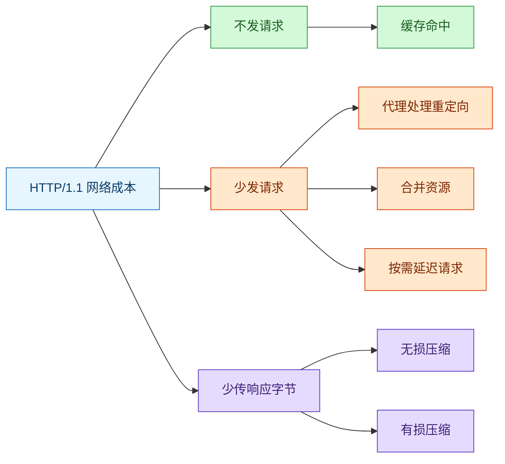
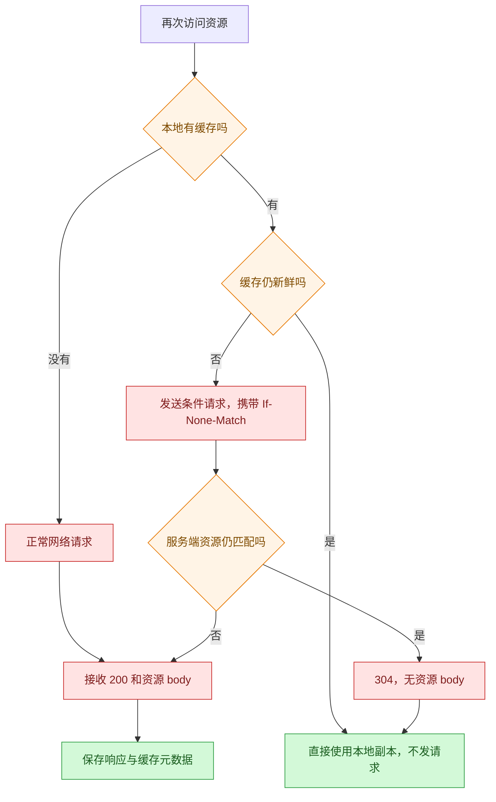
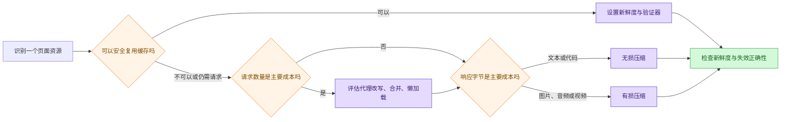
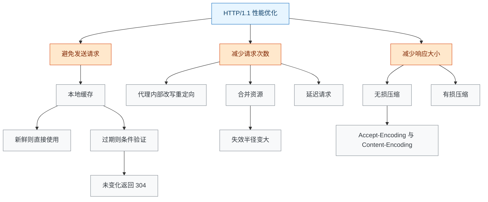

# HTTP/1.1 性能优化：不发、少发、少传

### 1. Topic Overview

- **主题**：在不改写 HTTP/1.1 协议本身的前提下，减少一次页面访问产生的网络开销。
- **为什么重要**：面试中不能只罗列“缓存、压缩、懒加载”，而要先判断瓶颈属于请求是否发生、请求次数，还是响应体大小。
- **难度**：中等。概念本身不难，难点是把每项技术放到正确成本轴上，并说明收益与代价。
- **前置知识**：HTTP 请求/响应模型、状态码与 Header、TCP 建连与慢启动、强制缓存与协商缓存。
- **本地原文**：[materials/network/2_http/http_optimize.md](../../../materials/network/2_http/http_optimize.md)
- **原文章节顺序**：避免发送请求 → 减少请求次数 → 减少响应数据大小 → HTTP/1.1 外部优化的上限。

本章的主干不是一串技巧，而是三个问题：

1. 这个请求能不能完全不走网络？
2. 必须走网络时，能不能少发几次？
3. 请求次数降不动时，每次能不能少传一些字节？

### 2. Core Concepts

#### 2.1 用“不发、少发、少传”定位优化方向

- **Definition**：把 HTTP/1.1 优化分成三条成本轴：避免请求、减少请求次数、减少响应数据大小。
- **Intuition**：一次网络请求不仅传 body，还可能付出往返等待、重复 Header、TCP 连接与慢启动等成本。因此，最强的优化通常是让请求不发生；做不到，再减少次数；次数也必要时，再缩小数据。
- **Example**：
  - 浏览器直接使用仍然新鲜的 logo 缓存：**不发**。
  - 把 20 个小图标做成一张 CSS Sprite：20 次变 1 次，属于**少发**。
  - 把 500 KB 的 JavaScript 用 Brotli 压到 150 KB：属于**少传**。
- **Common mistakes**：把所有优化都叫“压缩”；只背技术名，不会指出它究竟减少了哪一笔网络成本。

#### Visual Model: HTTP/1.1 优化究竟在减哪一笔成本？



- **How to read**：从中间成本出发，先判断要减少的是“是否发生”“发生几次”还是“每次多少字节”。
- **Source anchor**：`materials/network/2_http/http_optimize.md` 开头提纲与“总结”。

#### 2.2 先查新鲜度，再决定本地读还是网络验证

- **Definition**：客户端保存可缓存响应；再次访问时，缓存仍新鲜就直接使用，缓存过期则携带验证器向服务器做条件请求。
- **Intuition**：缓存不是简单的“有就用”，而是把流程分成两级：
  1. **新鲜度判断**：仍有效时完全不发请求。
  2. **重新验证**：过期不代表内容一定变了，只代表客户端不能再单方面相信它。
- **Example**：第一次请求 `/app.js`，服务器返回资源和 `ETag: "v1"`。缓存过期后，客户端请求带 `If-None-Match: "v1"`：
  - 资源未变：服务器返回 `304 Not Modified`，通常没有表示资源的 body，客户端继续使用本地副本。
  - 资源已变：服务器返回新的资源，例如 `200 OK` 加新 body，客户端替换旧缓存。
- **Common mistakes**：
  - 认为只要本地有缓存就永远不发请求。
  - 认为缓存一过期就必须重新下载完整资源。
  - 认为 `304` 会携带完整的新资源。
  - 把 `ETag` 和 `If-None-Match` 的方向背反。

#### Visual Model: 缓存何时不发请求，何时只做验证？



- **How to read**：关键分界不是“有没有缓存”，而是“缓存是否仍新鲜”；过期后先验证，只有资源变化才重传 body。
- **Source anchor**：`materials/network/2_http/http_optimize.md`，“如何避免发送 HTTP 请求？”及缓存 ETag 配图。
- **Boundary**：原文和配图把第二次请求简写为携带 `Etag`。标准字段方向是服务器响应 `ETag`、客户端条件请求发送 `If-None-Match`；对于 GET/HEAD，验证器匹配时可返回 `304`。原文把缓存近似成 `URL -> 响应` 映射，真实缓存键还会受到请求方法和 `Vary` 等因素影响。参见 [RFC 9110](https://www.rfc-editor.org/rfc/rfc9110.html) 与 [RFC 9111](https://www.rfc-editor.org/rfc/rfc9111.html)。

#### 2.3 把客户端可见的重定向留在代理侧

- **Definition**：资源从 `url1` 迁到 `url2` 时，客户端收到 `302 + Location` 会再发一次请求；若代理已经知道映射，可在代理内部改写目标并直接访问源服务器的 `url2`。
- **Intuition**：客户端重定向会把“资源在哪里”的内部路径暴露成一次额外的客户端—代理往返。代理内部重写仍可能访问源站，但减少了客户端可见的请求—响应轮次。
- **Example**：
  - 客户端重定向：客户端请求 `/url1` → 收到 `302 Location: /url2` → 再请求 `/url2` → 收到资源。
  - 代理重写：客户端只请求 `/url1` → 代理内部转到 `/url2` → 客户端直接收到资源。
- **Common mistakes**：
  - 说“代理重定向消灭了所有后端请求”；它主要减少的是客户端侧额外往返。
  - 把 `Location` 当作资源 body。
  - 认为所有 `3xx` 的语义完全相同；原文只要求掌握 `302` 示例，并指出 `301`、`308` 可用于持久重定向信息。

#### Visual Model: 为什么代理内部改写能少一次客户端请求？


- **How to read**：上路由要求客户端理解 302 并再请求一次；下路由把改写藏在代理内部。
- **Source anchor**：`materials/network/2_http/http_optimize.md`，“减少重定向请求次数”及三张时序配图。

#### 2.4 合并资源时，同时核算“请求收益”和“失效半径”

- **Definition**：用一个大资源替代多个小资源请求，例如 CSS Sprite、打包 JS/CSS，或把图片 Base64 内联进 HTML。
- **Intuition**：合并可以减少重复 Header、客户端请求次数以及可能的 TCP 连接成本；但大文件内部任一小部分变化，都可能迫使客户端重新下载更大的整体。
- **Example**：20 个图标各自请求，改成一张 Sprite 后只请求一次；浏览器再按 CSS 坐标显示所需区域。
- **Benefit**：
  - 请求次数下降。
  - 重复 HTTP Header 下降。
  - 在原文所讨论的 HTTP/1.1 非管道化场景下，可能减少为并发加载而建立的 TCP 连接，从而减少握手和慢启动开销。
- **Cost**：
  - 一个小资源更新，整个合并包可能失效。
  - Base64 内联使资源难以独立缓存和更新；应把“少一次请求”与“HTML 体积、缓存粒度”一起评估。
- **Common mistakes**：认为资源合并总是越大越好；忽略缓存失效时的重新下载范围。
- **Boundary**：原文以浏览器常开 5–6 个 TCP 连接说明 HTTP/1.1 并发成本，这只是历史上常见的实现现象，不应背成协议规定的固定数值。

#### 2.5 延迟请求是重新安排时间，不是消灭资源

- **Definition**：只加载当前可见或立即需要的资源，滚动或真正使用时再请求后续内容，即按需获取或懒加载。
- **Intuition**：首屏速度关心的是关键路径。页面下方的图片即使最终仍要下载，也不必和首屏 HTML、CSS、关键图片争抢最早的网络和解析资源。
- **Example**：新闻页先请求首屏 3 张图；用户向下滚动时才请求第 4–10 张图。
- **Common mistakes**：
  - 说懒加载降低了所有用户的总请求数；用户滚到底部时，总数可能没有变化。
  - 延迟过度，导致用户滚动后才开始长时间等待。

#### 2.6 无损压缩：先协商编码，再减少可完全恢复的数据

- **Definition**：压缩后可以恢复原始数据，适合文本、源代码、可执行文件等不能丢失信息的资源。
- **Intuition**：先去掉不影响程序执行的空格、换行等冗余，再用 gzip、Brotli 等内容编码压缩重复模式。
- **Example**：客户端声明：

```http
Accept-Encoding: gzip, deflate, br
```

服务器选择 gzip 后响应：

```http
Content-Encoding: gzip
```

这两个 Header 的职责不同：`Accept-Encoding` 表示客户端能接受什么；`Content-Encoding` 告诉客户端实际用了什么。
- **Common mistakes**：
  - 把“客户端支持列表”和“服务端实际选择”说成同一个字段。
  - 认为图片、音频一定适合再套 gzip；许多媒体格式本身已经压缩，收益需要实测。
  - 只比较压缩率，忽略服务器压缩 CPU 和客户端解压成本。
- **Boundary**：原文强调 Brotli 通常比 gzip 压缩效率更高，但真实选择还受资源类型、压缩级别、CPU 预算和浏览器支持影响。

#### 2.7 有损压缩：用可接受的质量损失换更少字节

- **Definition**：主动舍弃次要信息，使解码结果不再与原始数据逐位相同，但感知上仍接近；常用于图片、音频和视频。
- **Intuition**：文本代码错一个字节可能就出错，多媒体则常能容忍部分细节丢失，所以可以获得更高压缩比。
- **Example**：
  - 图片：在相近视觉质量下，使用 WebP 等更紧凑格式减少体积。
  - 视频：保留关键帧，后续帧只编码相对变化的增量；常见编码有 H.264、H.265。
  - 音频：常见编码有 AAC、AC3。
- **Content negotiation**：原文用下列请求表示媒体类型偏好：

```http
Accept: audio/*;q=0.2, audio/basic
```

这里 `q` 是媒体类型的**相对偏好权重**，不是“请把音质压到 20%”的直接参数。服务器仍需在可用表示中选择。
- **Common mistakes**：
  - 把有损压缩用在必须逐字节还原的代码或数据文件上。
  - 把 `Accept` 的 `q` 值理解成直接控制图片清晰度或音频码率。
  - 只说“WebP 一定更小”，不限定同一内容、相近质量和编码设置。

### 3. Deep Understanding

#### 3.1 三条优化轴为何有先后优先级

可以把一次页面加载的网络成本粗略拆成：

```text
请求是否发生
× 每个请求的固定成本
+ 请求数量带来的重复成本
+ 响应字节带来的传输成本
```

这不是精确时延公式，而是定位问题的成本账本：

1. **不发**：网络往返、Header、body 都归零，通常收益最大。
2. **少发**：仍走网络，但减少重复 Header、往返和连接竞争。
3. **少传**：请求仍发生，主要缩短 body 传输时间。

三条轴可以叠加。例如一个合并后的 JS bundle，既减少请求次数，又可以用 Brotli 减少响应字节；如果它之后命中强制缓存，则整个请求又被避免。

#### 3.2 每种收益都改变了另一个边界

| 优化 | 直接收益 | 新的代价或边界 |
| --- | --- | --- |
| 缓存 | 不发请求，或用 304 避免重传 body | 新鲜度与失效策略 |
| 代理改写重定向 | 少一次客户端请求—响应往返 | 代理需要维护正确规则 |
| 合并资源 | 请求、Header、连接成本下降 | 更新一个小资源可能使大包整体失效 |
| 延迟请求 | 首屏关键路径变短 | 用户真正需要时可能新增等待 |
| 无损压缩 | 字节减少且可完整恢复 | 压缩/解压 CPU 成本 |
| 有损压缩 | 多媒体体积显著下降 | 质量损失与格式兼容性 |

#### 3.3 HTTP/1.1 外部优化的上限

原文最后指出：这些手段能显著改善 HTTP/1.1，但没有改变协议的一些固有结构。缓存、打包、懒加载和压缩都是“围绕 HTTP/1.1 做优化”；当问题来自重复而巨大的 Header、请求—响应组织方式或并发机制时，需要 HTTP/2、HTTP/3 重新设计协议层。本章只建立 HTTP/1.1 的优化选择框架，不展开新版本机制。

### 4. Minimal Working Example

假设一个商城首页首次打开时需要：

- 1 个 HTML；
- 20 个小图标；
- 1 个 500 KB 的 JavaScript 文件；
- 3 张首屏商品图；
- 20 张首屏以下的商品图。

可以沿三条轴执行：

1. **不发**：给版本稳定的图标和 JavaScript 配置缓存；仍新鲜时本地读取，过期后用 `If-None-Match` 验证。
2. **少发**：把 20 个小图标合成 Sprite，或在适当粒度下打包；首屏以下的 20 张图延迟到滚动时请求。
3. **少传**：JavaScript 使用 Brotli/gzip 无损压缩；商品图选择合适的有损格式与质量。
4. **复查代价**：如果图标频繁独立更新，过度合并会扩大失效范围；如果用户经常立即滚动，懒加载阈值不能太保守。

#### Visual Model: 页面优化时按什么顺序做判断？



- **How to read**：先看能否复用，再看请求数量，最后看字节；所有方案最终都要回到正确性和代价检查。
- **Source anchor**：整章三类优化思路及总结。
- **Boundary**：现实优化应由测量驱动；这张图用于建立选择顺序，不表示所有资源都必须依次应用全部手段。

### 5. Chapter Knowledge Map



### 6. Self-Test Questions

#### Recall

1. HTTP/1.1 优化的三条主轴分别是什么？
2. 缓存过期后，`ETag`、`If-None-Match` 和 `304` 分别出现在哪个方向或分支？
3. `Accept-Encoding` 与 `Content-Encoding` 的职责有什么不同？

#### Application / Transfer

4. 一个站点把 40 个小 JS 文件合成一个 3 MB bundle 后，首屏变快，但修改一行代码就让所有用户重下 3 MB。请指出收益和代价分别属于哪条机制。
5. 一个页面压缩后 body 很小，但仍有十几次 302 往返。下一步应该沿哪条优化轴排查，代理可以怎样介入？

#### Explain Like I Am 5

6. 用“出门取快递”的类比解释：为什么“家里已经有”“一次拿多个”“把包裹压小”分别对应不发、少发、少传？

### 7. Weak Point Detection

- **列表记忆而无成本模型**：能说缓存、压缩、懒加载，却不能归类到不发、少发、少传。
- **缓存分支混淆**：认为缓存过期必然重传 body，或认为 `304` 携带新资源。
- **字段方向混淆**：把响应 `ETag` 与请求 `If-None-Match` 说反。
- **代理边界混淆**：认为代理内部改写消除了源站请求，而不是减少客户端可见往返。
- **合并只看收益**：忽略大包的失效半径和独立缓存能力。
- **懒加载偷换概念**：把“推迟请求”说成“请求永远消失”。
- **压缩类型混淆**：对代码使用有损压缩，或把媒体 `q` 值当作直接的清晰度百分比。
- **绝对化结论**：把 5–6 个连接、Brotli、WebP 等实现或经验结论背成协议永远保证的常数。
