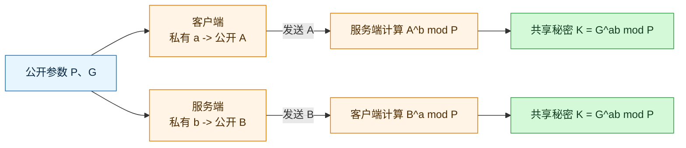
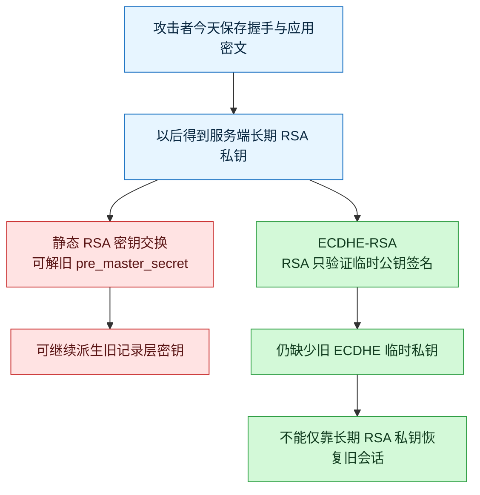
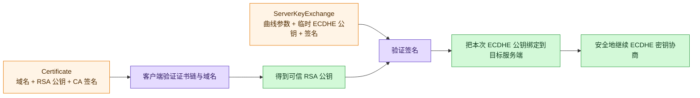
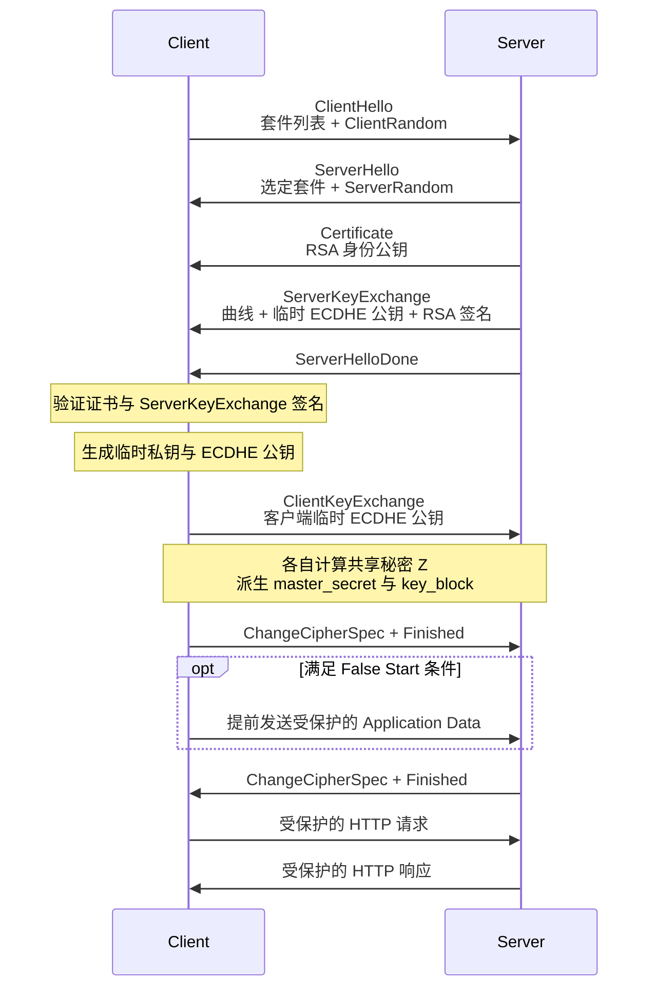
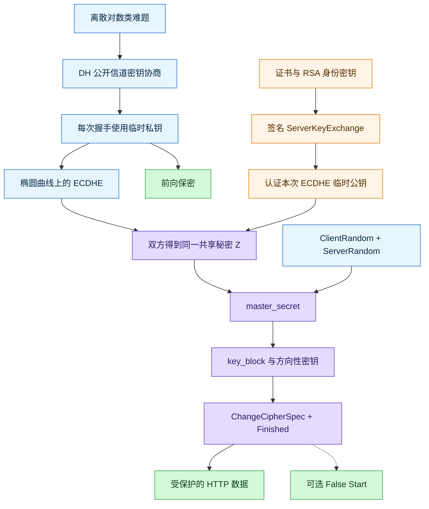

# HTTPS ECDHE 握手解析（TLS 1.2）

### 1. Topic Overview

- **What this is about**: 从 DH 的“公开信道协商同一秘密”出发，理解 ECDHE 如何在 TLS 1.2 中建立临时共享秘密，并由证书中的 RSA 公钥验证服务端的临时参数。
- **Why it matters**: ECDHE 是现代 TLS 的核心思想之一。真正需要掌握的不是公式本身，而是四个边界：哪些值公开、哪些值保密；密钥协商与身份认证如何配合；共享秘密如何变成记录层密钥；前向保密究竟保护什么。
- **Difficulty**: 中等偏难。主要难点是把“数学上的共享点”“TLS 中的 `pre_master_secret`”“长期证书密钥”和“临时 ECDHE 密钥”分开。
- **Prerequisites**: 对称加密与非对称密码的基本职责；TLS 1.2 的 `ClientHello`、`ServerHello`、证书验证、`master_secret -> key_block` 派生链。
- **Primary source**: `materials/network/2_http/https_ecdhe.md`。
- **Scope boundary**: 本章主线是带 `ServerKeyExchange` 的 **TLS 1.2 ECDHE-RSA 全握手**。TLS 1.3 仍使用临时的 Diffie-Hellman 类密钥交换，但消息结构和密钥派生不同。

### 2. Core Concepts

#### 2.1 Schema: 用“正向容易、反向困难”理解离散对数

- **Definition**: 在经典有限域 DH 中，公开大质数 `P` 和底数 `G`，由私有整数 `a` 计算 `A = G^a mod P` 很容易；但仅凭 `P`、`G`、`A` 反推出 `a`，在参数足够安全时极其困难。
- **Intuition**: 像把颜料混合：按配方混出结果很容易，但只看最终颜色还原精确配方很难。
- **Example**: 任何人都能看到 `P`、`G` 和公开值 `A`，但攻击者真正需要的私有指数 `a` 并没有被发送。
- **Common mistakes**:
  - 把“反推很难”说成数学上绝对不可能。
  - 认为 `P`、`G` 也必须保密。
  - 把经典有限域离散对数与椭圆曲线离散对数当成完全相同的运算；它们共享“正向容易、反向困难”的安全结构，但运算对象不同。

#### 2.2 Schema: 让双方在公开信道上算出同一秘密

- **Definition**: DH 让双方各自保留一个私有值，只交换由私有值计算出的公开值；收到对方公开值后，每一方用“自己的私有值 + 对方的公开值”算出相同的共享秘密。
- **Intuition**: 双方没有把最终秘密寄给对方，而是各自在本地把同一把钥匙算出来。
- **Example**:
  - 公共参数：`P`、`G`。
  - 客户端私有值 `a`，公开值 `A = G^a mod P`。
  - 服务端私有值 `b`，公开值 `B = G^b mod P`。
  - 客户端计算 `K = B^a mod P`；服务端计算 `K = A^b mod P`。
  - 因为两边最终都是 `G^(ab) mod P`，所以得到同一个 `K`。

#### Visual Model: 没有发送 K，双方为什么仍得到同一个 K？



- **How to read**: 网络上只出现公共参数与 `A`、`B`；`a`、`b` 和最终共享秘密都只留在端点本地。
- **Source anchor**: `materials/network/2_http/https_ecdhe.md`，`离散对数` 与 `DH 算法`。
- **Boundary**: 纯 DH 只解决“协商秘密”，不自动证明对方身份；若公开值没有经过认证，中间人可以分别与两端协商两套秘密。
- **Common mistakes**: 说一方生成会话密钥再加密发给另一方；认为看到 `A`、`B` 就等于看到共享秘密；忽略未认证 DH 的中间人风险。

#### 2.3 Schema: 用“每次都换私钥”获得前向保密

- **Definition**: `E` 代表 ephemeral。DHE/ECDHE 在每次握手中生成新的临时私钥，握手结束后不再依赖这对临时私钥建立其他会话。
- **Intuition**: 长期证书密钥像身份证明；每次会话的 ECDHE 私钥像一次性房间钥匙。以后身份证明密钥泄漏，不会自动重现过去已经销毁的一次性钥匙。
- **Example**:
  - 静态 RSA：旧抓包中的 `pre_master_secret` 是用长期 RSA 公钥加密的；以后得到 RSA 私钥，可能解开过去的秘密。
  - ECDHE-RSA：RSA 私钥只用于签名认证；旧会话秘密来自当时的临时 ECDHE 私钥。以后只得到长期 RSA 私钥，仍缺少过去的临时私钥。
- **Common mistakes**:
  - 把前向保密理解成“服务器以后永远不会被攻破”。
  - 认为临时私钥泄漏也不会影响该次会话。
  - 认为只要名称里有 RSA 就一定没有前向保密；关键要看 RSA 是做密钥交换还是只做签名认证。

#### Visual Model: 长期 RSA 私钥以后泄漏，旧会话会怎样？



- **How to read**: 两条路径的分叉点不是“有没有 RSA”，而是长期 RSA 私钥是否直接保护了会话秘密。
- **Source anchor**: `materials/network/2_http/https_ecdhe.md`，`DHE 算法` 与 `总结`。
- **Boundary**: 前向保密不覆盖端点在会话当时已被控制、会话密钥被日志记录、随机数生成器失效等情况。

#### 2.4 Schema: 把 DH 搬到椭圆曲线上

- **Definition**: ECDHE 使用椭圆曲线群。双方约定曲线和基点 `G`，各自生成临时私有标量 `d`，再通过标量乘法得到公开点 `Q = dG`。
- **Intuition**: DH 的骨架没有变：自己的私有值不发送；发送由它计算出的公开值；最后组合“自己的私有值 + 对方的公开值”。变化的是数学舞台从模幂运算换成椭圆曲线点运算。
- **Example**:
  - 客户端：私钥 `dC`，公钥 `QC = dC G`。
  - 服务端：私钥 `dS`，公钥 `QS = dS G`。
  - 客户端计算 `Z = dC QS = dC dS G`。
  - 服务端计算 `Z = dS QC = dS dC G`。
  - 双方得到同一共享点；TLS 将其坐标编码成密钥派生输入，而不是把共享点直接当作 HTTP 的 AES key。
- **Common mistakes**: 把 `dG` 当普通整数乘法；说双方互发私钥；把共享点的 `x` 坐标直接当作最终记录层密钥。

#### 2.5 Schema: 从密码套件拆出四种职责

- **Definition**: 原文抓包选择 `TLS_ECDHE_RSA_WITH_AES_256_GCM_SHA384`。名称描述的是一组分工，不是一个单独算法。
- **Example**:
  - `ECDHE`: 用双方临时椭圆曲线密钥协商共享秘密，提供前向保密。
  - `RSA`: 服务端证书公钥的算法；在本握手中用于验证服务端对 ECDHE 临时参数的签名，而不是加密 ECDHE 共享秘密。
  - `AES_256_GCM`: 用 256 位 AES-GCM 保护 TLS records，同时提供机密性和认证 tag。
  - `SHA384`: 作为该 TLS 1.2 套件的 PRF Hash，参与密钥材料和 `Finished` 验证值派生。
- **Common mistakes**: 说 RSA 仍负责加密 `pre_master_secret`；说 SHA384 为每条 GCM record 另算独立 HMAC；说 ECDHE 负责加密 HTTP body。

#### 2.6 Schema: 用证书签名把临时 ECDHE 公钥绑定到服务端身份

- **Definition**: 单独的 ECDHE 公钥没有身份。TLS 1.2 ECDHE-RSA 中，服务端在 `ServerKeyExchange` 发送曲线参数和临时 ECDHE 公钥，并用证书对应的 RSA 私钥对相关握手材料签名；客户端用已验证证书中的 RSA 公钥验签。
- **Intuition**: ECDHE 临时公钥是一把本次会话的新钥匙；证书私钥的签名相当于网站在钥匙上盖章，证明“这把临时钥匙确实是我本次给你的”。
- **Example**:
  1. 客户端先验证证书链、目标域名、有效期和用途。
  2. 客户端取得可信的 RSA 公钥。
  3. 客户端用它验证 `ServerKeyExchange` 中的签名。
  4. 验签通过，才接受该 ECDHE 临时公钥并继续协商。

#### Visual Model: ECDHE 已能协商秘密，为什么还需要 RSA 证书？



- **How to read**: 证书先让 RSA 公钥可信，再由该 RSA 公钥验证本次临时 ECDHE 公钥的签名；两层共同抵抗中间人替换公开值。
- **Source anchor**: `materials/network/2_http/https_ecdhe.md`，`TLS 第二次握手` 与 `TLS 第三次握手`。
- **Boundary**: 证书 RSA 密钥负责身份认证，不会直接算出 ECDHE 共享秘密；只有双方的临时 ECDHE 私钥参与共享点计算。
- **Common mistakes**: 认为证书链通过就无需验证 `ServerKeyExchange`；认为 ECDHE 自带身份认证；认为客户端用 RSA 公钥解密服务端签名来获得共享秘密。

#### 2.7 Schema: 从 ECDHE 共享秘密逐级派生方向性记录层密钥

- **Definition**: TLS 1.2 中，ECDHE 得到的共享秘密 `Z` 被编码为 `pre_master_secret`。双方再结合 `ClientRandom` 和 `ServerRandom` 通过 PRF 计算相同的 `master_secret`，随后扩展 `key_block` 并切分为客户端和服务端方向的写密钥、IV 等材料。
- **Intuition**: ECDHE 只产出共同的秘密原料；TLS 的派生链再把原料加工成不同方向、不同职责的工作密钥。
- **Example**:
  - 网络可见：`ClientRandom`、`ServerRandom`、曲线、双方 ECDHE 公钥。
  - 端点秘密：双方临时私钥、共享秘密 `Z`、`master_secret`、`key_block`、write keys 和 IV。
  - 派生链：`Z -> pre_master_secret -> master_secret -> key_block -> client/server write key + IV`。
- **Common mistakes**: 把两个 Hello random 当秘密；把 `Z` 直接作为两个方向共用的 AES key；认为方向性密钥要通过网络互相发送。

#### 2.8 Schema: 用 Finished 对账，用 False Start 有条件地提前发送数据

- **Definition**: 客户端在 `ChangeCipherSpec` 后发送受新密钥保护的 `Finished`，服务端随后也完成切换和验证。`Finished` 不只是“试一下能否解密”，还验证双方看到的握手 transcript 是否一致。
- **False Start**: 在满足协议版本、强密码套件和实现策略等条件时，客户端可以在发送自己的 `Finished` 后、收到服务端 `Finished` 前提前发送应用数据，从而节省等待一个往返的时间。
- **Boundary**: False Start 是可选优化，不是 ECDHE 握手必然发生的固定消息；ECDHE 提供的强密钥交换是其常见前提之一，但“使用 ECDHE”不能单独推出“必然抢跑”。
- **Common mistakes**: 说应用数据在计算共享秘密前就能发送；说 False Start 省掉了一条 TLS 握手消息；把 `ChangeCipherSpec` 当成携带会话密钥的消息。

### 3. Deep Understanding

#### 3.1 TLS 1.2 ECDHE-RSA 核心时序



- **How to read**: 服务端先用长期 RSA 身份密钥认证本次临时 ECDHE 公钥；双方交换临时公钥后，各自在本地计算同一共享秘密并派生记录层密钥。
- **Source anchor**: `materials/network/2_http/https_ecdhe.md`，`ECDHE 握手过程` 全节。
- **Boundary**: 图按原文章节的 TLS 1.2 全握手主线展开，省略可选客户端证书、扩展、会话恢复、告警和 TCP 分段。

#### 3.2 四类材料不能混

| 材料 | 生命周期 | 是否公开发送 | 主要职责 |
| --- | --- | --- | --- |
| 证书 RSA 公钥 / 服务端 RSA 私钥 | 长期 | 公钥随证书发送；私钥不发送 | 认证服务端并验证 `ServerKeyExchange` 签名 |
| 客户端/服务端 ECDHE 临时私钥 | 单次握手 | 不发送 | 与对方临时公钥共同计算共享秘密 |
| 客户端/服务端 ECDHE 临时公钥 | 单次握手 | 公开发送 | 让对方能够在不知道己方私钥的情况下算出同一共享秘密 |
| `master_secret`、write keys、IV | 单次会话 | 不直接发送 | 保护 `Finished` 和后续 TLS records |

#### 3.3 RSA 密钥交换与 ECDHE-RSA 的机制对比

| 问题 | 静态 RSA 密钥交换 | ECDHE-RSA |
| --- | --- | --- |
| 会话秘密怎样建立 | 客户端生成 `pre_master_secret`，用长期 RSA 公钥加密 | 双方临时 ECDHE 私钥共同算出共享秘密 |
| RSA 的职责 | 密钥交换，并配合证书认证服务端 | 只对本次 ECDHE 参数签名以认证服务端 |
| 关键额外消息 | 无 `ServerKeyExchange` | 服务端发送 `ServerKeyExchange` |
| 长期 RSA 私钥以后泄漏 | 可能恢复旧会话 | 仅凭它不能恢复已销毁的旧临时 ECDHE 私钥 |
| 前向保密 | 不提供 | 在临时密钥正确生成和销毁等前提下提供 |

#### 3.4 本章核心因果链

```text
离散对数类难题
-> 私有值能安全地产生公开值
-> 双方交换公开值但不发送共享秘密
-> 各自算出同一个 ECDHE 共享秘密
-> RSA 证书签名认证本次临时公开值
-> TLS PRF 派生 master_secret 与方向性记录层密钥
-> Finished 验证密钥与握手 transcript
-> 加密并认证 HTTP 数据
-> 长期证书私钥以后泄漏也不能单独恢复旧会话
```

### 4. Minimal Working Example

**玩具 DH 例子：只用于看见结构，数字太小，完全不安全。**

```text
公共参数：P = 23, G = 5
客户端私有值：a = 6  -> 公开 A = 5^6 mod 23 = 8
服务端私有值：b = 15 -> 公开 B = 5^15 mod 23 = 19

客户端：K = B^a mod 23 = 19^6 mod 23 = 2
服务端：K = A^b mod 23 = 8^15 mod 23 = 2
```

**Reasoning flow**:

1. 监听者能看到 `23`、`5`、`8`、`19`，但没有直接看到 `6`、`15` 或 `2`。
2. 客户端用自己的私有值 `6` 和对方公开值 `19` 计算；服务端用自己的私有值 `15` 和对方公开值 `8` 计算。
3. 两边结果相同，不是因为网络传输了 `K`，而是因为运算结构把两边都合并成同一个 `G^(ab)`。
4. ECDHE 把这套“自己的私有值 + 对方公开值”结构搬到椭圆曲线点运算上，以更短密钥获得合适的安全性和性能。
5. 在真实 TLS 1.2 中，共享结果不会直接充当 HTTP 的 AES key；它会进入 `pre_master_secret -> master_secret -> key_block` 派生链。
6. 还必须认证交换的临时公钥；否则中间人可以替换双方公开值，分别与两端建立秘密。

### 5. Chapter Knowledge Map



### 6. Self-Test Questions

**Recall**

1. DH/ECDHE 过程中，哪些值公开发送，哪些值始终只留在本地？
2. `TLS_ECDHE_RSA_WITH_AES_256_GCM_SHA384` 中 ECDHE、RSA、AES-GCM、SHA384 各自负责什么？
3. 为什么 TLS 1.2 ECDHE-RSA 比静态 RSA 密钥交换多一个 `ServerKeyExchange`？

**Application / Transfer**

1. 攻击者保存了今天的 ECDHE-RSA TLS 流量，三年后只拿到服务器证书对应的 RSA 私钥。说明他仍缺少什么，以及为什么不能据此恢复旧 HTTP 明文。
2. 中间人不破解椭圆曲线，只把服务端 ECDHE 公钥替换成自己的公钥。TLS 中哪一步应发现这个替换？如果没有该认证，纯 ECDHE 为什么仍可能被中间人攻击？

**Explain like I am 5**

1. 用“长期身份证明 + 一次性钥匙 + 双方各自配出同一把房间钥匙”解释 ECDHE-RSA 和前向保密。

### 7. Weak Point Detection

| 典型错误表现 | 对应 schema | 错误类型 | 检查方法 |
| --- | --- | --- | --- |
| 说客户端生成共享秘密后加密发给服务端 | 公开信道协商同一秘密 | concept misunderstanding | 追问网络上是否出现过最终共享秘密 |
| 把公开的 ECDHE 公钥或 Hello random 当作私钥 | 公开值与私有值边界 | boundary confusion | 让学习者按“发送 / 不发送”分类所有材料 |
| 说 ECDHE 天然完成身份认证 | 密钥协商与认证分工 | concept misunderstanding | 给出替换公开值的中间人场景，追问 RSA 签名的作用 |
| 说 RSA 在 ECDHE-RSA 中加密 `pre_master_secret` | 密码套件职责 | boundary confusion | 对比 RSA 密钥交换和 ECDHE-RSA 两条秘密建立路径 |
| 把共享点 `x` 直接作为两个方向共用的 AES key | TLS 密钥派生链 | procedure confusion | 补全 `Z -> master_secret -> key_block -> write keys/IV` |
| 认为长期 RSA 私钥泄漏会解开所有旧 ECDHE 流量 | 前向保密 | transfer failure | 追问旧会话还缺哪两个临时私钥中的至少一个 |
| 认为使用 ECDHE 就必然出现 False Start | 可选优化边界 | overgeneralization | 追问 ECDHE 与实现策略/安全条件分别是什么关系 |
