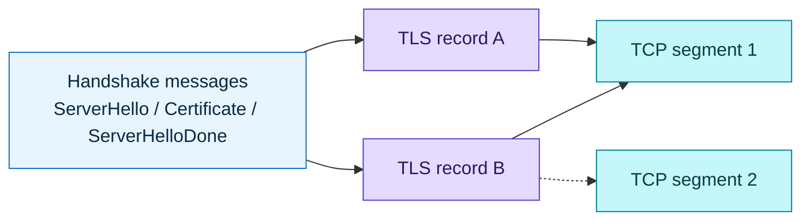
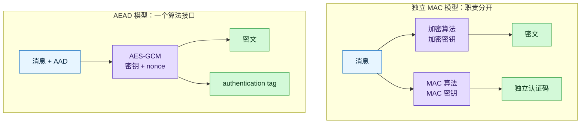
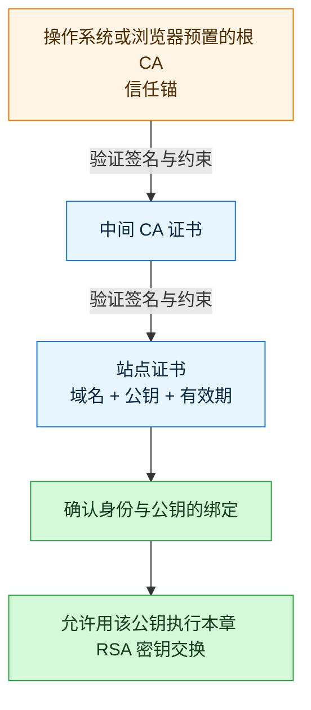
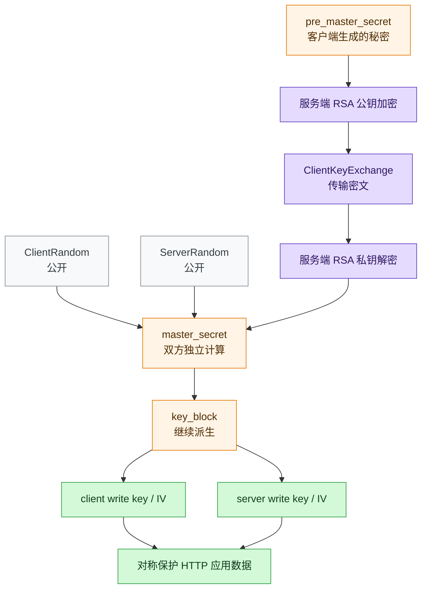
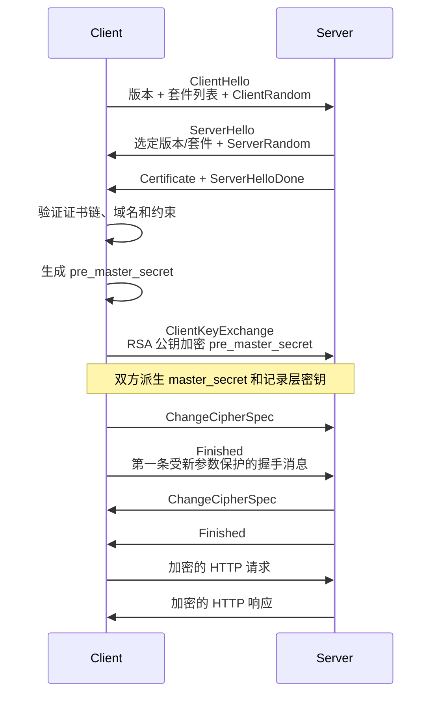
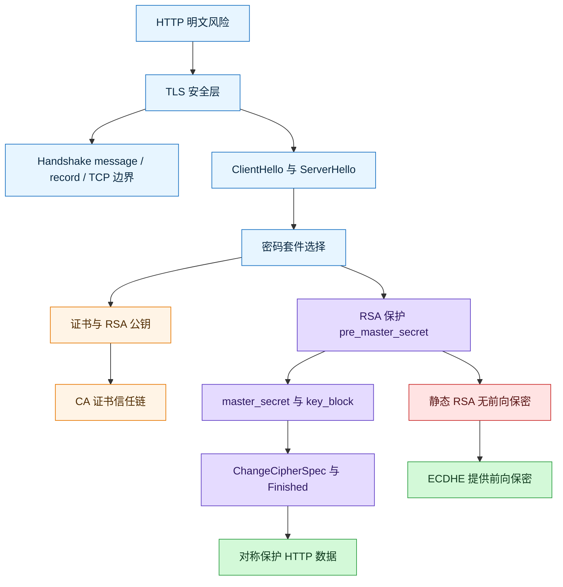

# HTTPS RSA 握手解析（TLS 1.2）

### 1. Topic Overview

- **What this is about**: 沿一次经典 TLS 1.2 RSA 密钥交换抓包，理解握手消息如何协商参数、验证服务端、建立共享密钥并切换到加密通信。
- **Why it matters**: 面试里最常见的错误不是背不出 `ClientHello`，而是把公钥、证书、`pre_master_secret`、`master_secret`、记录层密钥和 HTTP 数据加密混成一个东西。
- **Difficulty**: 中等偏难。难点在消息时序、承载边界和不同密钥材料的职责，而不是消息名称本身。
- **Prerequisites**: HTTP 明文的三类风险；对称加密与非对称加密；Hash、数字签名和 CA 的基本作用。
- **Primary source**: `materials/network/2_http/https_rsa.md`。
- **Scope boundary**: 本章描述的是经典 **TLS 1.2 静态 RSA 密钥交换**。TLS 1.3 已移除静态 RSA 密钥交换；RSA 仍可用于证书签名，但不再用于把客户端生成的 `pre_master_secret` 直接加密给服务器。

### 2. Core Concepts

#### 2.1 Schema: 把 HTTP 三类风险映射到 TLS 三类职责

- **Definition**: HTTP 明文通信面临窃听、篡改和冒充；TLS 分别通过机密性保护、完整性校验和身份认证降低这些风险。
- **Intuition**: “看不懂内容”“改了会被发现”“知道对面是谁”是三个不同问题，不能只用“加密”一个词概括。
- **Example**:
  - 窃听：应用数据用协商出的对称密钥加密。
  - 篡改：记录层的认证机制和握手 `Finished` 校验使未授权修改可被发现。
  - 冒充：客户端验证证书链、域名和证书有效性，确认站点公钥的归属。
- **Common mistakes**: 说“HTTPS 只是给 HTTP 加密”；认为内容加密后就自然完成身份认证。

#### 2.2 Schema: 分清 Handshake message、TLS record、TCP segment 和 flight

- **Definition**:
  - **Handshake message** 表示协议语义，例如 `ClientHello`、`Certificate`、`Finished`。
  - **TLS record** 是 TLS 记录层的承载与保护单位，可以承载握手、告警、应用数据等内容。
  - **TCP segment** 是 TCP 的传输分段；一个 TCP segment 可承载多个 TLS records，一个 TLS record 也可能跨多个 TCP segments。
  - **Flight** 是一方在等待对方响应前连续发出的一组握手内容。
- **Intuition**: 像“信的内容 -> 信封 -> 邮车”。多封信可以装上同一辆邮车，一封很大的信也可能拆给多辆车运。
- **Example**: 原文抓包把经典 RSA 全握手压成四个方向批次：
  1. 客户端发送 `ClientHello`；
  2. 服务端发送 `ServerHello + Certificate + ServerHelloDone`；
  3. 客户端发送 `ClientKeyExchange + ChangeCipherSpec + Finished`；
  4. 服务端发送 `ChangeCipherSpec + Finished`。

#### Visual Model: 为什么“四次 TLS 握手”不等于四个 TCP 包？



- **How to read**: 先按语义识别握手消息，再看它们怎样装入 TLS records，最后才看 TCP 如何分段；三层数量没有一一对应关系。
- **Source anchor**: `materials/network/2_http/https_rsa.md`，`TLS 握手过程` 与 `RSA 握手过程`。
- **Boundary**: “四次”描述常见完整 RSA 握手的四个方向批次；实际抓包数量会受分段、合并、重传、扩展和认证方式影响。
- **Common mistakes**: 把“TLS 四次握手”背成固定四个 TCP 包；把 `Certificate` 等握手消息与 record 当成同一种单位。

#### 2.3 Schema: 从密码套件拆出密钥交换、身份认证和数据保护

- **Definition**: 密码套件决定握手和记录层采用的一组算法。原文抓包中的 `TLS_RSA_WITH_AES_128_GCM_SHA256` 属于 TLS 1.2 风格命名。
- **Intuition**: 不要把整串名字当一个算法；它是“怎样建立秘密 + 怎样保护数据 + 派生时用什么 Hash”的组合说明。
- **Example**:
  - `RSA`: 在本章套件中用于 RSA 密钥交换，并由 RSA 证书完成服务端身份认证。
  - `AES_128_GCM`: 用 128 位 AES-GCM 对称算法保护记录层数据；GCM 同时提供加密与认证。
  - `SHA256`: 作为该套件的 TLS 1.2 PRF Hash，参与密钥材料和 `Finished` 校验值的派生。

##### Prerequisite Bridge: AEAD 认证与独立 MAC

- **MAC（Message Authentication Code）**: 用一把只有通信双方知道的 MAC key，对消息计算认证码。接收方重新计算并比较；消息或认证码被篡改时，比较会失败。MAC 提供完整性与来源认证，但不隐藏内容。
- **独立 MAC 模型**: 加密算法负责产生密文，另一个 MAC 算法和 MAC key 负责产生认证码；两项职责由两个密码学组件承担。
- **AEAD（Authenticated Encryption with Associated Data）**: 一个算法接口同时产生密文和 authentication tag。接收方只有在 tag 验证成功后才应接受明文。
- **AAD（Additional Authenticated Data）**: 只认证、不加密的附加信息；它参与 tag 计算，因此被改动也会导致验证失败。
- **本套件的结论**: `AES_128_GCM` 是 AEAD，GCM 产生认证 tag，所以不再需要为每条 record 配置独立 HMAC。末尾的 `SHA256` 是 TLS 1.2 PRF Hash，不是这里的独立 record MAC。

#### Visual Model: 独立 MAC 与 AEAD 的职责怎样不同？



- **How to read**: 左边需要分别理解加密组件和 MAC 组件；右边由 AES-GCM 一次输出密文与 tag，并把 AAD 也纳入认证。
- **Source anchor**: `materials/network/2_http/https_rsa.md`，密码套件 `TLS_RSA_WITH_AES_128_GCM_SHA256`；此处补足原文默认读者已经掌握的前置知识。
- **Boundary**: 左图只比较职责是否分开，不表示所有历史 TLS 套件都采用相同的 MAC/加密线序。
- **Common mistakes**: 说 RSA 负责加密后续所有 HTTP 数据；看到 `SHA256` 就机械地说它一定是独立的记录层 MAC，而忽略 GCM 是 AEAD。

#### 2.4 Schema: 证书链证明“这个公钥属于这个服务端”

- **Definition**: 站点证书包含站点身份信息和公钥，并由上级 CA 签名；客户端从本地信任锚出发逐级验证证书路径。
- **Intuition**: 公钥解决“怎么加密给持有私钥的人”，证书解决“这个公钥到底是不是目标网站的”。
- **Example**: 根 CA 公钥验证中间 CA 证书；中间 CA 公钥再验证 `baidu.com` 站点证书；同时还要检查域名、有效期、用途等约束。

#### Visual Model: 站点公钥怎样获得客户端信任？



- **How to read**: 信任从本地根 CA 出发，通过每一级签名验证传到站点证书，最终得到可信的“域名—公钥”绑定。
- **Source anchor**: `materials/network/2_http/https_rsa.md`，`客户端验证证书`。
- **Boundary**: 图没有展开吊销检查和全部 X.509 路径约束；证书也不“等于公钥”，而是包含公钥及其身份、用途、有效期和签名等信息。
- **Common mistakes**: 认为服务器发来公钥就可以直接相信；只比较证书 Hash，却不检查签发链和身份约束；把 CA 的私钥误认为客户端持有。

#### 2.5 Schema: 用三个输入逐级派生记录层密钥

- **Definition**: 客户端和服务端公开交换 `ClientRandom`、`ServerRandom`；客户端另生成秘密的 `pre_master_secret`，用证书中的服务端 RSA 公钥加密发送，服务端用 RSA 私钥解密。双方随后独立派生出相同的 `master_secret`，再扩展成实际使用的记录层写密钥和 IV 等材料。
- **Intuition**: RSA 只护送最关键的秘密种子；真正高频传输仍由更快的对称密钥完成。
- **Example**:
  - `ClientRandom`：客户端在 `ClientHello` 中明文发送。
  - `ServerRandom`：服务端在 `ServerHello` 中明文发送。
  - `pre_master_secret`：客户端生成，RSA 公钥加密后放进 `ClientKeyExchange`。
  - `master_secret`：双方用 PRF 从以上材料计算，不直接在网络上传输。
  - `key_block`：从 `master_secret` 和两个 random 继续派生，切分为客户端/服务端方向的写密钥、IV 等。

#### Visual Model: RSA 到底保护了什么，HTTP 又由什么加密？



- **How to read**: 两个公开 random 和一个受 RSA 保护的秘密共同进入派生链；RSA 不直接承担后续 HTTP 数据的批量加密。
- **Source anchor**: `materials/network/2_http/https_rsa.md`，`TLS 第一次握手` 到 `TLS 第四次握手`。
- **Boundary**: 原文把 `master secret` 简称为“会话密钥”；更精确地说，TLS 1.2 会从它继续扩展出各方向真正使用的记录层密钥材料。
- **Common mistakes**: 认为三个随机数都必须保密；认为服务端生成 `pre_master_secret`；认为 `master_secret` 会被直接发到网络上。

#### 2.6 Schema: 用 ChangeCipherSpec 切换状态，用 Finished 验证整场握手

- **Definition**: 在 TLS 1.2 中，`ChangeCipherSpec` 通知对方把待定密码状态切为当前状态；紧接着的 `Finished` 是第一条受新算法、密钥和秘密保护的握手消息。
- **Intuition**: `ChangeCipherSpec` 是“从下一条开始启用新规则”，`Finished` 是双方第一次用新规则完成的对账。
- **Example**: 客户端发 `ChangeCipherSpec` 后，用新密钥保护 `Finished`；服务端验证成功，再以同样顺序发送自己的两条消息。双方都验证通过后才发送 HTTP 应用数据。
- **Common mistakes**: 认为 `ChangeCipherSpec` 自己承载会话密钥；认为 `Finished` 只测试能否解密，而不校验此前握手 transcript 是否一致。

#### 2.7 Schema: 用“私钥以后泄漏，旧流量会怎样”判断前向保密

- **Definition**: 静态 RSA 密钥交换不提供前向保密。攻击者若记录了旧握手中的 RSA 加密 `pre_master_secret` 和后续密文，将来拿到服务端 RSA 私钥后，就可能恢复旧会话密钥并解密历史流量。
- **Intuition**: 锁的私钥长期不变；过去录下来的“上锁种子”可以在未来拿到私钥后重新打开。
- **Example**: `capture now -> steal private key later -> decrypt old pre_master_secret -> derive old traffic keys -> decrypt old application data`。
- **Common mistakes**: 把“当前私钥没泄漏”当成对历史流量的永久保证；认为更换网站证书能让已经泄漏的私钥无法解开过去抓到的 RSA 握手。

### 3. Deep Understanding

#### 3.1 本章核心因果链



- **How to read**: 先协商参数，再证明身份并取得可信公钥；然后保护秘密种子、独立派生对称密钥、互验握手，最后才发送 HTTP。
- **Source anchor**: `materials/network/2_http/https_rsa.md`，`RSA 握手过程` 全节。
- **Boundary**: 省略可选客户端证书、会话恢复、扩展、告警和 TCP 重传；本图只表示本章的经典 TLS 1.2 RSA 全握手。

#### 3.2 四组不能混的职责

| 对象 | 谁生成/持有 | 是否在网络中直接发送 | 主要职责 |
| --- | --- | --- | --- |
| 证书中的 RSA 公钥 | 服务端持有对应私钥；证书由 CA 签发 | 公钥随证书发送 | 加密 `pre_master_secret`；身份由证书链保证 |
| 服务端 RSA 私钥 | 只应留在服务端 | 不发送 | 解密 `pre_master_secret`；泄漏会破坏静态 RSA 的历史保密性 |
| 三个随机输入 | 两个 Hello random 公开；`pre_master_secret` 保密 | 两个公开发送；`pre_master_secret` 只以 RSA 密文发送 | 让双方派生同一套会话秘密 |
| 记录层对称密钥 | 双方独立派生 | 不发送 | 高效保护后续握手和 HTTP 应用数据 |

#### 3.3 规范边界校正

- 原文“证书文件其实就是服务端公钥”是便于理解的简称；证书实际还包含身份、签发者、有效期、用途和签名等字段。
- 原文把 `master secret` 直接称为“会话密钥”；TLS 1.2 还会从它扩展出 client/server write keys、IV 等记录层材料。
- 原文密码套件解释可作为记忆入口；但在 `AES_128_GCM` 这种 AEAD 套件中，GCM 已同时提供加密与认证，`SHA256` 主要是 TLS 1.2 PRF Hash。
- 本章 RSA 密钥交换流程属于历史上重要、适合理解机制的 TLS 1.2 模型；TLS 1.3 已移除静态 RSA 密钥交换并要求公钥密钥交换提供前向保密。

### 4. Minimal Working Example

**场景：Wireshark 中看到以下四个方向批次。**

```text
1. C -> S  ClientHello
2. S -> C  ServerHello, Certificate, ServerHelloDone
3. C -> S  ClientKeyExchange, ChangeCipherSpec, Finished
4. S -> C  ChangeCipherSpec, Finished
5. C -> S  Application Data
```

**Reasoning flow**:

1. 从 `ClientHello`/`ServerHello` 读出协商版本、两个公开 random 和选定密码套件。
2. 用系统信任锚验证证书链，并检查证书是否适用于目标域名；只有这一步通过，证书中的 RSA 公钥才可信。
3. 客户端生成 `pre_master_secret`，用该 RSA 公钥加密后发送；服务端用私钥解密。
4. 双方拥有相同的三个输入，所以能各自计算相同的 `master_secret` 和记录层密钥；这些秘密无需直接互传。
5. `ChangeCipherSpec` 切换到新密码状态，`Finished` 验证双方得到的密钥和握手 transcript 是否一致。
6. `Application Data` 才是由记录层对称密钥保护的 HTTP 内容。
7. 若干年后服务端 RSA 私钥泄漏，攻击者可能从保存的第 3 批密文中恢复 `pre_master_secret`，所以这个流程没有前向保密。

### 5. Chapter Knowledge Map



### 6. Self-Test Questions

**Recall**

1. `Handshake message`、TLS record 和 TCP segment 的数量为什么没有一一对应关系？
2. `ClientRandom`、`ServerRandom`、`pre_master_secret` 分别由谁生成，哪些是明文可见的？
3. `ChangeCipherSpec` 和 `Finished` 各自负责什么？

**Application / Transfer**

1. 抓包里同一个 TCP segment 出现 `ServerHello`、`Certificate`、`ServerHelloDone`，这是否意味着它们是同一个握手消息或同一个 TLS record？请分层判断。
2. 攻击者今天完整保存了一条静态 RSA TLS 1.2 连接，但今天拿不到服务器私钥；三年后私钥泄漏。说明攻击者如何从旧抓包恢复应用数据，并指出哪一种安全性质缺失。

**Explain like I am 5**

1. 用“身份证、公锁、秘密种子、临时房间钥匙”解释证书、RSA 公钥、`pre_master_secret` 和记录层对称密钥的关系。

### 7. Weak Point Detection

| 典型错误表现 | 对应 schema | 错误类型 | 检查方法 |
| --- | --- | --- | --- |
| 把四次 TLS 握手说成固定四个 TCP 包 | 消息/record/TCP 边界 | boundary confusion | 给一个 TCP segment 承载多个握手消息的抓包，让学习者分层命名 |
| 说服务器发来的证书就是一个裸公钥 | 证书链与公钥归属 | concept misunderstanding | 追问证书还绑定了哪些身份和约束信息 |
| 说三个随机数都必须是秘密 | 密钥派生输入 | boundary confusion | 让学习者指出 Hello 里明文出现的两个 random |
| 说 RSA 加密所有 HTTP 请求和响应 | 混合加密职责 | concept misunderstanding | 追问谁只保护 `pre_master_secret`，谁保护应用数据 |
| 把 `master_secret` 当成网络里直接传输的唯一 AES key | 分层密钥派生 | procedure confusion | 让学习者补全 `pre_master_secret -> master_secret -> key_block` |
| 只说 `Finished` 测试能否解密 | 握手完成验证 | surface-level memorization | 追问它还验证此前握手 transcript 的什么性质 |
| 认为以后更换证书就自动保护旧 RSA 抓包 | 前向保密 | transfer failure | 用“现在抓、以后偷私钥”的场景要求推演解密链 |
