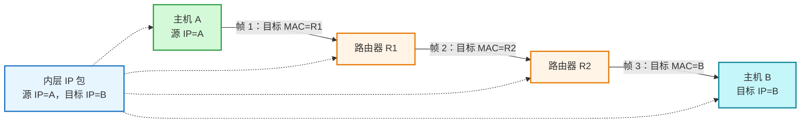
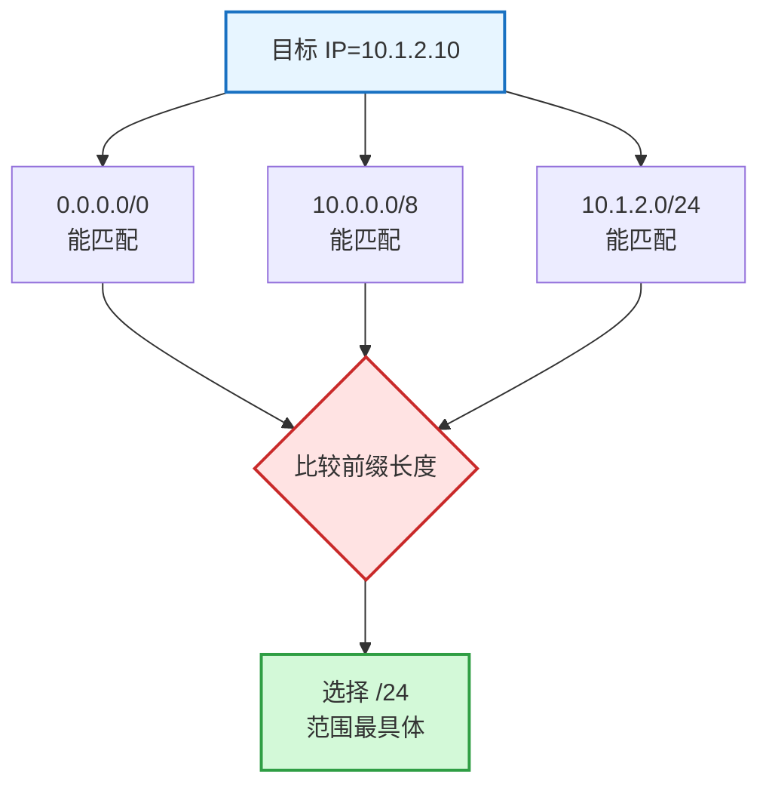
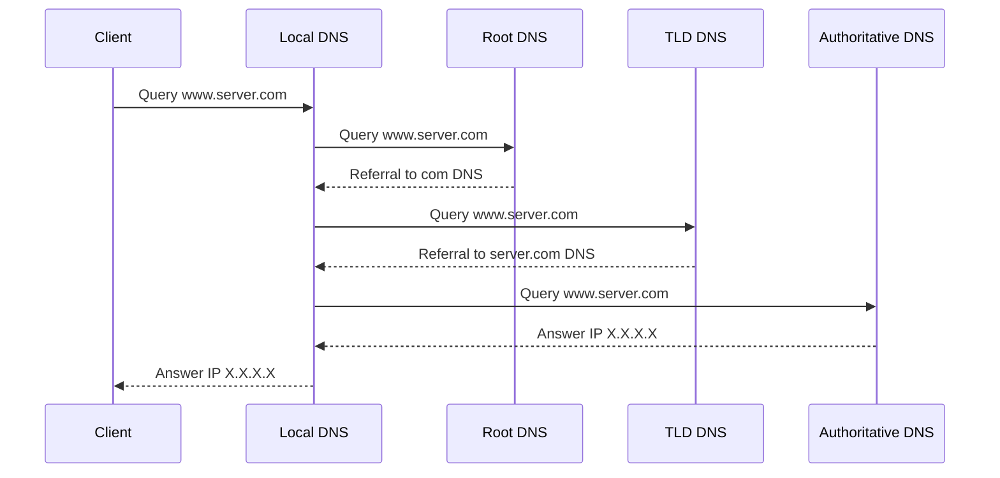
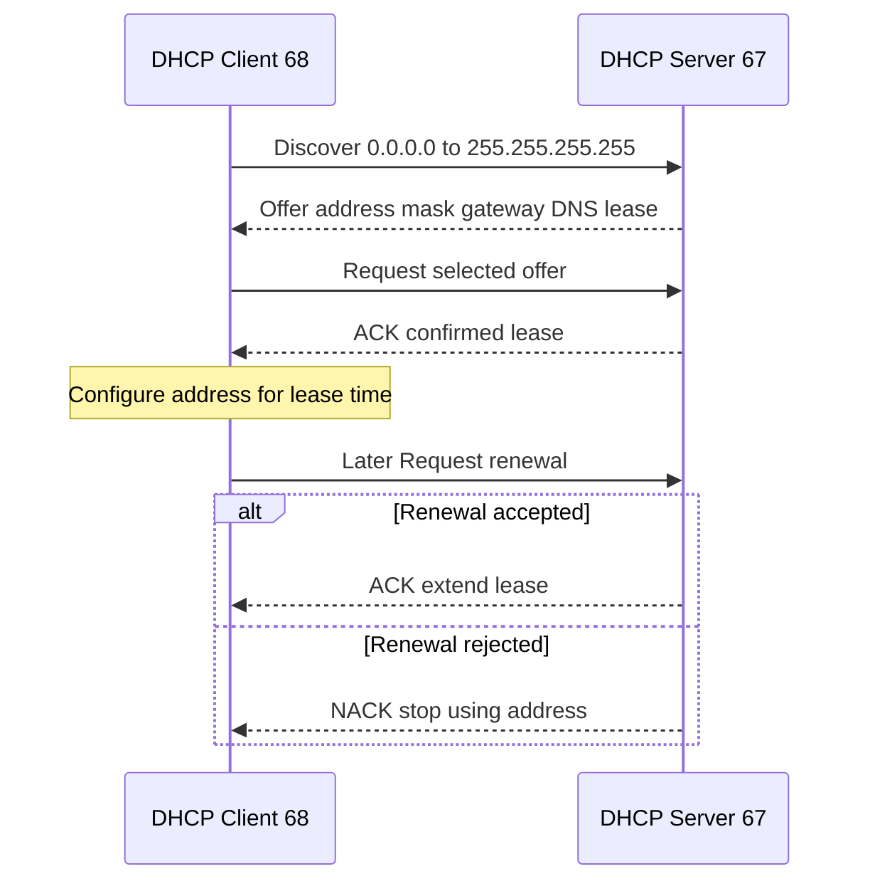
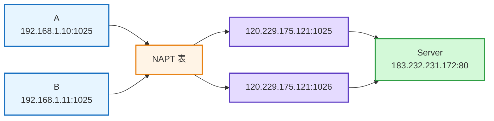
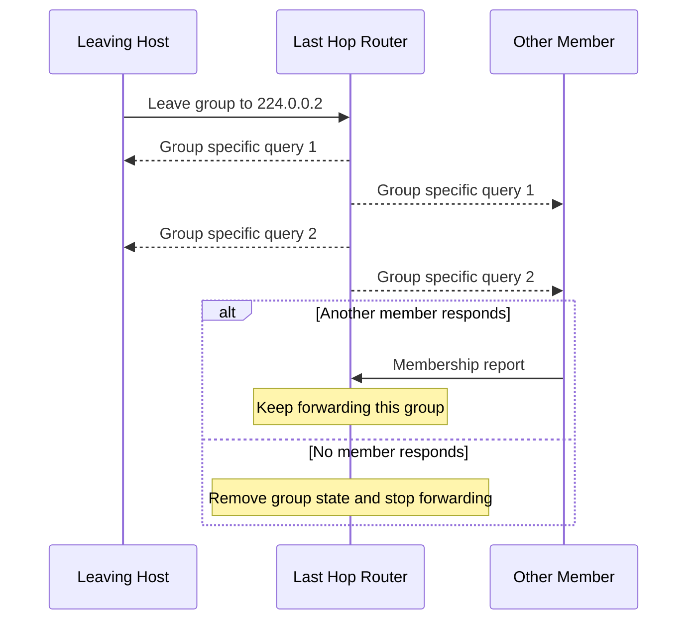
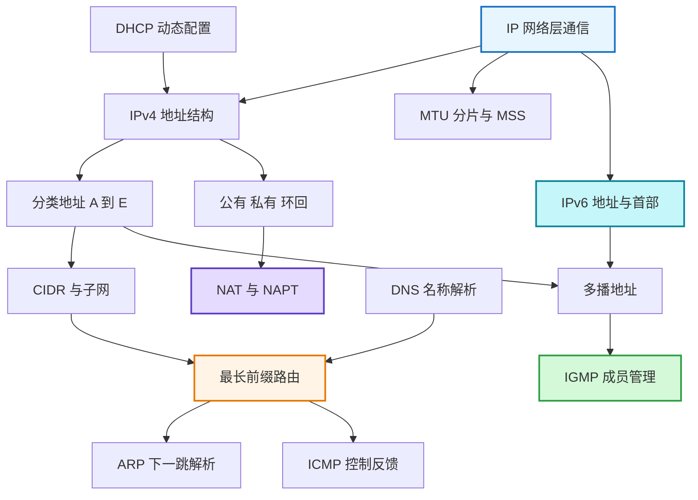

# IP 基础知识全家桶

### 1. Topic Overview

- **What this is about**: 本章从 IP 的网络层职责出发，依次覆盖 IPv4 地址结构、分类地址、CIDR 与子网、公私网、路由、分片、IPv6，以及 DNS、ARP/RARP、DHCP、NAT/NAPT、ICMP、IGMP。
- **Why it matters**: IP 是把“最终要到哪台主机”变成“这一跳先交给谁”的核心层。地址计算、路由选择和配套协议共同决定一台刚入网的主机能否获得配置、解析域名、找到下一跳并跨网段通信。
- **Difficulty level**: 中高。难点不在名词本身，而在同时守住四组边界：`最终目标 vs 当前下一跳`、`网络号 vs 主机号`、`主机自己的 IP vs 组播目标地址`、`地址分配/解析/转发/诊断各由哪个协议负责`。
- **Prerequisites**: 二进制与按位 AND；数据链路层帧和 MAC 地址；路由器连接多个网络；TCP/UDP 端口的基本作用。
- **Source order**: `IP 基本认识 -> IPv4 地址基础 -> 分类地址 -> CIDR/子网 -> 公私网 -> 路由 -> 分片 -> IPv6 -> DNS -> ARP/RARP -> DHCP -> NAT/NAPT -> ICMP -> IGMP -> 读者问答`。
- **Source fidelity**: 已完整读取 `materials/network/4_ip/ip_base.md` 的 697 行正文，并逐张核对文中 46 个图片引用。正文没有展开的分类范围、私网范围、`/26` 子网表、IPv6 地址类型、首部字段和 ICMP 类型已从原图恢复到笔记。
- **Visual-needs scan**: “IP 与 MAC 的逐跳协作”“CIDR 地址计算”“最长前缀匹配”“DNS 查询”“DHCP DORA”“NAPT 映射”“IGMP 查询与离组”存在明显的层次、时序或状态关系，已在对应位置用 Mermaid 压缩；简单范围表不重复画图。
- **Source boundary**: 本笔记忠实覆盖原文，同时会标出会影响推理的简化。比如：无 NAT 时端到端 IP 通常保持不变；IPv6 支持安全机制不代表通信自动安全；DHCP 并非所有阶段在所有实现中都只能广播。

### 2. Core Concepts

#### 2.1 Schema: 用“最终行程 + 当前车票”区分 IP 与 MAC

- **Definition**:
  - IP 位于 TCP/IP 模型的网络层，负责主机到主机的端到端通信和跨网络定位。
  - MAC 位于数据链路层，负责同一条链路上相邻设备之间的一跳交付。
- **Intuition**: IP 像整段旅行的行程表，写最终从哪里到哪里；MAC 像当前交通区间的车票，只负责这一段从当前节点交给下一节点。只拿行程表不能上车，只拿一张车票也不知道完整目的地。
- **Example**: 主机 A 经 R1、R2 到主机 B。每一跳都要重新封装链路层帧，所以源/目标 MAC 随当前链路改变；IP 包仍以 A 为源、B 为目标。
- **Boundary**: “IP 不变、MAC 逐跳变”适用于没有地址转换等改写时的普通转发。NAT 会改写 IP/端口；隧道还可能额外套一层 IP 首部。

#### Visual Model: 最终目标和当前下一跳分别写在哪里？



- **How to read**: 横向看外层帧的目标 MAC 每跳变化；虚线看同一个内层 IP 包始终描述最终端点。
- **Source anchor**: `ip_base.md`，`前菜 —— IP 基本认识`，原图 2、3。
- **Common mistakes**: 把路由器下一跳写进最终目标 IP；认为跨网段只靠 MAC；忘记 NAT 是“IP 始终不变”的例外。

#### 2.2 Schema: 把 IPv4 地址读成“32 位接口标识 + 网络/主机两部分”

- **Representation**: IPv4 是 32 位正整数；人类把它每 8 位分一组，写成四个十进制数，例如二进制 `11000000.10101000.00000001.00000001` 写作 `192.168.1.1`。
- **Address-space size**: 共有 `2^32 = 4,294,967,296` 个比特组合，约 43 亿。它不是 43 亿台可直接使用的主机数，因为地址还要划分网络/主机部分，并存在保留与特殊地址。
- **配置对象**: IP 更准确地绑定到网络接口/逻辑接口，而不是“一台机器只能有一个”。一台主机可以有多个 IP；路由器通常有多个接口和多个 IP；同一网卡也能配置多个 IP。
- **核心拆分**: IP 地址由网络号和主机号组成。网络号标识所在网络，是路由聚合与匹配的依据；主机号标识该网络内的接口。
- **Why NAT appears later**: IPv4 数量有限，而私有网络可以复用同一组私网地址；NAT/NAPT 让大量内部接口共享少量公网地址。
- **Common mistakes**: 把 IPv4 地址数等同于可联网设备数；认为 IP 天生属于整台主机且只能有一个；只会点分十进制而不知道底层仍按位处理。

#### 2.3 Schema: 用前导位读分类地址，再用主机位判断特殊地址

分类地址按开头比特固定网络号和主机号边界：

| 类别 | 前导位 | 网络号位数 | 主机号位数/用途 | 源图给出的范围 | 每个网络最大主机数 |
| --- | --- | ---: | ---: | --- | ---: |
| A | `0` | 7 | 24 | `0.0.0.0 ~ 127.255.255.255` | `2^24-2 = 16,777,214` |
| B | `10` | 14 | 16 | `128.0.0.0 ~ 191.255.255.255` | `2^16-2 = 65,534` |
| C | `110` | 21 | 8 | `192.0.0.0 ~ 223.255.255.255` | `2^8-2 = 254` |
| D | `1110` | 无主机号 | 28 位组编号，用于多播 | `224.0.0.0 ~ 239.255.255.255` | 不分配给普通主机接口 |
| E | `1111` | 无主机号 | 预留 | `240.0.0.0 ~ 255.255.255.255` | 不分配给普通主机接口 |

- **最大主机数为何减 2**: 在原文采用的传统子网模型中，主机号全 0 表示网络地址，主机号全 1 表示该网络的广播地址，因此不能当普通主机地址分配。
- **网络地址例**: `192.168.1.0/24` 的主机位全 0，标识网络本身。
- **广播地址例**: `172.20.0.0/16` 把 16 位主机部分全置 1，得到 `172.20.255.255`。
- **本地广播**: `192.168.0.255/24` 发给本链路所有主机，路由器通常不把它转到其他链路。
- **直接广播**: 向远端网络的广播地址发送，例如从别的网段发向 `192.168.1.255/24`；路由器若允许，会把它交付给 `192.168.1.0/24` 的所有主机。因安全风险，多数路由器默认不转发。
- **多播 vs 广播**:
  - 广播面向链路上的所有主机。
  - 多播只面向加入特定组的主机，路由器可在组播路由支持下复制并跨网段转发。
  - D 类地址细分：`224.0.0.0 ~ 224.0.0.255` 为链路本地预留组播；`224.0.1.0 ~ 238.255.255.255` 为用户可用组播；`239.0.0.0 ~ 239.255.255.255` 为本地管理组播。
- **分类地址优点**: 看前导位就能快速确定固定边界，结构简单，早期选路方便。
- **分类地址缺点**:
  - 同一网络内部缺少进一步的地址层次，不能灵活区分生产、测试、开发等子网。
  - 规模僵硬：C 类 254 个主机位常常太少，B 类 65,534 个又常常太多，造成浪费。
- **Source boundary**: 表格复现源图的“类别总范围”，其中包含一些保留或特殊用途地址；它不等于每个地址都能作为普通公网主机地址。`-2` 也是原文的传统模型，特殊前缀另有例外。
- **Common mistakes**: 把 D 类地址配置给一台主机；把广播和多播都理解成“所有互联网主机”；只背十进制范围，不知道分类由前导位决定。

#### 2.4 Schema: 用 CIDR 前缀一次算出网络、广播和可用主机范围

- **Definition**: CIDR 不再依赖 A/B/C 的固定边界，而把任意 IPv4 地址写成 `a.b.c.d/x`；前 `x` 位是网络号，后 `32-x` 位是主机号，`x` 可为 `0~32`。
- **子网掩码**: 前缀位对应连续的 1，主机位对应连续的 0。`IP AND 子网掩码 = 网络地址`。
- **Example 1**: `10.100.122.2/24`：
  - 掩码：`255.255.255.0`
  - 网络地址：`10.100.122.0`
  - 广播地址：`10.100.122.255`
  - 源图给出的可用范围：`10.100.122.1 ~ 10.100.122.254`，共 254 个。
- **为什么要分离网络号/主机号**: 主机先比较网络地址，判断目标是否处于同一广播域；同网可直接交付，异网交给路由器。路由器也按目标的网络前缀选路。
- **子网划分的本质**: 从原主机位中“借位”作为子网号，即 `原网络号 + 子网号 + 子网主机号`。
- **Example 2：把 `192.168.1.0/24` 划为 `/26`**:
  - 掩码 `255.255.255.192`，最后一个字节为 `11000000`。
  - 从 8 个主机位借 2 位作为子网号，得到 `2^2=4` 个子网；每个子网剩 6 个主机位，传统模型下可用 `2^6-2=62` 个地址。

| 子网号 | 网络地址 | 可用主机范围 | 广播地址 |
| --- | --- | --- | --- |
| `00` | `192.168.1.0` | `192.168.1.1 ~ 192.168.1.62` | `192.168.1.63` |
| `01` | `192.168.1.64` | `192.168.1.65 ~ 192.168.1.126` | `192.168.1.127` |
| `10` | `192.168.1.128` | `192.168.1.129 ~ 192.168.1.190` | `192.168.1.191` |
| `11` | `192.168.1.192` | `192.168.1.193 ~ 192.168.1.254` | `192.168.1.255` |

#### Visual Model: 看到 CIDR 后按什么顺序计算？


- **How to read**: 先确定边界，再谈主机范围；不要靠“看起来前三段相同”猜子网。
- **Source anchor**: `ip_base.md`，`无分类地址 CIDR`，原图 15~21。
- **Common mistakes**: 把 `/26` 当 26 个主机位；把掩码与 IP 做 OR；忘记块大小为 `256-192=64`；把 `192.168.1.128` 当普通主机地址。

#### 2.5 Schema: 用作用域区分公有、私有和环回地址

- **私有 IPv4 范围**（来自原图 22）：
  - `10.0.0.0 ~ 10.255.255.255`，即 `10.0.0.0/8`。
  - `172.16.0.0 ~ 172.31.255.255`，即 `172.16.0.0/12`。
  - `192.168.0.0 ~ 192.168.255.255`，即 `192.168.0.0/16`。
- **私有地址**: 组织内部自行管理，可在不同私网重复使用；若要访问公网，通常经 NAT/NAPT 转换。
- **公有地址**: 在互联网路由范围内要求全局唯一。原文给出的管理链为 `ICANN -> IANA -> 区域互联网注册机构`：ARIN、LACNIC、RIPE NCC、AfriNIC、APNIC；中国由 CNNIC 管理相关分配。
- **环回地址**: 原文重点给出 `127.0.0.1` 和主机名 `localhost`，用于同一台机器的程序间网络通信，数据包不流向物理网络。
- **Common mistakes**: 把 `172.x.x.x` 全部看作私网；认为私网地址在全球必须唯一；认为访问 `127.0.0.1` 会发到网关。

#### 2.6 Schema: 每一跳都对目标 IP 做最长前缀匹配

- **路由表内容**: 目标网络前缀，以及匹配后该交给哪个下一跳/哪个出接口。主机和路由器都维护自己的路由表。
- **查表对象**: 看 IP 首部的最终目标地址，而不是当前帧的目标 MAC。
- **最长匹配**: 多条路由都能匹配时，选择相同前缀位数最多、范围最具体的一条。
- **源图执行流**:
  1. 主机 A：源 `10.1.1.30`，目标 `10.1.2.10`。主机表无更具体匹配，使用默认路由 `0.0.0.0/0 -> 10.1.1.1`，交给 R1。
  2. R1 匹配 `10.1.2.0/24`，下一跳为 R2 的 `10.1.0.2`。
  3. R2 发现 `10.1.2.0/24` 直连，从 `10.1.2.1` 接口发出，经交换机到目标主机。
- **默认路由**: `/0` 匹配所有目标，但因为前缀最短，只在没有更具体匹配时兜底。

#### Visual Model: 最长前缀匹配为什么选更具体的路由？



- **How to read**: “能匹配”只是候选条件；最终胜者由最长前缀决定。
- **Source anchor**: `ip_base.md`，`IP 地址与路由控制`，原图 25。
- **Common mistakes**: 一看到默认路由就停止；按下一跳 IP 而不是最终目标 IP 查表；把“最长匹配”误解成十进制字符串最长。

#### 2.7 Schema: 先用 MTU 判断会不会 IP 分片，再用 MSS 尽量避免它

- **MTU**: 每种数据链路允许承载的最大 IP 包大小不同。源文示例：FDDI 为 4352 字节，常见以太网为 1500 字节。
- **IPv4 分片**: IP 数据报大于下一条链路 MTU 时，可能被拆成多个 IP 分片。源图用 4000 字节数据报经 1500 字节 MTU 链路拆成 3 片示意。
- **重组位置**: 分片只在最终目标主机重组，中间路由器不会重组。
- **代价**: 任一分片丢失，原始 IP 数据报就无法完整重组，整份数据报作废。
- **TCP 的应对**: TCP 用 MSS 限制单个 TCP 段的数据载荷，先在传输层分段，尽量让加上 IP/TCP 首部后的包不超过 MTU，避免 IPv4 再分片。
- **UDP 的应对**: 源文建议尽量避免发送大于路径 MTU 的 UDP 数据报。
- **Boundary**: TCP 做的是“分段”而非 IP “分片”；两者的编号、重传与重组层次不同。
- **Common mistakes**: 认为每个路由器收到所有分片后再重组；把 MTU 当 TCP 载荷上限；认为丢一个分片只损失那一小块且上层不受影响。

#### 2.8 Schema: 用“更大地址 + 固定基础首部 + 端系统处理扩展”理解 IPv6

- **地址长度**: IPv4 为 32 位，IPv6 为 128 位。IPv6 每 16 位一组，共 8 组，用十六进制和冒号表示。
- **压缩写法**: 连续的全 0 组可用 `::` 省略，但一个地址里只能使用一次，否则无法唯一还原。例如原图把中间连续 0 压成 `FEDC:BA98:7654::3210`。
- **IPv6 地址类型**:
  - 未指定地址：`::/128`。
  - 环回地址：`::1/128`。
  - 唯一本地地址：`FC00::/7`，类似 IPv4 私网作用域。
  - 链路本地单播：`FE80::/10`，只用于同一链路，不经路由器。
  - 多播地址：`FF00::/8`。
  - 全局单播：源图归为“其他”，用于互联网一对一通信。
  - 任播：同一地址由多个节点提供，路由协议把包送到度量上最近的节点。
  - IPv6 没有广播地址，以多播等机制替代。
- **源文列出的亮点**:
  - 可自动配置，即使没有 DHCP 服务器也能获得地址。
  - 基础首部固定 40 字节，取消首部校验和，减轻逐跳处理负担。
  - 支持防地址伪造、线路窃听相关的安全能力。
- **IPv4 与 IPv6 基础首部对比**:
  - IPv4 图中字段：Version、IHL、TOS、Total Length、Identification、Flags、Fragment Offset、TTL、Protocol、Header Checksum、源/目标地址、Options/Padding。
  - IPv6 基础首部字段：Version、Traffic Class、Flow Label、Payload Length、Next Header、Hop Limit、源/目标地址。
  - 取消 IPv4 首部校验和；分片相关字段不在基础首部，中间路由器不做 IPv6 分片；选项移出固定基础首部，由 `Next Header` 指向扩展首部。
  - 名称/位置变化：TTL 对应 Hop Limit，Protocol 对应 Next Header，TOS 对应 Traffic Class；IPv6 新增 Flow Label。
- **兼容性边界**: IPv4 和 IPv6 不能直接互相理解，设备与运营商网络都需升级或使用过渡机制，这是普及较慢的原因之一。
- **Security boundary**: IPv6 的协议设计支持安全扩展，不等于所有 IPv6 流量自动加密、认证或不可伪造；是否安全仍取决于实际部署与配置。
- **Fragmentation boundary**: IPv6 中间路由器不分片；需要分片时由源主机处理，最终目标重组。
- **Common mistakes**: 在一个 IPv6 地址中写两次 `::`；认为 IPv6 仍用广播；认为固定 40 字节意味着没有扩展首部；认为使用 IPv6 就自动加密。

#### 2.9 Schema: 把 DNS 解析看成“缓存短路，否则逐级问路”

- **Goal**: 把人类可记的域名转换为 IP 地址。
- **域名层级**: 点分隔层次，越靠右层级越高。以 `www.server.com` 为例：根域 -> `.com` 顶级域 -> `server.com` 权威域；权威 DNS 是该域名数据的原始管理者。
- **本地短路顺序**: 浏览器缓存 -> 操作系统缓存 -> 本机 `hosts` 文件 -> 本地 DNS 服务器。
- **本地 DNS 缓存**: 如果本地 DNS 已有结果，直接返回，不必走完整层级。
- **完整查询主线**:
  1. 客户端问本地 DNS：`www.server.com` 的 IP 是什么。
  2. 本地 DNS 问根 DNS；根不直接给最终 IP，而指向 `.com` 顶级域服务器。
  3. 本地 DNS 问 `.com`；顶级域服务器指向 `server.com` 权威 DNS。
  4. 本地 DNS 问权威 DNS；权威 DNS 返回最终 IP。
  5. 本地 DNS 把结果交给客户端，客户端再与目标建立连接。
- **Intuition**: 根和顶级域通常“只指路不带路”；本地 DNS 代表客户端沿层级迭代查询。

#### Visual Model: DNS 缓存未命中时，谁在逐级问路？



- **How to read**: 客户端只把请求交给本地 DNS；逐级访问根、顶级域、权威 DNS 的是本地 DNS。
- **Source anchor**: `ip_base.md`，`DNS`，原图 32、33。
- **Common mistakes**: 认为根 DNS 保存所有域名最终 IP；忘记缓存/hosts 能提前结束；把层级左右方向读反。

#### 2.10 Schema: 路由先选下一跳 IP，ARP 再补当前链路的 MAC

- **Trigger**: 路由表已经告诉主机“下一跳 IP 是谁”，但数据链路层仍缺少目标 MAC。
- **ARP 工作流**:
  1. 主机在同一链路广播 ARP 请求：“哪个接口拥有目标 IP？”
  2. 链路上所有设备都能看到请求，只有 IP 匹配者把自己的 MAC 放入 ARP 响应返回。
  3. 操作系统缓存 `IP -> MAC` 映射，后续可直接使用；缓存有期限，到期清除或刷新。
- **关键边界**: 跨网段发送时，ARP 查询的是“下一跳路由器的 IP 对应 MAC”，不是远端最终主机的 MAC。ARP 广播本身不跨路由器。
- **RARP**: 方向相反，已知 MAC 向 RARP 服务器求 IP。源文以打印机服务器等嵌入式设备为例：设备广播自己的 MAC，服务器按预先登记的映射返回 IP。
- **Historical boundary**: RARP 是原文覆盖的相关协议；现代动态配置主线是后面的 DHCP。
- **Common mistakes**: 拿 DNS 求 MAC；跨网段时 ARP 远端服务器；认为 ARP 缓存永不过期；把 ARP 和 RARP 的方向说反。

#### 2.11 Schema: 用 DORA 建立 DHCP 租约，再用中继跨广播域

- **端口与传输**: DHCP 使用 UDP；客户端监听 68，服务器监听 67。
- **DORA 四步**:
  1. **Discover**: 客户端尚无 IP，也不知道服务器地址，源 `0.0.0.0:68`，目标 `255.255.255.255:67`，广播寻找服务器。
  2. **Offer**: 服务器提供可租 IP、子网掩码、默认网关、DNS 服务器和租期；源图以广播回客户端。
  3. **Request**: 客户端从一个或多个 Offer 中选择一个，广播 Request，回显接受的 IP、租期和服务器标识，使所有服务器知道选择结果。
  4. **ACK**: 被选服务器确认配置，客户端在租期内使用该 IP。
- **续租**: 租约临近到期时客户端发送 DHCP Request；服务器同意回 ACK 并延长租期，不同意回 NACK，客户端停止使用旧租约。
- **为什么需要中继**: 广播通常不被路由器跨网段转发。DHCP 中继在客户端链路接收广播，再把请求以单播送给远端 DHCP 服务器；服务器回复中继，中继再在本地链路交付给客户端，从而让一个服务器统一管理多个网段。

#### Visual Model: DORA 如何把“无地址客户端”变成“有租约主机”？



- **How to read**: 前四条是获得租约；后两条是租约生命周期，不应混进首次 DORA 的缩写。
- **Source anchor**: `ip_base.md`，`DHCP`，原图 36、37。
- **Boundary**: 原文概括“全程 UDP 广播”，其图示的首次 DORA 也是广播；但同章中继到服务器一段明确是单播，续租等阶段也可能按实现/状态使用单播。应记机制原因，不背成“任何 DHCP 包永远只能广播”。
- **Common mistakes**: 对调 67/68；认为 Discover 能以自己的正式 IP 为源；漏掉客户端从多个 Offer 中做选择；认为跨网段必须每段部署一台 DHCP 服务器。

#### 2.12 Schema: 用五元组映射理解 NAPT 如何共享一个公网 IP

- **NAT**: 私网主机对外通信时，边界设备改写 IP 首部中的私有源地址为公有地址；返回方向再按转换表恢复内部目标地址。
- **普通一对一 NAT 的限制**: 若 N 个内部地址同时需要 N 个公网地址，节省有限。
- **NAPT**: 同时转换 IP 和 TCP/UDP 端口，让多个连接共享一个公网 IP。
- **源图例**:
  - `192.168.1.10:1025 -> 183.232.231.172:80` 映射为 `120.229.175.121:1025 -> 183.232.231.172:80`。
  - `192.168.1.11:1025 -> 183.232.231.172:80` 映射为 `120.229.175.121:1026 -> 183.232.231.172:80`。
  - 两台内部主机即使使用相同本地端口，公网侧也可用不同端口区分。
- **映射表生命周期**: 源文以 TCP 为例说首次 SYN 建表，连接关闭确认后删表；准确实现还会结合连接状态与超时，不能把单个 FIN 当成所有设备的唯一删除条件。
- **缺点**:
  - 外部通常无法在没有既存/静态映射时主动连接内部服务。
  - 维护和执行转换表有性能开销。
  - NAT 设备重启会丢失状态，依赖映射的 TCP 连接会中断/重置。
- **两类缓解方向**:
  - 使用 IPv6，让设备拥有充足的全局地址，减少地址共享需求。
  - NAT 穿透：内部应用主动发现 NAT 外部地址并协调建立端口映射，使外部流量能通过已有映射抵达。

#### Visual Model: NAPT 为什么能区分两个相同内网端口？



- **How to read**: 回包不是只凭公网 IP 判断内部主机，而是查公网侧端口对应的映射行。
- **Source anchor**: `ip_base.md`，`NAT`，原图 38、39。
- **Boundary**: NAT 穿透不会让 NAT“完全不再转换”；它主要是主动协商/建立可用映射。原文最后一句把这点说得过于绝对。
- **Common mistakes**: 认为 NAT 只替换一次地址而无需状态；认为同一公网 IP 的同一端口可无条件同时映射给多个完全相同的外部流；认为 NAT 后的服务器天然能接收任意外部主动连接。

#### 2.13 Schema: 把 ICMP 当成 IP 的反馈/诊断通道，而不是数据传输替代品

- **Meaning**: ICMP 是 Internet Control Message Protocol，负责传递 IP 交付过程中的控制、诊断和差错信息。
- **主要功能**: 确认/诊断目标是否可达、报告 IP 包被丢弃的原因、帮助改善网络设置。
- **封装关系**: ICMP 报文由 IP 承载，也要按普通 IP 路由返回源主机。
- **源图例**: 主机 A 发往主机 B；R2 多次 ARP 仍找不到已关机的 B，于是给 A 返回 ICMP 目标不可达。A 解析 ICMP 首部和数据域，知道失败原因。
- **两大类**:
  - 查询报文：用于诊断，例如类型 8 Echo Request、类型 0 Echo Reply。
  - 差错报文：报告失败，例如类型 3 Destination Unreachable、类型 4 Source Quench、类型 5 Redirect、类型 11 Time Exceeded。
- **Source boundary**: 上述类型表按原图完整收录；某些历史类型在现代网络中的状态与部署细节不在本章范围内。
- **Common mistakes**: 把 ICMP 说成“保证 IP 一定送达”；认为 ICMP 不需要 IP；看到目的不可达就断言一定是远端主机本身故障，而不检查返回者和具体代码。

#### 2.14 Schema: 用 IGMP 管“这个链路是否还有组员”，不改主机自己的 IP

- **IGMP 与 ICMP 无关**: 名字相近，但职责不同。IGMP 是 Internet Group Management Protocol，用于 IPv4 组播成员管理。
- **工作边界**: IGMP 工作在组播成员主机与最后一跳路由器之间；更上游路由器间如何构造组播树属于组播路由协议，不是 IGMP。
- **封装**: IGMP 由 IP 封装，IP 协议号为 2；TTL 通常为 1，因为只在主机和直连路由器之间交换。
- **加入含义**: 主机通过 socket 接口加入某个组播组。路由器记录该链路对该组有成员，之后才需要把该组流量复制到这条链路。
- **IGMPv2 常规查询与响应**:
  1. 路由器周期性向 `224.0.0.1` 发送常规查询；该地址代表本链路所有主机和路由器。
  2. 组成员启动随机 `0~10` 秒报告延迟计时器。
  3. 若计时器到期，主机向组播组地址发送成员关系报告；若此前听到同组其他主机报告，自己抑制发送，减少冗余。
  4. 路由器收到报告，在本链路保留该组成员状态并继续转发该组流量。
- **IGMPv2 离组**:
  1. 离开者向 `224.0.0.2`（本链路所有路由器）发送离组报文。
  2. 路由器以 1 秒间隔连续发送 2 次特定组查询。
  3. 若其他成员响应，继续向该链路转发；若无人响应，超时后删除该链路的组状态并停止转发。

#### Visual Model: 一台主机离组后，路由器为什么不能立刻停止转发？



- **How to read**: 离组报文只证明“这一台要走”，不能证明“整个链路没人了”；特定组查询是在检查剩余成员。
- **Source anchor**: `ip_base.md`，`IGMP`，原图 42~45。
- **读者问答边界**:
  - 主机加入组播组时，不把自己的单播 IP 改成 D 类组播地址。
  - 发送 UDP 组播时，目标 IP 填组播地址；加入该组的主机可以接收。
  - 加入/离开由 socket 接口控制，与重新跑 DHCP 无关，主机原 IP 不变。
- **Common mistakes**: 把组播地址当某台主机的接口地址；认为离组必须释放 DHCP 租约；认为一台主机离开就代表整个 LAN 已无成员；把 IGMP 当跨互联网组播路由协议。

### 3. Deep Understanding

#### 3.1 一台刚接入网络的主机如何完成一次跨网访问

1. **DHCP 配置身份与环境**: 获得自己的 IP/前缀、默认网关、DNS 服务器和租期。
2. **DNS 找最终目标**: 把域名解析为目标 IP。
3. **CIDR 判断同网/异网**: 本机 IP 与目标 IP 分别和掩码 AND；若网络地址不同，选择默认网关。
4. **路由决定下一跳 IP**: 主机和沿途路由器每跳都对最终目标 IP 做最长前缀匹配。
5. **ARP 补出下一跳 MAC**: 在当前链路把下一跳 IP 解析成 MAC，构造当前一跳的帧。
6. **逐跳转发**: 每个路由器拆旧帧、保留/处理 IP 包、查本地路由、重新封装新帧。
7. **可能发生地址转换与控制反馈**: 私网出口经 NAPT 改写地址/端口；若无法交付，路由器或主机可能返回 ICMP。

#### 3.2 四组最容易混淆的职责边界

| 问题 | 主要机制 | 它回答什么 | 它不负责什么 |
| --- | --- | --- | --- |
| 最终去哪 | IP 地址与路由 | 目标主机和下一跳路径 | 当前链路的具体 MAC |
| 当前一跳交给谁 | ARP + MAC | 下一跳 IP 对应的链路地址 | 域名解析或跨网选路 |
| 我是谁、网关/DNS 是谁 | DHCP | 动态配置与租期 | 把域名解析成目标 IP |
| 域名对应谁 | DNS | 名称到 IP | IP 到 MAC |
| 多个内网连接如何共享公网地址 | NAPT | 地址和端口状态映射 | 提供端到端透明性 |
| 为什么 IP 包失败 | ICMP | 诊断/差错反馈 | 保证重传和可靠交付 |
| 这条链路是否还有组播成员 | IGMP | 主机与最后一跳路由器的成员状态 | 路由器间组播树构建 |

#### 3.3 原文中三个需要加条件的绝对句

- **“源/目标 IP 传输中不变”**: 普通无 NAT 转发时成立；NAT、隧道等会改写或增加首部。
- **“DHCP 全程广播”**: 初次获取配置的源图主线使用广播；中继到服务器一段明确为单播，续租也可能出现单播。
- **“IPv6 更安全”**: IPv6 支持安全相关能力，但安全结果仍取决于是否启用加密、认证和正确策略。

### 4. Minimal Working Example

场景：笔记本刚接入 `192.168.1.0/24`，要访问 `www.server.com`；服务器解析为 `183.232.231.172`，家庭出口公网 IP 为 `120.229.175.121`。

1. 笔记本从 `0.0.0.0:68` 广播 DHCP Discover，完成 DORA，获得 `192.168.1.10/24`、默认网关 `192.168.1.1` 和 DNS。
2. 浏览器/系统缓存与 `hosts` 未命中，本地 DNS 逐级问根、`.com`、权威 DNS，得到 `183.232.231.172`。
3. 本机计算：`192.168.1.10 AND /24 = 192.168.1.0`；目标 `183.232.231.172 AND /24` 显然不是本地网络，所以选默认网关。
4. ARP 广播询问 `192.168.1.1` 的 MAC；网关回复后，本机发送：内层目标 IP=`183.232.231.172`，外层目标 MAC=网关 MAC。
5. 网关做最长前缀匹配并建立 NAPT 映射，例如把 `192.168.1.10:1025` 改为 `120.229.175.121:1025`。
6. 沿途每跳换 MAC；除 NAT 改写点外，路由转发仍围绕最终目标 IP。
7. 若某路由器发现目标不可达，ICMP 由 IP 带回客户端；若正常到达，回包由 NAPT 表还原到 `192.168.1.10:1025`。

这个流程把本章压成一条可运行链：

```text
DHCP 给配置
-> DNS 给最终 IP
-> CIDR 判同网/异网
-> 路由给下一跳 IP
-> ARP 给下一跳 MAC
-> NAPT 在私网出口改写连接标识
-> ICMP 在失败时反馈原因
```

### 5. Chapter Knowledge Map



### 6. Self-Test Questions

#### Recall

1. IP 和 MAC 分别描述“最终目标”还是“当前一跳”？跨两个路由器时哪些字段通常不变、哪些逐跳变化？
2. `192.168.1.130/26` 的网络地址、广播地址和可用主机范围是什么？
3. DHCP DORA 四步分别携带或完成什么信息？客户端和服务器端口各是多少？

#### Application / Transfer

4. 路由表同时有 `0.0.0.0/0`、`10.0.0.0/8`、`10.1.2.0/24`，目标 `10.1.2.10` 应选哪条？选完路由后为什么还需要 ARP？
5. 两台内网主机都用本地端口 1025 访问同一个 Web 服务器。请写出 NAPT 至少必须怎样改写，才能让回包不混淆。

#### Explain Like I Am 5

6. 用“整段旅行、每段车票、问路、临时门牌”解释 IP、MAC、DNS 和 NAPT 各自做什么。

### 7. Weak Point Detection

| 典型错误表现 | 对应 schema | 错误类型 | 检查方法 |
| --- | --- | --- | --- |
| 把下一跳路由器写成 IP 最终目标 | IP vs MAC | 边界混淆 | 让学习者分别填写 IP 目标和帧目标 MAC |
| 认为同一网卡只能有一个 IP | IPv4 表示与配置对象 | 概念误解 | 给出路由器多接口/网卡多地址场景 |
| 把 D 类地址分给某台主机 | 分类与组播 | 概念误解 | 追问 D 类地址表示主机还是组 |
| `/26` 被理解成 26 个主机位 | CIDR | 表面记忆 | 让学习者写掩码并算块大小 |
| 把整个 `172.0.0.0/8` 当私网 | 公私地址作用域 | 边界混淆 | 追问私网的准确起止范围 |
| 路由匹配到默认路由后不再比较 | 最长前缀匹配 | 程序混淆 | 给出 `/0`、`/8`、`/24` 三条候选 |
| 认为路由器会重组 IPv4 分片 | MTU/分片/MSS | 层次混淆 | 追问分片重组发生在哪个端点 |
| IPv6 地址写两次 `::` | IPv6 压缩 | 表示混淆 | 要求唯一还原省略的 0 组 |
| DNS 直接求 MAC，ARP 直接求域名 | DNS vs ARP | 职责混淆 | 分别问“名字到 IP”和“下一跳 IP 到 MAC” |
| DHCP 端口、消息方向对调 | DORA | 程序混淆 | 从“客户端还没有 IP”倒推源/目标 |
| 认为 NAT 无需状态或外网可任意主动入站 | NAPT | 机制遗漏 | 追问回包依据哪一条映射返回 |
| 把 ICMP 当可靠重传协议 | ICMP | 概念误解 | 追问它报告问题还是修复丢包 |
| 加入组播时把主机 IP 改成组播地址 | IGMP | 边界混淆 | 追问 socket 加组、目标组播 IP 与 DHCP 的关系 |

### Appendix A. Source Coverage Index

- **前菜：IP 基本认识**: 网络层的主机到主机通信；IP vs MAC；旅行/车票比喻；普通转发中 IP 端点稳定、MAC 逐跳变化。
- **IPv4 基础表示**: 32 位、点分十进制、`2^32`；主机/路由器/网卡可配置多个 IP；网络号与主机号；NAT 缓解地址不足。
- **分类地址**: A/B/C/D/E 前导位、位数、范围、主机数；网络/广播特殊地址；本地广播与直接广播；D 类组播范围及三段细分；分类优缺点。
- **CIDR 与子网**: `/x`、掩码 AND、同网判断、路由依赖网络号；从主机位借位；`192.168.1.0/24 -> /26` 的四个完整子网。
- **公私网**: 三段私网范围；公网唯一性；ICANN/IANA、五个区域机构和 CNNIC；环回 `127.0.0.1/localhost`。
- **路由控制**: 路由表、目标网络、下一跳、最长匹配；主机 A -> 默认路由 -> R1 -> R2 -> 目标网络的源图路径。
- **分片**: 不同链路 MTU、以太网 1500、4000 字节三片示例、只在目标重组、丢一片整报文作废、TCP MSS 与 UDP 大报文建议。
- **IPv6**: 128 位与十六进制、`::` 压缩限制、单播/多播/任播/无广播、三类单播作用域、准确前缀表、固定 40 字节基础首部、校验/分片/选项字段变化。
- **DNS**: 域名右侧层级更高；根/TLD/权威；浏览器/OS/hosts/本地 DNS 缓存；八步逐级查询与“只指路不带路”。
- **ARP/RARP**: 路由先给下一跳 IP；广播请求、目标单机响应、缓存期限；RARP 的 MAC 到 IP 与服务器登记模型。
- **DHCP**: UDP 67/68；Discover/Offer/Request/ACK 的地址、配置与租期；续租 ACK/NACK；中继的本地广播与跨网单播。
- **NAT/NAPT**: 私网到公网改写；端口复用；两个 `:1025` 映射到公网 `:1025/:1026`；映射生成/删除；三类缺点；IPv6 与 NAT 穿透。
- **ICMP**: 控制/诊断职责；目标不可达执行例；IP 封装；查询与差错两类；源图 0/3/4/5/8/11 类型。
- **IGMP 与问答**: 主机到最后一跳路由器、协议号 2、TTL 1；IGMPv1/v2/v3；v2 常规查询/报告抑制；离组两种分支；组播地址不替换主机 IP，也不触发 DHCP。

