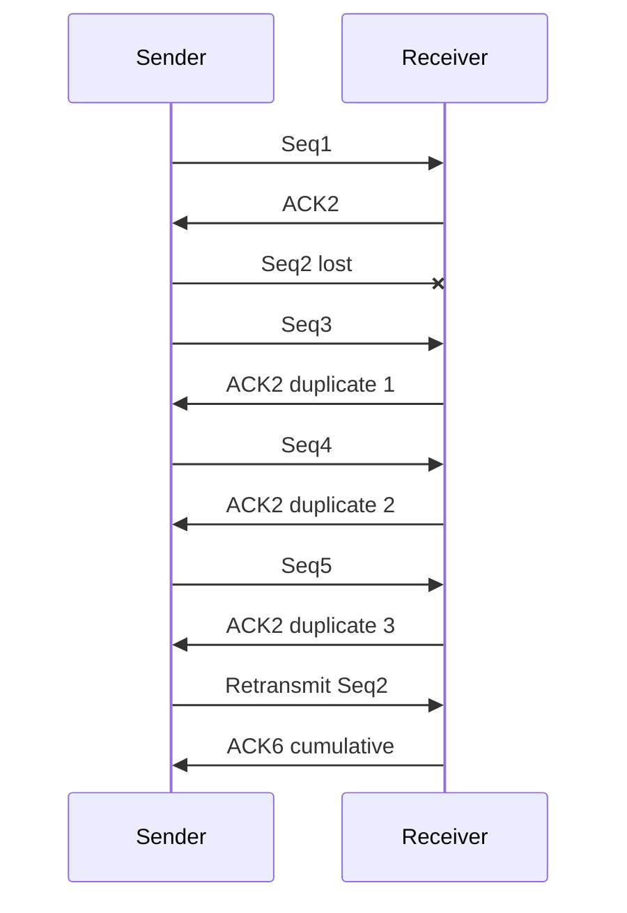
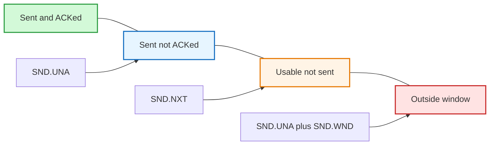
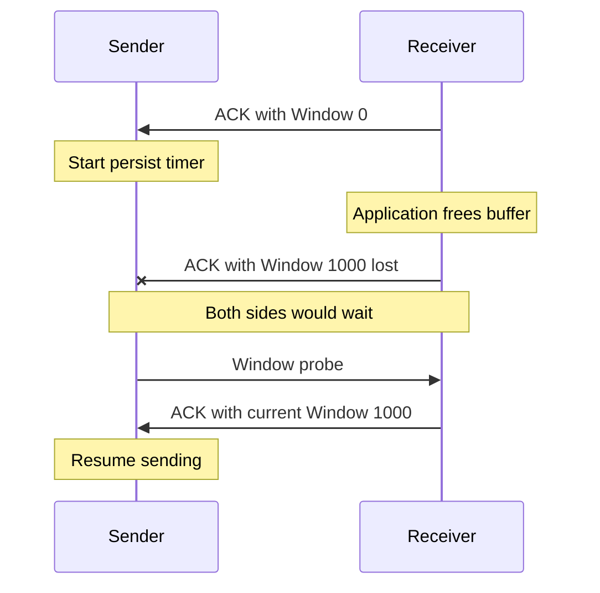
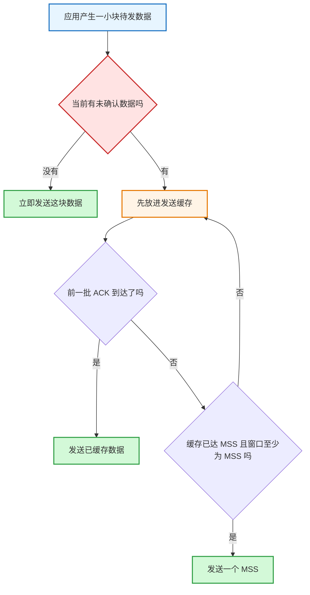
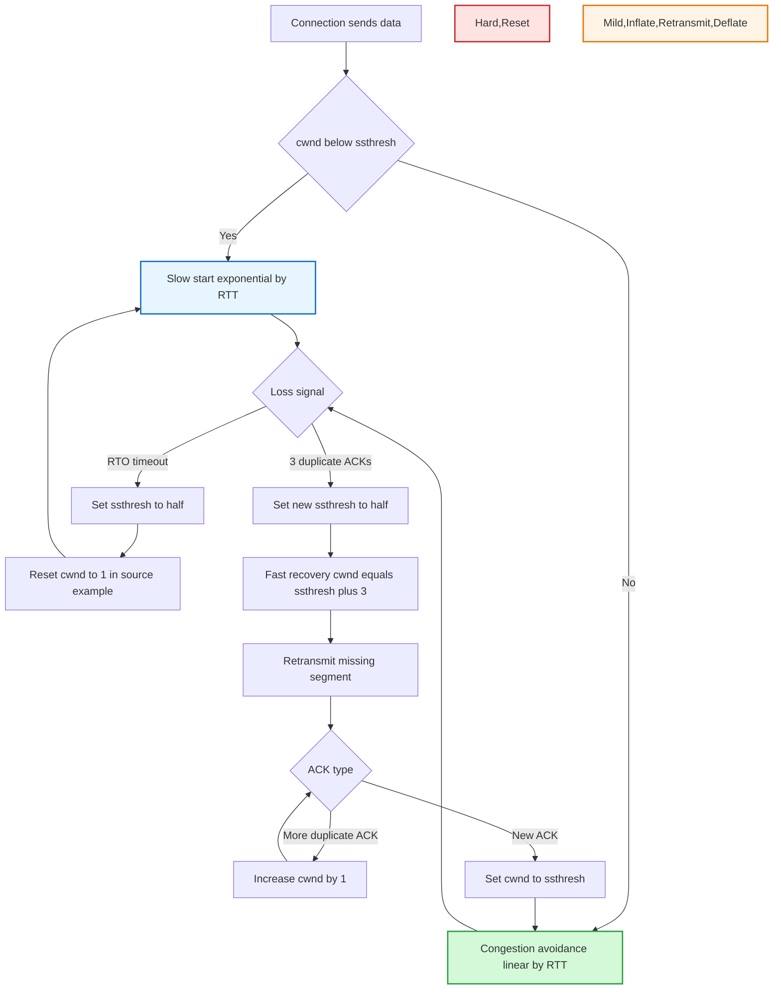
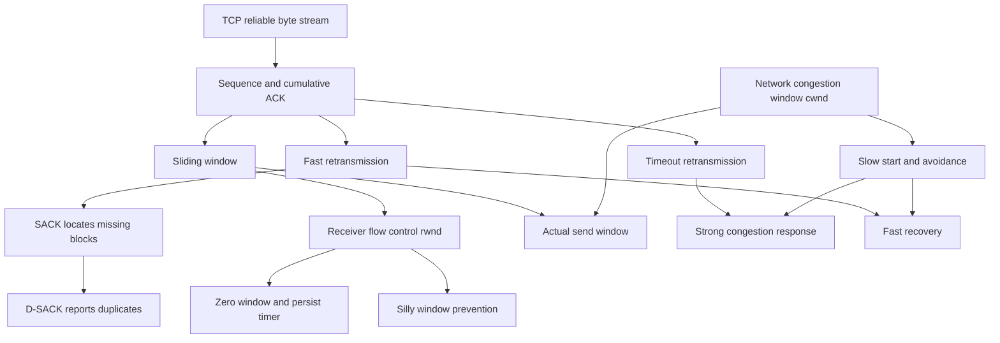

# TCP 可靠传输：重传、滑动窗口、流量控制与拥塞控制

### 1. Topic Overview

- **What this is about**: 本章解释 TCP 怎样在不可靠、时延波动且共享的网络上维持可靠且高效的字节流，按源文顺序覆盖重传机制、滑动窗口、流量控制与拥塞控制。
- **Why it matters**: 四组机制分别回答不同问题：丢了怎样补、怎样让多个段同时在途、怎样不压垮接收端、怎样不压垮网络。面试和排障中最常见的错误，就是把这些反馈信号和窗口混为一谈。
- **Reliability context from the source**: 可靠传输总体要面对数据破坏、丢包、重复与分片顺序混乱。TCP 综合使用序列号、确认应答、重发控制、连接管理和窗口控制；本章集中展开其中的重传、滑动窗口、流量控制和拥塞控制。
- **Difficulty level**: 高。难点是同时跟踪序列号、累计确认、发送/接收窗口、接收缓冲区、`cwnd`、`ssthresh`、RTT 与 RTO，并区分“接收端慢”和“网络拥塞”。
- **Prerequisites**: TCP 是有序可靠字节流；IP 只做尽力而为交付；TCP 序列号按字节编号；`ACK=N` 表示下一次期望收到字节 `N`。
- **Source order**: `重传机制 -> 滑动窗口 -> 流量控制 -> 拥塞控制 -> 读者问答`。笔记保持这一推进顺序，但把零散事实压成可运行的 schema。
- **Visual-needs scan**: “重复 ACK 如何暴露缺口”“发送窗口四区”“零窗口通知丢失后的死锁”“慢启动/拥塞避免与两种丢包分支”适合视觉压缩，已在对应位置加入 Mermaid。
- **Source**: `materials/network/3_tcp/tcp_feature.md`，共 689 行；本文中的数值和 Linux 参数说明以该源文为锚点，具有实现相关性的地方会明确标边界。

### 2. Core Concepts

#### 2.1 Schema: 根据 ACK 反馈判断“何时重传、重传哪些、为何误重传”

- **Definition**: TCP 用序列号标识字节位置，用累计 ACK 报告“从开头到哪里已经连续收到”。当缺口长期未被确认时，发送方通过超时或重复 ACK 触发重传；SACK 和 D-SACK进一步补充缺口与重复接收信息。
- **Intuition**: 普通 ACK 像书签，只告诉发送方“我下一页要第几页”；SACK 像额外列出“后面的哪些散页已经拿到”；D-SACK 则告诉发送方“某一页其实收到了两次”。
- **超时重传**:
  - 发送数据时启动定时器，超过 RTO 仍未收到确认，就重发该数据。
  - 两种触发场景在发送方看来都可能是“没有收到 ACK”：数据段丢失，或数据已到但 ACK 丢失。
- **快速重传**:
  - 它由数据反馈驱动，而不是由时间驱动。
  - 例：`Seq1` 到达后回 `ACK2`；`Seq2` 丢失，而 `Seq3/4/5` 依次到达时仍回 `ACK2`。发送方收到 3 个重复的 `ACK2`，在 RTO 到期前重传 `Seq2`。
  - 当 `Seq2` 补齐，而 `Seq3/4/5` 已缓存时，累计确认可直接前进到 `ACK6`。
- **快速重传的歧义**: 若 `Seq2`、`Seq3` 都丢了，只重传 `Seq2` 会让 `Seq3` 等下一轮重复 ACK；重传 `Seq2` 之后全部数据又会浪费已经收到的 `Seq4/5/6`。普通累计 ACK 本身不能精确描述后续离散块。
- **SACK（Selective Acknowledgment）**:
  - 接收端在 TCP 选项中报告已收到的数据块，发送端由此推断空洞，只重传缺失块。
  - 源文示例中，累计 ACK 配合 SACK 表明只有 `200~299` 丢失，因此只重传这一段。
  - 双方都必须支持；源文给出 Linux `net.ipv4.tcp_sack`，Linux 2.4 后默认开启。
- **D-SACK（Duplicate SACK）**:
  - 复用 SACK 格式报告“哪些数据被重复接收”。当 SACK 块位于累计 ACK 已覆盖的范围内，它表示该块早已收到、现在又来了一份。
  - ACK 丢失示例：累计 `ACK=4000`，却报告 `SACK=3000~3500`，发送方可判断原数据没有丢，之前的 ACK 丢了，超时重传造成重复。
  - 网络延迟示例：原始 `1000~1499` 延迟，3 个重复 ACK 先触发重传；随后延迟的原包到达。累计 ACK 已到 `3000`，再报告 `SACK=1000~1500`，说明两份数据都到过。
  - 它还能暴露网络复制包。源文给出 Linux `net.ipv4.tcp_dsack`，Linux 2.4 后默认开启。

#### Visual Model: 三个重复 ACK 为什么能在 RTO 前触发重传？



- **How to read**: 后续段持续到达，证明连接仍在工作；确认号却卡在 2，说明连续字节流的第一个缺口仍是 `Seq2`。
- **Source anchor**: `tcp_feature.md`，`快速重传`、`SACK 方法`、`Duplicate SACK`。
- **Boundary**: 图按源文把段简写为 `Seq1~Seq5`；真实 TCP 的序列号按字节计算。
- **Common mistakes**:
  - 把 `ACK2` 解释成“已经收到 Seq2”；它实际表示“下一个要 Seq2”。
  - 把快速重传说成“等一个很短的超时”。它根本不以定时器到期为触发条件。
  - 把 SACK 和 D-SACK 混为一件事：SACK 主要定位缺失块，D-SACK 主要报告重复块及误重传线索。

#### 2.2 Schema: 用“平滑时延 + 波动”设置 RTO

- **Definition**: `RTT` 是发送数据到收到对应确认的往返时间；`RTO` 是发送方等待确认后触发超时重传的时间。
- **Tradeoff**:
  - RTO 太大：真正丢包后很久才重传，恢复慢。
  - RTO 太小：未丢的包也可能被误判并重传，增加拥塞；更多拥塞又造成更多超时和重传。
  - 因而直觉目标是 `RTO` 略大于当前路径的 RTT，但不能只看一次样本。
- **为什么必须动态**: RTT 会随排队和路径状况波动。只记录一次 `t1 - t0` 无法代表后续网络，既要平滑中心趋势，也要跟踪偏差。
- **源文图片中的初始化公式**，第一次 RTT 样本为 `R1`：
  - `SRTT = R1`
  - `DevRTT = R1 / 2`
  - `RTO = μ * SRTT + δ * DevRTT`
- **后续样本更新**，最新 RTT 为 `R2`：
  - `SRTT = SRTT + α * (RTT - SRTT)`
  - `DevRTT = (1 - β) * DevRTT + β * |RTT - SRTT|`
  - `RTO = μ * SRTT + δ * DevRTT`
- **源文给出的 Linux 参数**: `α=0.125`、`β=0.25`、`μ=1`、`δ=4`。原文正文把偏差变量误写成 `DevRTR`，图片使用 `DevRTT`；这里按图片统一为 `DevRTT`。原文写 `RFC6289`，常见标准编号为 `RFC 6298`。
- **指数退避**: 一次重传后仍再次超时，下一次 RTO 间隔设为前一次的两倍。连续超时是网络状况不佳的信号，不应高频反复注入更多数据。
- **Common mistakes**: 把 RTO 固定成某个 RTT；只做 RTT 平均而不考虑抖动；超时后仍用相同短间隔不断重发。

#### 2.3 Schema: 把滑动窗口读成“字节状态分区 + 累计确认推进”

- **Definition**: 窗口大小是发送方无需等待新 ACK，仍可继续发送的数据上限。发送方必须把未确认数据保留在操作系统发送缓冲区，确认后才可清除。
- **为什么需要窗口**: 停等协议每发一个段就等一轮 RTT；RTT 越大，链路空闲越久。窗口允许多个段同时在途，提高带宽时延积利用率。
- **累计确认**: 窗口为 3 个段时可连续发送 3 段；即使中间 `ACK600` 丢失，后续 `ACK700` 仍表示 700 之前的连续字节都已收到。
- **窗口由谁告诉谁**: TCP 头部 `Window` 字段由接收端通告剩余接收能力。发送端据此限制自己的发送窗口，避免压垮接收缓冲区。
- **发送方四区**:
  1. 已发送且已确认，例如 `1~31`。
  2. 已发送但未确认，例如 `32~45`。
  3. 未发送但仍在窗口内，可以立即发送，例如 `46~51`。
  4. 未发送且在窗口外，暂不可发送，例如 `52` 以后。
- **三个发送变量**:
  - `SND.UNA`: 最早未确认字节，即区 2 左边界。
  - `SND.NXT`: 下一个将发送的字节，即区 3 左边界。
  - `SND.WND`: 当前发送窗口大小，由接收端通告的窗口约束。
  - 右边界：`SND.UNA + SND.WND`。
  - **可用窗口**：`SND.WND - (SND.NXT - SND.UNA)`。
- **源文数值例**: `SND.UNA=32`、`SND.NXT=46`、`SND.WND=20`，可用窗口为 `20-(46-32)=6`。确认 `32~36` 后，`SND.UNA` 右移 5；若窗口大小不变，右端也右移 5，`52~56` 变为可发送。
- **接收方分区**:
  - 已成功接收并确认、等待应用读取的数据。
  - 尚未收到但窗口内可以接收的数据。
  - 窗口外不能接收的数据。
  - `RCV.NXT` 指向下一期待字节；`RCV.WND` 是通告给发送端的接收窗口；右边界是 `RCV.NXT + RCV.WND`。
- **发送窗口与接收窗口为何只约等于**: 接收应用读取后，真实 `RCV.WND` 可能已经增大，但新通告还在网络中；发送端看到的是略有时延的快照。

#### Visual Model: `SND.UNA`、`SND.NXT` 和窗口右边界怎样切分字节流？



- **How to read**: ACK 推动 `SND.UNA`；真正发送新字节推动 `SND.NXT`；接收端的新窗口通告改变右边界。
- **Source anchor**: `tcp_feature.md`，`发送方的滑动窗口`、`接收方的滑动窗口`。
- **Boundary**: 图只画逻辑边界；真实缓冲区是环形或实现相关的数据结构，不是四块独立数组。
- **Common mistakes**: 认为 ACK 只释放一个段而不能累计推进；混淆 `SND.NXT` 与 `RCV.NXT`；用 `SND.NXT + SND.WND` 计算窗口右边界。

#### 2.4 Schema: 用 `rwnd` 把接收应用速度反馈给发送端

- **Definition**: 流量控制让发送端根据接收端实际处理能力控制在途数据，保护的是接收端缓冲区，而不是整个网络。
- **固定 200 字节窗口的源文执行流**:
  1. 服务端从序号 241 发送 80 字节，`SND.NXT=321`，可用窗口 `200-80=120`；客户端随后期待 321。
  2. 再发送 120 字节，`SND.NXT=441`，可用窗口耗尽。
  3. `ACK321` 到达使 `SND.UNA=321`、可用窗口恢复为 80；`ACK441` 到达又恢复为 200。
  4. 发送 160 字节，`SND.NXT=601`，可用窗口为 40；收到 `ACK601` 后恢复为 200。
- **应用读取慢会收缩窗口**: 初始接收缓冲和窗口为 360。收到 140 字节后应用只读 40，仍占用 100，通告 `rwnd=260`；再收到 180 且应用不读，通告 `rwnd=80`；再收 80 后通告 `rwnd=0`。发送端依次把发送窗口收缩到 260、80、0。
- **操作系统直接缩小接收缓冲区的危险**:
  1. 初始 360，操作系统先把缓冲区减少 120；收到 140 且应用未读后，真实可用空间只剩 100。
  2. 新通告尚未到达发送端，发送端仍按旧可用窗口发送 180；180 大于真实接收窗口 100，接收端只能丢弃。
  3. 旧在途数据存在时强行把发送窗口右边界左移，还可能让发送端计算出负的可用窗口。
- **规避规则**: 不要同时“缩小缓冲区”和“收缩接收窗口”。应先通过窗口通告让在途数据消化、窗口安全收缩，过一段时间再减小实际缓冲区。
- **Common mistakes**: 把流量控制解释成路由器限速；认为窗口永远固定；忘记窗口通告存在传播时延。

#### 2.5 Schema: 用“持续计时器 + 两端抑制小块”处理零窗口与糊涂窗口

- **窗口关闭**: `Window=0` 时，发送方停止发送普通数据，直到窗口重新打开。
- **潜在死锁**: 接收应用处理数据后发出非零窗口通告；若这个 ACK 丢失，发送方等待非零窗口，接收方等待新数据，双方永久互等。
- **持续计时器（persist timer）**:
  - 收到零窗口通知的一方启动持续计时器。
  - 超时后发送窗口探测报文，接收方必须在确认中带回当前窗口。
  - 若仍为 0，重新启动计时器；若非 0，恢复发送。
  - 源文给出“一般探测 3 次、每次约 30~60 秒；部分实现仍为 0 时发 RST”的示例，具体次数和间隔属于实现细节。

#### Visual Model: 非零窗口通告丢失后，持续计时器如何打破死锁？



- **How to read**: 探测不是猜窗口大小，而是强迫接收端重新报告窗口，从而修复“窗口更新 ACK 丢失”的控制信息丢失。
- **Source anchor**: `tcp_feature.md`，`窗口关闭`。
- **Boundary**: 源文未展开窗口探测报文的具体序列号与载荷形式，笔记也不把某一种实现写成唯一规范。
- **糊涂窗口综合症**: 接收端每次只腾出几个字节就通告小窗口，发送端也立即发送几个字节。为几字节数据付出通常 20 字节 TCP 头 + 20 字节 IPv4 头，利用率极差。问题可能由接收端“开小窗口”和发送端“发小数据”共同造成。
- **源文数值轨迹**: 接收窗口初始 360，接收 360 后应用只读三分之一，剩余 240，因此窗口降到 120；下一段到达前再读 40，随后收到 120、只读其中 40，缓冲区累计占用 280，窗口降到 80；下一段前再读 40，收到 80 后只读约三分之一，图中最终缓冲区占用 293、窗口只剩 67。窗口越来越小，发送段也随之越来越碎。
- **前置桥接：MSS 是什么**:
  - `MSS`（Maximum Segment Size）是一个 TCP 段最多承载多少**数据载荷**，不包含 TCP 头和 IP 头。
  - `MTU` 限制整个 IP 包；以常见以太网 `MTU=1500`、IPv4 头 20 字节、TCP 头 20 字节且都无选项为例，`MSS=1500-20-20=1460` 字节。
  - 发送窗口决定一轮允许多少字节在途，MSS 决定这些字节要拆成多少个 TCP 段；MSS 不是整条连接的数据总量上限。
  - TCP 建连时通常通过选项协商 MSS，目的是让 TCP 先按合适大小分段，尽量避免 IP 层再分片。
- **接收端策略**:
  - 当可用窗口 `< min(MSS, 接收缓存/2)` 时，对外通告 0。
  - 等可用窗口 `>= MSS`，或至少有一半接收缓存可用时，再打开窗口。
- **发送端 Nagle 算法**:
  - 若可用窗口 `>= MSS` 且待发数据 `>= MSS`，立即发送一个 MSS。
  - 否则，若还有未确认数据，就先缓存小数据；若没有未确认数据，可立即发送。
  - 等价地说，凑够 MSS 或等前一批数据 ACK 后再发，避免持续产生小段。

#### Visual Model: Nagle 遇到一小块待发数据时，先看哪个状态？



- **How to read**: 第一问只看“有没有尚未收到 ACK 的数据”；没有就可发当前小块，有就先缓存，再等待 ACK 或凑够一个 MSS。
- **Source anchor**: `tcp_feature.md`，`糊涂窗口综合症` 中 Nagle 伪代码。
- **Boundary**: 图只压缩源文中的发送判断，不展开 delayed ACK 等其他实现交互。
- **组合边界**: 只开 Nagle 不保证消除糊涂窗口；若接收端仍频繁通告小窗口且 ACK 很快，Nagle 的 ACK 条件会不断放行小包。接收端抑制小窗口与发送端 Nagle 需要配合。
- **交互应用**: Telnet、SSH 等强调低延迟的小消息交互，常通过 Socket 选项 `TCP_NODELAY` 关闭 Nagle。源文示例：`setsockopt(sock_fd, IPPROTO_TCP, TCP_NODELAY, ...)`；这是每个 Socket 的选择，不是全局开关。
- **Common mistakes**: 把零窗口探测当普通超时重传；把 Nagle 说成接收端算法；只减少小包却完全忽略交互延迟代价。

#### 2.6 Schema: 先定位瓶颈在“接收端”还是“网络”

| 机制 | 要保护什么 | 反馈变量由谁维护/通告 | 典型信号 |
| --- | --- | --- | --- |
| 流量控制 | 接收端缓冲区与应用处理能力 | 接收端通告 `rwnd` | Window 字段变小或为 0 |
| 拥塞控制 | 共享网络中的链路、队列和其他流量 | 发送端维护 `cwnd` | 超时、重复 ACK 等丢包/拥塞迹象 |

- **Definition**: `cwnd` 是发送端根据网络拥塞程度动态维护的拥塞窗口；`rwnd` 是接收端通告的接收窗口。实际发送窗口受两者中更小者约束：`swnd = min(cwnd, rwnd)`。
- **反馈规则**: 网络未显示拥塞时逐步增大 `cwnd`；出现拥塞信号时减小 `cwnd`。源文先用“超时重传”解释拥塞判断，后文再把 3 个重复 ACK 作为较轻的拥塞信号。
- **为什么流量控制不够**: 即使接收端缓冲区很大，共享路径中的路由器队列仍可能被许多主机共同填满。继续重传会增加负担，形成“拥塞 -> 丢包/时延 -> 重传 -> 更拥塞”的正反馈。
- **四个算法角色**: 慢启动负责试探可用容量；拥塞避免负责谨慎增长；拥塞发生规定丢包后的降窗；快速恢复在仍能收到重复 ACK 时避免彻底回到起点。
- **Common mistakes**: 认为 `rwnd` 大就一定可以高速发送；把 `cwnd` 当接收端通告字段；忘记最终发送上限取最小值。

#### 2.7 Schema: 用 `ssthresh` 在指数试探与线性试探之间切换

- **慢启动**:
  - 源文以 MSS 为单位简化：每收到一个 ACK，`cwnd += 1 MSS`。
  - 若一个 RTT 内当前窗口的每个段都被确认，`cwnd` 约从 `1 -> 2 -> 4 -> 8`，表现为按轮次指数增长；“慢”指从小窗口起步，不是增长曲线慢。
  - 源文教学例从 `cwnd=1` 开始，同时补充现代 Linux 每条新 TCP 连接常见初始值为 10 MSS，可用 `ss -nli` 观察。教学数值不等于所有系统固定实现。
- **慢启动门限 `ssthresh`**:
  - `cwnd < ssthresh`：慢启动。
  - `cwnd >= ssthresh`：拥塞避免。
  - 源文给出 `ssthresh=65535` 字节作为一般示例；实际值会被拥塞事件更新，不应当作永久常量。
- **拥塞避免**:
  - 把 `cwnd` 归一化为 MSS 个数时，每个 ACK 令 `cwnd += 1/cwnd`，因此一个 RTT 收到约 `cwnd` 个 ACK 后，合计只增大约 1 MSS。
  - 源文例：`ssthresh=8`，窗口为 8 时，每个 ACK 增加 `1/8`；8 个 ACK 合计增加 1，下一轮为 9，形成线性增长。
- **读者问答边界**: 加法是 `1/cwnd`，不是 `1/ssthresh`。前者才会让一轮 RTT 中约 `cwnd` 个 ACK 的总增量接近 1。
- **Common mistakes**: 因为名字叫慢启动就说它线性增长；把 `ssthresh` 当当前发送窗口；把拥塞避免误写成完全停止增长。

#### 2.8 Schema: 根据“超时”与“3 个重复 ACK”选择不同降窗强度

- **超时重传：较严重**:
  - `ssthresh = cwnd / 2`。
  - 源文教学例把 `cwnd` 重置为 1 MSS，然后重新慢启动。
  - 这会让流量骤降，但超时意味着反馈中断更严重，因此反应更强。
- **快速重传：较轻**:
  - 还能收到 3 个重复 ACK，说明后续数据仍在通过网络，通常只是局部丢失。
  - 源文写法：先把 `cwnd` 减半，再令 `ssthresh = cwnd`，然后进入快速恢复；也就是新门限等于丢包前窗口的一半。
- **快速恢复**:
  1. `cwnd = ssthresh + 3`，3 表示已有 3 个重复 ACK 对应的数据离开网络。
  2. 立即重传丢失段。
  3. 每多收到一个重复 ACK，`cwnd += 1`，允许继续维持数据流并尽快修复缺口。
  4. 收到确认新数据的 ACK 后，说明缺口恢复完成，把 `cwnd` 收回 `ssthresh`，转入拥塞避免。
- **为什么恢复中先加后降**: 临时膨胀窗口是为了用重复 ACK 反映已离开网络的段，维持管道并修复丢包；新 ACK 到来后，临时膨胀应撤销，真正的拥塞后窗口仍是减半后的 `ssthresh`。
- **读者问答边界**: 源文明确回答“快速重传时更新 `cwnd` 与 `ssthresh` 的顺序没有写反”；最后把 `cwnd` 降回 `ssthresh` 正是结束临时膨胀、回到拥塞避免。

#### Visual Model: 两类丢包信号如何分叉到不同恢复路径？



- **How to read**: 超时路径回到很小的窗口；重复 ACK 路径保留一半容量并快速修复，因此后续直接进入线性拥塞避免。
- **Source anchor**: `tcp_feature.md`，`慢启动`、`拥塞避免算法`、`拥塞发生`、`快速恢复`、`读者问答`。
- **Boundary**: 这是源文使用的经典 Reno 风格教学模型；现代系统可能采用不同拥塞控制算法，具体字节单位和实现细节不能只靠此图推断。
- **Common mistakes**: 两种丢包都把 `cwnd` 清到 1；把 `cwnd=ssthresh+3` 当恢复后的长期窗口；收到新 ACK 后继续保持膨胀窗口。

### 3. Deep Understanding

#### 3.1 本章的统一反馈链

```text
发送字节并记录序列号
-> 接收端用累计 ACK 报告连续前缀
-> ACK 推动 SND.UNA，滑动发送窗口
-> rwnd 约束接收端承载能力
-> cwnd 约束共享网络承载能力
-> 实际发送上限 swnd = min(rwnd, cwnd)
-> 缺口通过重复 ACK 或 RTO 暴露
-> 重传修复可靠性，同时拥塞控制降低注入速率
```

这条链把四部分连起来：重传不是孤立补包；它依赖 ACK 和窗口状态，同时丢包信号会反过来调整拥塞窗口。

#### 3.2 四组最容易混淆的边界

1. **RTT vs RTO**: RTT 是测量结果，RTO 是基于平滑 RTT 与波动计算的行动阈值。
2. **`rwnd` vs `cwnd`**: `rwnd` 代表接收端还能装多少，`cwnd` 代表发送端估计网络还能承受多少。
3. **普通 ACK vs SACK vs D-SACK**: 普通 ACK 给连续前缀边界；SACK 给已收离散块；D-SACK 报告已重复接收块。
4. **零窗口 vs 拥塞丢包**: 零窗口是接收端明确说“先别发”；拥塞通常由超时/重复 ACK 等间接推断。

#### 3.3 状态变量速查

| 变量 | 所在端 | 它回答的问题 |
| --- | --- | --- |
| `SND.UNA` | 发送端 | 最早还没确认的是哪个字节？ |
| `SND.NXT` | 发送端 | 下一个准备发送的是哪个字节？ |
| `SND.WND` | 发送端视图 | 当前通告允许覆盖多大范围？ |
| `RCV.NXT` | 接收端 | 下一个连续期待字节是什么？ |
| `RCV.WND/rwnd` | 接收端通告 | 接收缓冲区还允许多少？ |
| `cwnd` | 发送端 | 网络估计还允许多少在途数据？ |
| `ssthresh` | 发送端 | 何时从指数试探切到线性试探？ |
| `SRTT/DevRTT/RTO` | 发送端 | 多久未确认才判定超时？ |

### 4. Minimal Working Example

**场景**: 发送端的 `rwnd=6 MSS`、`cwnd=4 MSS`，因此 `swnd=min(6,4)=4 MSS`。发送 `Seq1~Seq4`，其中 `Seq2` 丢失。

1. 接收端收到 `Seq1`，回 `ACK2`；`SND.UNA` 可向前推进，发送端又获得空间发送 `Seq5`。
2. `Seq3`、`Seq4`、`Seq5` 都到达，但连续前缀仍缺 `Seq2`，所以分别回 3 个重复的 `ACK2`。
3. 发送端不等 RTO，快速重传 `Seq2`。若启用 SACK，接收端还能明确报告 `Seq3~Seq5` 已到，发送端无需把它们全部重传。
4. `Seq2` 到达后连续缺口消失，累计确认直接前进为 `ACK6`；这同时释放发送缓冲区中的 `Seq1~Seq5`。
5. 3 个重复 ACK 被视作局部拥塞信号：进入快速恢复，而不是像 RTO 超时那样把源文示例中的 `cwnd` 清到 1。
6. 如果此时接收应用变慢并通告 `rwnd=2 MSS`，即使拥塞恢复后的 `cwnd` 更大，实际发送窗口仍只能是 2 MSS。流量控制成为当前瓶颈。

**Reasoning result**: ACK 缺口负责定位可靠性问题；SACK 缩小重传范围；`cwnd` 对网络信号反应；`rwnd` 对接收端能力反应；发送端始终取两者较小值。

### 5. Chapter Knowledge Map



### 6. Self-Test Questions

- **Recall**
  1. 为什么 RTO 不能直接固定为一次测得的 RTT？连续超时后为什么要翻倍？
  2. `SND.UNA`、`SND.NXT`、`SND.WND` 分别指什么？可用窗口公式是什么？
  3. `rwnd` 与 `cwnd` 分别保护谁，为什么实际发送窗口要取两者最小值？
- **Application/Transfer**
  1. 累计 ACK 已到 5000，却出现 `D-SACK=3000~3500`。这说明哪个范围发生了什么，可能暴露哪类误判？
  2. 接收端从零窗口恢复后，非零窗口 ACK 丢失。若没有持续计时器，双方各在等什么？
- **Explain-like-I-am-5**
  - 用“仓库容量”和“公路堵车”解释：为什么接收窗口很大时，发送端仍可能必须降低发送速度？

### 7. Weak Point Detection

| 典型错误表现 | 对应 schema | 错误类型 | 检查方法 |
| --- | --- | --- | --- |
| 说 `ACK2` 表示 Seq2 已收到 | 累计 ACK 与快速重传 | 概念误解 | 给出 Seq2 丢、Seq3 到的场景追问 ACK 值 |
| 把 SACK 当快速重传的触发计数 | 重传反馈分工 | 边界混淆 | 分别问“何时重传”和“重传哪些” |
| RTO 只取平均 RTT | RTO 动态估计 | 表面记忆 | 追问 RTT 突然抖动时偏差项的作用 |
| 用 `SND.NXT + SND.WND` 算右边界 | 发送窗口四区 | 公式/边界混淆 | 让学习者代入 UNA=32、NXT=46、WND=20 |
| 把流量控制说成解决路由器拥塞 | rwnd vs cwnd | 层次混淆 | 追问控制信号由接收端还是网络反馈 |
| 认为零窗口后只能无限等待 | 持续计时器 | 机制遗漏 | 让学习者诊断非零窗口 ACK 丢失 |
| 认为 Nagle 单独必然消灭小包 | 糊涂窗口综合症 | 组合遗漏 | 追问接收端仍通告小窗口会怎样 |
| 说慢启动线性、拥塞避免指数 | cwnd 两阶段增长 | 概念对调 | 用每 RTT 的窗口序列检查 |
| 两种丢包都把 cwnd 清到 1 | 拥塞发生与快速恢复 | 信号强度混淆 | 比较 RTO 与 3 个重复 ACK 还证明了什么 |
| 快速恢复结束后保持 `ssthresh+3` | 临时窗口膨胀 | 状态边界混淆 | 追问新 ACK 到来后为何撤销临时膨胀 |

### Appendix A. Source Coverage Index

- **重传机制**: 超时重传的两种丢失、RTT/RTO 取舍、动态估计公式、参数与翻倍退避；快速重传；SACK；ACK 丢失/网络延迟两类 D-SACK 及三项用途。
- **滑动窗口**: 停等低效、窗口定义与发送缓存、累计确认、窗口决定方、发送四区与三个变量、可用窗口公式、接收三区与两个变量、收发窗口约等于。
- **流量控制**: 固定 200 字节的 10 步示例、应用读取慢导致 360→260→80→0、系统缩缓存造成丢包与负窗口、窗口关闭、持续计时器与探测、糊涂窗口综合症、接收端抑制小窗口、Nagle 与 `TCP_NODELAY`。
- **拥塞控制**: 流量控制对比、`cwnd`、`swnd=min(cwnd,rwnd)`、拥塞信号、四算法、慢启动、`ssthresh`、拥塞避免、超时降窗、Linux 初始 cwnd 观察、快速重传降窗、快速恢复临时膨胀与退出。
- **读者问答**: `1/cwnd` 而非 `1/ssthresh`；快速重传/恢复的更新顺序没有写反；`ssthresh` 是慢启动门限并在拥塞时更新。
