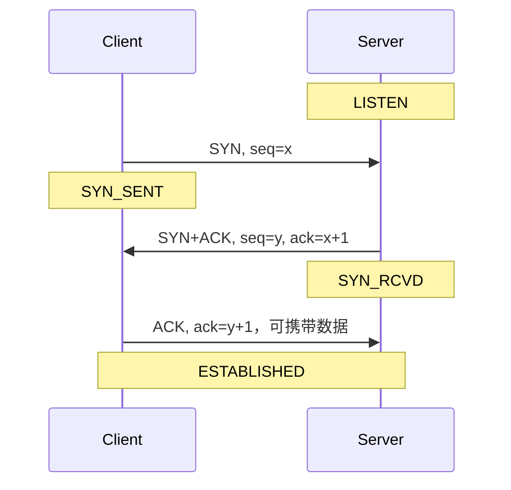
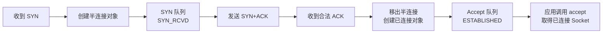
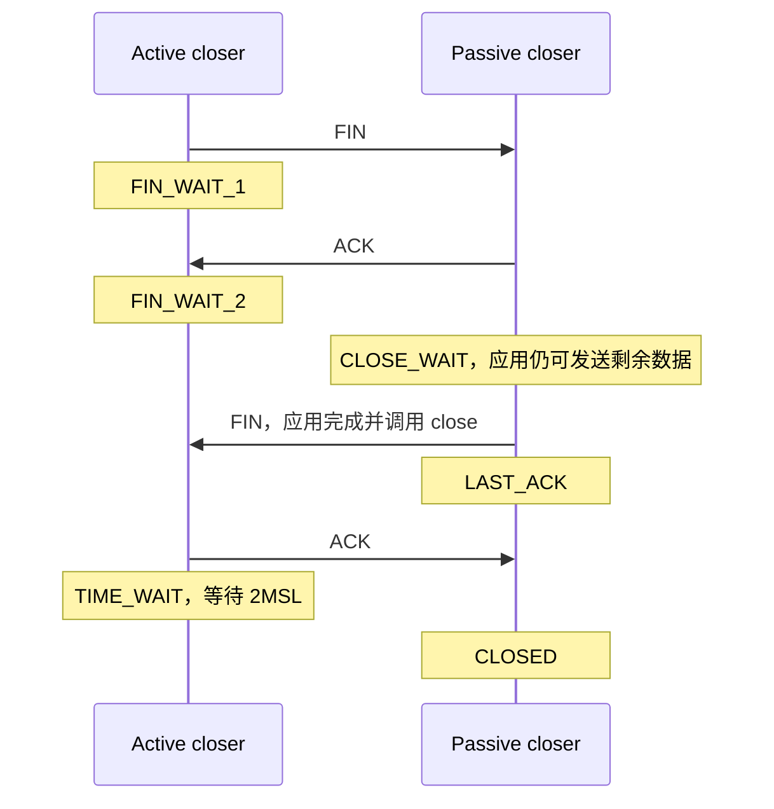
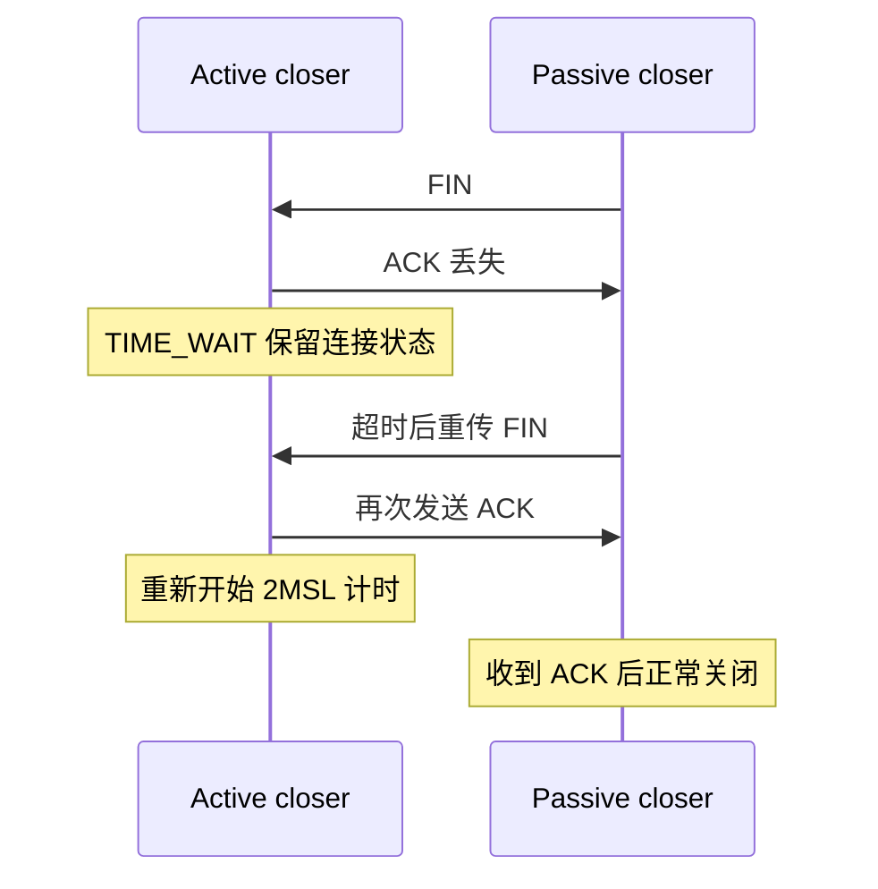
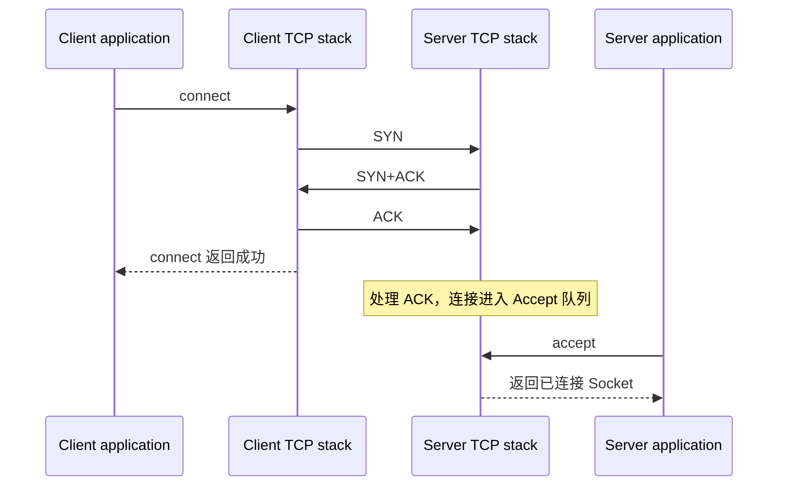
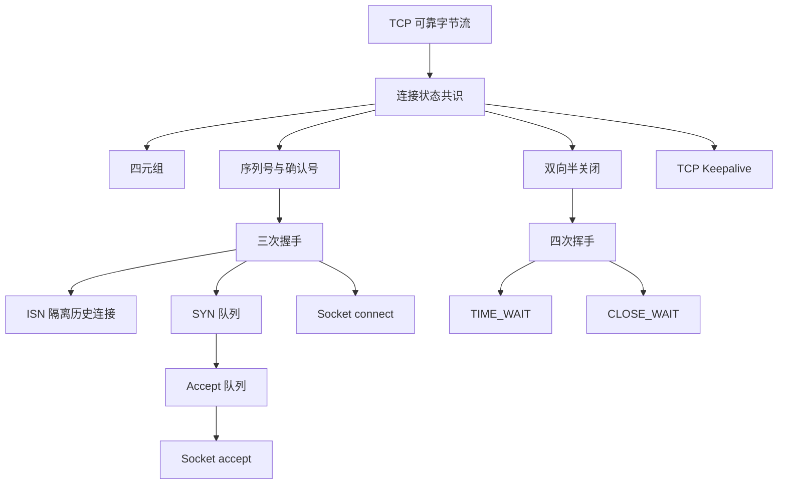

# TCP 三次握手与四次挥手面试题

### 1. Topic Overview

- **What this is about**: 本章按原文顺序覆盖 TCP 基本认识、连接建立、连接断开与 Socket 编程，重点是三次握手、四次挥手、丢包后的重传责任、`TIME_WAIT` / `CLOSE_WAIT`、半连接/全连接队列，以及系统调用和 TCP 状态的对应关系。
- **Why it matters**: TCP 面试题常被背成“3 次、4 次、2MSL”三个数字。真正可迁移的能力，是从“双方各自维护什么状态、哪一个方向已经确认、丢包后谁有可重传的原报文”推导答案。
- **Difficulty level**: 中等偏高。难点不在记状态名，而在区分双向序列号空间、半关闭、内核与应用责任、历史报文与新连接，以及端口资源与四元组资源。
- **Prerequisites**: TCP/IP 四层模型、IP 提供尽力而为交付、端口用于定位主机内的传输层端点、进程通过 Socket 使用内核协议栈。
- **Source scope**: 原文明确不展开 TCP 可靠传输、滑动窗口、流量控制和拥塞控制的完整机制；本文只保留理解连接生命周期所需的序列号、确认号、窗口和重传边界。
- **Visual-needs scan**: “握手时序与状态”“SYN/Accept 两个队列”“挥手的双向半关闭”“最后 ACK 丢失时 TIME_WAIT 的作用”“Socket API 与内核状态”适合用图压缩，已在对应位置加入 Mermaid。

### 2. Core Concepts

> Core Concepts 依照原文推进，但把零散问答组织成能解释、预测和诊断的 schema。

#### 2.1 Schema: 把 TCP 连接看成“双向可靠字节流的状态共识”

- **Definition**: TCP 是传输层的、面向连接的、可靠的、基于字节流的通信协议。RFC 793 把连接描述为双方为可靠性和流量控制维护的一组状态信息，原文将其压成 `Socket + 序列号 + 窗口大小`。
- **Intuition**: TCP 连接不是一根真实管道，也不是某一个握手包；它是两端内核中互相匹配的一组状态。握手的工作，是让双方确认“对方存在、双方的初始序列号是什么、后续如何收发”。
- **关键头部字段**:
  - `Sequence Number`: 本方向字节流中数据的位置；帮助接收端排序、去重并定位缺口。
  - `Acknowledgment Number`: 本端下一次期望收到的序号；它累计确认此前连续收到的数据。
  - `SYN`: 发起连接并占用一个序列号，用于同步初始序列号。
  - `ACK`: 使确认号字段有效。纯 ACK 通常不单独重传；若它丢失，对方会重传等待确认的 SYN、FIN 或数据。
  - `FIN`: 表示本方向以后不再发送数据，也占用一个序列号；它不等于双方立刻都不能发送。
  - `RST`: 异常或不存在的连接状态下强制复位连接。
- **连接身份**: 一个 TCP 连接由四元组唯一标识：`源 IP、源端口、目的 IP、目的端口`。服务端 IP 与监听端口固定时，客户端 IP 与客户端端口的组合给出约 `2^48` 的理论标识空间；现实上限先受文件描述符、内存和内核资源约束。
- **Example**: 两台客户端都可用本地端口 `50000` 连接同一服务器 `10.0.0.8:443`，因为源 IP 不同，四元组仍不同；同一主机的 TCP 80 和 UDP 80 也不冲突，因为 IP 头的协议号先把报文分流给独立的 TCP/UDP 模块。
- **Common mistakes**:
  - 把“可靠”说成网络断裂时 TCP 仍保证最终送达。更准确的边界是：TCP 在连接有效且重试未耗尽时提供有序、去重、重传等语义；无法恢复时会向应用报告失败。
  - 把字节流当消息流。TCP 不保留应用消息边界，应用必须自己设计长度字段、分隔符或固定长度协议。
  - 只用端口号识别连接，忽略 IP 和传输协议命名空间。

#### 2.2 Schema: 根据“消息边界、可靠性和时延容忍度”选择 TCP 或 UDP

- **Definition**: TCP 先建立一对一连接，提供有序可靠字节流、流量控制和拥塞控制；UDP 无连接、按报文发送，保留消息边界，不承诺交付、顺序或去重。
- **Intuition**: TCP 像由内核维护状态的连续物流通道；UDP 像一封一封独立投递的明信片。选择时先问应用需要什么语义，而不是只背“TCP 慢、UDP 快”。

| 维度 | TCP | UDP |
| --- | --- | --- |
| 连接 | 传输前建立连接 | 可直接发送 |
| 服务对象 | 一对一 | 一对一、一对多、多对多 |
| 可靠性 | 有序、去重、丢失重传 | 尽最大努力；可靠性可由上层实现 |
| 控制机制 | 流量控制、拥塞控制 | 协议本身不提供 |
| 首部 | 基本首部 20 字节，可带变长选项 | 固定 8 字节 |
| 数据形态 | 字节流，无消息边界 | 数据报，有消息边界 |
| 大包处理 | TCP 按 MSS 分段 | 过大时通常由 IP 分片 |

- **Example**: HTTP/HTTPS、FTP 通常使用 TCP；DNS 小查询、SNMP、实时音视频和广播常使用 UDP。QUIC 说明“基于 UDP”不等于“不可靠”，应用/用户态协议仍可在 UDP 上补可靠传输。
- **原文中的两个头部追问**:
  - UDP 不需要首部长度字段，因为首部固定 8 字节；TCP 需要，因为选项使首部变长。
  - TCP 负载长度可由 `IP 总长度 - IP 首部长度 - TCP 首部长度` 推出。原文把 UDP 长度字段的存在解释为历史兼容或 4 字节对齐的可能原因，并明确这些是推测，不应当成唯一标准结论。
- **Common mistakes**: 把“UDP 不可靠”误解为 UDP 数据一定会丢；把 TCP 的字节流误解为一个 `write` 必然对应接收端一个 `read`；只凭协议名判断应用时延和可靠性。

#### 2.3 Schema: 用“三次确认双方状态”推导 TCP 建连

- **Definition**: 三次握手让双方交换并确认各自的初始序列号，并在服务端真正建立连接前给客户端一次否定历史连接的机会。
- **Example**:
  1. 服务端先 `LISTEN`。
  2. 客户端发送 `SYN, seq=x`，进入 `SYN_SENT`。
  3. 服务端发送 `SYN+ACK, seq=y, ack=x+1`，进入 `SYN_RCVD`。
  4. 客户端发送 `ACK, ack=y+1`，进入 `ESTABLISHED`；第三次握手可以携带应用数据。
  5. 服务端收到第三次 ACK 后进入 `ESTABLISHED`。

#### Visual Model: 三次握手分别确认了哪个方向？

- **How to read**: 第一次把客户端 ISN 送给服务端；第二次确认客户端 ISN，同时送出服务端 ISN；第三次确认服务端 ISN。
- **Source anchor**: `materials/network/3_tcp/tcp_interview.md`，`TCP 三次握手过程是怎样的？`
- **Boundary**: 图只表示正常主线，不表示每个报文一定对应一次应用系统调用。

- **为什么不是两次或四次**:
  1. **主要原因：阻止旧的重复连接初始化**。旧 `SYN(seq=90)` 先到时，服务端回 `ack=91`；已经发起新连接 `seq=100` 的客户端能识别确认号不符并回 RST。两次握手会让服务端在客户端否定旧连接前过早进入已建立状态。
  2. **可靠同步双方 ISN**。客户端的 ISN 需要服务端 ACK，服务端的 ISN 也需要客户端 ACK；`SYN+ACK` 把原本四步中的中间两步合并成一步。
  3. **避免冗余资源**。缺少第三次确认时，服务端难以知道自己的 SYN 是否被当前客户端接受，延迟/重复 SYN 更容易制造无效连接。
- **Linux observation**: 原文使用 `netstat -napt` 查看 TCP 状态；现代系统也常用 `ss -napt`，但本章状态推理不依赖具体命令。
- **Common mistakes**: 只答“确认双方收发能力”而没有说明确认了什么；把第三次 ACK 当作服务端 SYN 的重传；认为前两次握手也能安全携带应用数据。

#### 2.4 Schema: 用“隔离新旧连接”理解 ISN 与 MSS

- **Definition**: 每个方向的 ISN 应随连接变化，避免同一四元组的新连接误收旧连接中延迟的报文，也降低伪造序列号的可预测性。MSS 则把分段责任放在 TCP 层，尽量避免代价更高的 IP 分片。
- **ISN mechanism in the source**: 原文给出历史性模型 `ISN = M + F(localhost, localport, remotehost, remoteport)`：`M` 随时钟递增，`F` 对四元组做不可轻易预测的散列。重点不是死记具体算法，而是“随时间和连接身份变化且不易预测”。具体实现会随操作系统和时代变化。
- **为什么固定 ISN 危险**: 旧连接的延迟数据若序号恰好落进新连接接收窗口，就可能被当成新数据。不同 ISN 能显著降低风险，但序列号会回绕，因此不能把它说成绝对消除历史报文。
- **MSS vs MTU**:
  - `MTU`: 一个链路层帧所承载网络包的常见上限，以太网通常为 1500 字节。
  - `MSS`: 去掉 IP 和 TCP 首部后，单个 TCP 段允许的最大数据长度，通常在握手选项中协商。
  - 若让 IP 对一个大 TCP 段分片，丢一个 IP 分片会使接收端无法重组完整 TCP 段，发送端最终重传整个 TCP 段；TCP 先按 MSS 分段后，通常只需重传丢失的段。
- **Common mistakes**: 把 MSS 说成整个 IP 包大小；把“随机 ISN”理解成纯随机且与时间、四元组无关；说不同 ISN 能百分之百消除旧包。

#### 2.5 Schema: 先找“谁在等确认”，再判断握手丢包后的重传者

- **Definition**: ACK 本身通常没有单独重传定时器。一个确认丢失时，由仍在等待确认的那一方重传原始 SYN/SYN-ACK，新的 ACK 随之产生。

| 丢失位置 | 客户端行为 | 服务端行为 | 原文中的 Linux 控制项 |
| --- | --- | --- | --- |
| 第一次 `SYN` | 重传相同序列号的 SYN，指数退避 | 未收到报文，无动作 | `tcp_syn_retries` |
| 第二次 `SYN+ACK` | 因未确认 SYN 而重传 SYN | 因未确认自己的 SYN 而重传 SYN+ACK | 客户端 `tcp_syn_retries`；服务端 `tcp_synack_retries` |
| 第三次 `ACK` | 已进入 ESTABLISHED；ACK 不单独重传 | 等不到确认，重传 SYN+ACK | `tcp_synack_retries` |

- **Example**: 第三次纯 ACK 丢失后，如果客户端继续发一个带正确 ACK 的数据段，服务端在 `SYN_RCVD` 也可以由这个段确认第二次握手并建立连接。
- **Timing boundary**: 原文用 1、2、4、8…秒说明指数退避，并以常见默认重试次数计算约一分钟。确切初始超时、默认值和参数语义与内核版本有关，排障时必须读取目标机器当前配置。
- **Common mistakes**: 说“第三次 ACK 自己超时重传”；第二次握手丢失时只写一端重传；认为 SYN 重传会换一个新序列号。

#### 2.6 Schema: 用“SYN 队列 -> Accept 队列”理解 SYN 攻击与服务端建连

- **Definition**: 服务端内核为未完成握手和已完成握手维护不同队列：`SYN 队列`保存 `SYN_RCVD` 半连接，`Accept 队列`保存已完成三次握手、等待应用 `accept` 的连接。
- **Intuition**: 三次握手由内核协议栈执行；`accept` 不是第三次握手，而是应用从“已完成连接仓库”领取一个连接 Socket。

#### Visual Model: 连接何时从 SYN 队列移动到 Accept 队列？

- **How to read**: ACK 到达后，内核先完成连接并放入 Accept 队列；应用何时调用 `accept` 是下一步。
- **Source anchor**: `materials/network/3_tcp/tcp_interview.md`，`什么是 SYN 攻击？` 与 `listen 时候参数 backlog 的意义？`
- **Boundary**: 图省略了队列溢出、SYN cookie 和不同 Linux 版本中的具体实现细节。

- **SYN 攻击**: 攻击者伪造大量源 IP 发送 SYN，却不完成第三次握手，使半连接长期占用 SYN 队列，正常 SYN 可能因队列满而被丢弃。
- **原文列出的缓解方向**:
  - 调整网卡到内核处理前的 `net.core.netdev_max_backlog`，避免入口积压；它不是 SYN 队列本身。
  - 增大半连接相关容量，例如 `tcp_max_syn_backlog`，并结合 `listen backlog`、`somaxconn` 评估实际队列上限。
  - 队列满时开启 `tcp_syncookies`：服务端把验证信息编码进第二次握手的序列号，不为每个 SYN 保存半连接状态；合法 ACK 返回后再创建连接。
  - 减少 `tcp_synack_retries`，更快释放迟迟不完成握手的半连接，但会降低糟糕网络下正常慢连接的容忍度。
- **Common mistakes**: 把 SYN 队列和 Accept 队列混为一个；认为 `accept` 参与网络上的三次握手；只背“调大队列”而不说明攻击占用的是哪种状态。

#### 2.7 Schema: 把四次挥手拆成“两个方向各自关闭”

- **Definition**: TCP 是全双工的。一个 `FIN` 只关闭发送方到接收方的一个方向，因此正常关闭需要两个 FIN；每个 FIN 又需要一个 ACK，通常形成四次挥手。
- **Example**:
  1. 主动关闭方发送 FIN：`FIN_WAIT_1`。
  2. 被动方内核确认 FIN：被动方进入 `CLOSE_WAIT`，主动方收到 ACK 后进入 `FIN_WAIT_2`。
  3. 被动方应用处理完剩余数据并调用 `close`，发送 FIN：`LAST_ACK`。
  4. 主动方确认 FIN：进入 `TIME_WAIT`；被动方收到 ACK 后 `CLOSED`；主动方等待 2MSL 后 `CLOSED`。

#### Visual Model: 为什么 FIN 和 ACK 通常不能像握手那样合并？

- **How to read**: 被动方确认“收到对方不再发送”与被动方自己“也不再发送”是两件事；中间可能还要处理和发送数据，所以 ACK 与 FIN 通常分开。
- **Source anchor**: `materials/network/3_tcp/tcp_interview.md`，`TCP 四次挥手过程是怎样的？` 与 `为什么挥手需要四次？`
- **Boundary**: 如果被动方在收到 FIN 时也已没有数据要发，ACK 与 FIN 可能合并，表现为三次挥手。

- **丢包推理**:

| 丢失位置 | 谁重传什么 | 关键状态/限制 |
| --- | --- | --- |
| 第一次 FIN | 主动方重传 FIN | 重试受 `tcp_orphan_retries` 等实现参数影响 |
| 第二次 ACK | ACK 不重传；主动方重传 FIN，迫使被动方再 ACK | `close` 后的 `FIN_WAIT_2` 可受 `tcp_fin_timeout` 限制 |
| 第三次 FIN | 被动方重传 FIN；主动方等待 | 被动方在 `LAST_ACK`；主动方可能因 `FIN_WAIT_2` 超时关闭 |
| 第四次 ACK | 被动方重传 FIN；主动方在 TIME_WAIT 再回 ACK | 每次再次收到 FIN，主动方重置 2MSL 计时 |

- **`close` vs `shutdown` boundary**: `close` 释放应用对 Socket 的使用，Linux 会限制孤儿连接在 `FIN_WAIT_2` 的停留；`shutdown` 可以只关闭发送方向而保留接收方向，此时半关闭语义不同，不能机械套用同一超时结论。
- **Common mistakes**: 把收到 FIN 理解为自己也必须立刻 FIN；认为 FIN 只占标志位、不占序列号；把 `CLOSE_WAIT` 当内核自动超时就一定能解决的状态。

#### 2.8 Schema: 用“收尾可靠性 + 隔离历史报文”解释 TIME_WAIT

- **Definition**: `TIME_WAIT` 出现在主动关闭方。它等待 2MSL，一方面让最后 ACK 丢失时仍能响应对方重传的 FIN，另一方面让旧连接两个方向的报文在网络中自然消亡，降低相同四元组新连接误收旧报文的风险。
- **MSL vs TTL**: MSL 是报文在网络中的最大生存时间，单位是时间；TTL 是可经过的路由跳数。原文给出 Linux 常见 `TIME_WAIT = 60s`、可理解为 `2 * 30s MSL`，并强调这是内核常量语义而不是普通运行时 sysctl。

#### Visual Model: 最后 ACK 丢失时，TIME_WAIT 如何完成收尾？

- **How to read**: 主动方不能在第一次发送最后 ACK 后立刻忘掉连接，否则重传 FIN 到达时只能回 RST，无法优雅收尾。
- **Source anchor**: `materials/network/3_tcp/tcp_interview.md`，`为什么 TIME_WAIT 等待的时间是 2MSL？` 与 `为什么需要 TIME_WAIT 状态？`
- **Boundary**: 2MSL 是工程折中，不是证明所有网络条件下绝不再出现旧包。

- **TIME_WAIT 过多的影响**:
  - 客户端若集中连接同一 `目的 IP + 目的端口`，可耗尽可用本地端口/四元组；同一个本地端口仍可能用于不同目的端点。
  - 服务端作为主动关闭方时，监听端口本身不会因此只能建立一个连接；主要压力是内核维护大量 TIME_WAIT 控制块和哈希查找等系统资源。TIME_WAIT 项通常已不再对应应用持有的普通文件描述符。
- **原文列出的优化与代价**:
  - `tcp_tw_reuse` 配合时间戳，让连接发起方在满足条件时复用旧 TIME_WAIT；具体行为依赖内核版本。
  - `tcp_max_tw_buckets` 超限后直接重置后续 TIME_WAIT，较为激进。
  - `SO_LINGER` 设置为立即 RST 可跳过正常挥手和 TIME_WAIT，但会牺牲优雅关闭与残留数据安全，通常不应作为常规优化。
  - 更根本地，应先找出为什么本机总是主动关闭，而不是看到 TIME_WAIT 就删除保护机制。
- **Common mistakes**: 说 TIME_WAIT 在被动关闭方；只答“等旧包消失”而漏掉最后 ACK 可靠收尾；把服务端 TIME_WAIT 与监听端口被占满直接画等号。

#### 2.9 Schema: 用“谁先发 FIN + 应用有没有 close”诊断 TIME_WAIT 与 CLOSE_WAIT

| 观察到的状态 | 直接含义 | 优先排查方向 |
| --- | --- | --- |
| 大量 `TIME_WAIT` | 本机频繁主动关闭连接 | 谁调用/触发关闭；HTTP 短连接；长连接空闲超时；单连接请求数上限 |
| 大量 `CLOSE_WAIT` | 对端已发 FIN，本机内核已确认，但本机应用迟迟没 close | accept/epoll 注册链路、异常路径、死锁、资源释放代码 |

- **服务端大量 TIME_WAIT 的三个原文场景**:
  1. HTTP 未启用长连接，服务端发完响应后主动关闭。
  2. 长连接超过 `keepalive_timeout`，服务端定时器主动关闭。
  3. 单条长连接处理请求数达到 `keepalive_requests` 上限，服务端主动轮换连接。
- **服务端大量 CLOSE_WAIT 的程序链路**: `listen socket 注册 epoll -> accept 已连接 socket -> 已连接 socket 注册 epoll -> 感知 FIN/EOF -> 应用 close`。任一关键步骤卡住、漏做或异常退出，都可能使应用拿不到关闭事件或没有执行 close。
- **Common mistakes**: 看到两种状态都说“网络不好”；用调内核参数掩盖 CLOSE_WAIT 的代码资源释放问题；忘记先判断本机是主动方还是被动方。

#### 2.10 Schema: 区分“主机失联、进程崩溃、应用空闲”

- **Definition**: TCP 只能依据收到的报文或超时判断连接。进程崩溃时，本机内核仍在，通常会回收 Socket 并发送 FIN；主机断电时内核也消失，对端若一直不发数据，可能长期无法感知。
- **TCP keepalive**: 应用需在 Socket 上开启 `SO_KEEPALIVE`。原文列出的 Linux 常见默认值是：空闲 `7200s` 后开始探测，每隔 `75s` 探测，连续 `9` 次无响应后报告失败，总体约 2 小时 11 分 15 秒。
- **三种探测结果**:
  1. 对端连接仍正常：响应探测，保活计时重置。
  2. 对端重启且已丢失连接状态：对探测回复 RST，很快发现连接失效。
  3. 对端断电或路径不可达：探测无响应，次数耗尽后向应用报告死亡连接。
- **应用层心跳/空闲超时**: Web 服务的 `keepalive_timeout` 是应用协议的连接空闲策略，通常比 TCP keepalive 更快，也更了解业务语义；它与 HTTP Keep-Alive、TCP `SO_KEEPALIVE` 是三套不同概念。
- **Common mistakes**: 把进程崩溃等同于主机断电；以为 TCP keepalive 默认对所有 Socket 自动生效；把 HTTP 长连接超时叫成 TCP keepalive。

#### 2.11 Schema: 把 Socket API 映射到内核 TCP 生命周期

- **Definition**: Socket API 是应用驱动内核 TCP 状态机的接口。监听 Socket 负责接收新连接，`accept` 返回的已连接 Socket 才用于该连接的数据传输。
- **`close(fd)` 的 OS 语义**: `fd` 是进程文件描述符表中的索引。应用调用 `close(fd)` 经系统调用进入内核，撤销该 fd 对内核对象的引用。它是通用 OS 资源释放接口，既可用于普通文件，也可用于 Socket；关闭普通文件 fd 不等于删除文件。
- **`close(fd)` 的 TCP 语义**: 当这是该 Socket 的最后一个引用时，内核 Socket/TCP 层根据当前状态执行关闭；正常情况下由内核发送 FIN，配置特殊 `SO_LINGER` 时可能发送 RST。应用只是发出“我不再使用这个 fd”的请求，网络报文与 TCP 状态迁移由内核完成。
- **关键边界**: `close()` 返回只表示该进程不再使用这个 fd，不代表 TCP 控制块已立即消失。内核仍可继续重传、完成挥手，或保留 `TIME_WAIT`；若 `dup`/`fork` 等使同一 Socket 还有其他引用，关闭一个 fd 也未必立即触发 FIN。
- **正常流程**:
  - 服务端：`socket -> bind -> listen -> accept -> read/write -> close`。
  - 客户端：`socket -> connect -> read/write -> close`。
  - 客户端 `close` 触发 FIN；服务端协议栈把 FIN 表现为排在已接收数据之后的 EOF。服务端应用读完数据再读到 EOF 后调用 `close`，触发反方向 FIN。
- **`listen backlog`**: Linux 2.2 以后通常指 Accept 队列长度，上限受 `somaxconn` 约束，常用近似是 `min(backlog, somaxconn)`；半连接队列还有独立的内核约束。不要把所有内核版本和所有队列都归因于一个 backlog 参数。

#### Visual Model: `connect`、第三次握手与 `accept` 的先后关系

- **How to read**: 客户端收到第二次握手后由协议栈发送第三次 ACK，并在该阶段让 `connect` 返回；服务端只有处理第三次 ACK、把连接放入 Accept 队列后，阻塞的 `accept` 才能取得它。
- **Source anchor**: `materials/network/3_tcp/tcp_interview.md`，`accept 发生在三次握手的哪一步？`
- **Boundary**: 系统调用唤醒与报文实际发出之间有实现时序，面试回答应抓住“`accept` 不执行握手，返回的是内核已完成的连接”。

- **特殊边界**:
  - **没有 `accept` 也能完成三次握手**：只要监听存在且队列未满，内核可把连接放进 Accept 队列；应用只是暂时不领取。
  - **没有 `listen` 的普通被动服务不能接收连接**；原文中的“可以”仅指 TCP 自连接或双方同时主动打开等特殊情形，不能推广成任意客户端都能连一个未监听端口。
- **Common mistakes**: 认为 `accept` 发出 SYN+ACK；把监听 Socket 当成每条连接的数据 Socket；看到没有调用 accept 就断言网络握手一定未完成。

### 3. Deep Understanding

#### 3.1 本章的统一机制：每一步都在创建、确认、释放状态

1. **创建身份**: 四元组选择一条逻辑连接；双方各自生成 ISN。
2. **确认状态**: 三次握手让双方的 SYN 都得到确认，并排除不匹配的历史初始化请求。
3. **使用状态**: 序列号、确认号和窗口支撑双向可靠字节流；本章不展开其完整传输算法。
4. **分别释放方向**: 每个 FIN 只关闭一个发送方向；应用处理完数据后才能关闭自己的方向。
5. **保留收尾状态**: 主动方用 TIME_WAIT 应对最后 ACK 丢失和旧报文残留。

真正的推理问题不是“第几次”，而是：**当前哪一端已经确认了哪一方向？哪一端仍保存可重传状态？哪一端需要等应用作决定？**

#### 3.2 内核责任与应用责任

- **内核自动完成**: SYN/SYN-ACK/ACK 的协议处理、重传定时器、收到 FIN 后回 ACK、队列管理、进程退出时回收 Socket。
- **应用必须决定**: 何时 `listen`、何时从 Accept 队列取连接、如何解释字节流消息边界、何时处理完数据并 `close`、是否开启 `SO_KEEPALIVE`、是否实现业务心跳。
- **诊断边界**: `SYN_RCVD` 堆积优先看握手/半连接容量/攻击；`CLOSE_WAIT` 堆积优先看应用 close；`TIME_WAIT` 堆积优先找主动关闭策略。

#### 3.3 面试回答模板

遇到 TCP 状态题，按四步回答：

1. **定位角色与方向**: 谁主动建连/关闭？当前讨论哪个发送方向？
2. **写出当前状态和待确认报文**: `SYN_RCVD` 在等 ACK，`LAST_ACK` 也在等 ACK，但等待的是不同 FIN/SYN。
3. **应用 ACK 不单独重传规则**: 确认丢失时，找出对方会重传的原始报文。
4. **补上边界与代价**: 内核版本、队列上限、应用是否 close、`close` vs `shutdown`、普通场景 vs TCP 特殊打开。

#### 3.4 五组必须分开的概念

1. TCP 可靠字节流 vs 应用消息边界。
2. 端口号 vs 四元组连接身份。
3. SYN 队列半连接 vs Accept 队列已完成连接。
4. TIME_WAIT 主动收尾 vs CLOSE_WAIT 等应用关闭。
5. HTTP Keep-Alive vs TCP `SO_KEEPALIVE` vs 应用层心跳/空闲超时。

### 4. Minimal Working Example

**场景：客户端连接一个 TCP echo 服务，发送 `hello` 后主动关闭。**

1. 服务端 `socket/bind/listen`，监听 Socket 进入 `LISTEN`。
2. 客户端 `connect` 触发 SYN；服务端把半连接放进 SYN 队列并回 SYN+ACK。
3. 客户端协议栈回第三次 ACK，客户端 `connect` 返回；服务端把已完成连接放进 Accept 队列。
4. 服务端 `accept` 取得一个新的已连接 Socket。监听 Socket 继续接收其他连接，不能拿它直接替代这个连接的数据 Socket。
5. 客户端 `write("hello")`。TCP 只保证有序字节流；服务端本次 `read` 可能一次、也可能多次读到这 5 个字节，应用不能把一次 write 当成消息边界保证。
6. 客户端 `close`，内核发送 FIN。服务端内核回 ACK，并把 EOF 排在此前数据之后；服务端进入 CLOSE_WAIT。
7. 服务端读完 `hello`，随后 `read` 返回 EOF；应用调用 `close`，内核发送 FIN，进入 LAST_ACK。
8. 客户端回 ACK，进入 TIME_WAIT；若 ACK 丢失，服务端重传 FIN，客户端仍能再次 ACK 并重置 2MSL。

**Reasoning result**: 这条执行流同时解释了为什么没有 `accept` 仍可能完成握手、为什么 CLOSE_WAIT 通常是应用问题、为什么主动关闭方进入 TIME_WAIT，以及为什么 TCP 字节流需要应用层消息边界。

### 5. Chapter Knowledge Map

### 6. Self-Test Questions

- **Recall（回忆）**
  1. 一个 TCP 连接为什么不能只用“服务端端口”唯一标识？
  2. 三次握手的三条理由是什么？哪一条是原文强调的主要原因？
  3. TIME_WAIT 为什么在主动关闭方，为什么要保留 2MSL？

- **Application/Transfer（应用/迁移）**
  1. 服务端大量连接停在 `SYN_RCVD`，另一个服务端大量连接停在 `CLOSE_WAIT`。两者分别最应该先查网络握手队列还是应用资源释放？为什么？
  2. 第三次握手的纯 ACK 丢失，但客户端随后立即发送带 ACK 的数据。服务端是否一定只能等 SYN+ACK 重传超时？请按确认语义解释。

- **Explain-like-I-am-5（简化解释）**
  用“两个人打电话”的比喻解释：为什么接通需要三次确认，而挂断通常需要分别关闭两个说话方向。

### 7. Weak Point Detection

| 典型错误表现 | 对应 schema | 错误类型 | 检查方法 |
| --- | --- | --- | --- |
| 只背“TCP 可靠”，说不出连接维护什么状态 | 2.1 连接状态共识 | 表面记忆 | 让学习者写出 Socket、序列号、窗口的职责 |
| 用端口号代替四元组 | 2.1 连接身份 | 概念误解 | 给两个同端口、不同 IP 的连接判断是否冲突 |
| 说 TCP 一次 write 对应一次 read | 2.1/2.2 字节流 | 边界混淆 | 让学习者给 TCP 应用设计一个消息边界 |
| 三次握手只答“确认收发能力” | 2.3 三次握手 | 表面记忆 | 用旧 SYN 场景追问两次握手为什么过早建连 |
| 把 MSS 和 MTU 都说成 1500 | 2.4 MSS/MTU | 概念误解 | 让学习者写 `MSS = MTU - IP头 - TCP头` 的典型关系 |
| 说第三次 ACK 丢失后客户端重传 ACK | 2.5 握手丢包 | 过程混淆 | 追问服务端仍保存并等待确认的是哪个报文 |
| 认为 accept 负责完成第三次握手 | 2.6/2.11 队列与 API | 层次混淆 | 追问未调用 accept 时连接位于哪个队列 |
| 认为一个 FIN 就关闭双向连接 | 2.7 双向半关闭 | 概念误解 | 追问被动方收到 FIN 后为何仍可发剩余数据 |
| 把 TIME_WAIT 和 CLOSE_WAIT 都归因于网络差 | 2.8/2.9 状态诊断 | 诊断失败 | 先让学习者判断谁主动发 FIN、谁还没调用 close |
| 混淆 HTTP Keep-Alive 与 TCP keepalive | 2.10 存活检测 | 边界混淆 | 分别问连接复用、死连接探测、业务空闲超时由谁负责 |
| 说没有 listen 任何普通连接都能建立 | 2.11 特殊打开 | 过度推广 | 要求区分普通被动打开、自连接和同时打开 |
