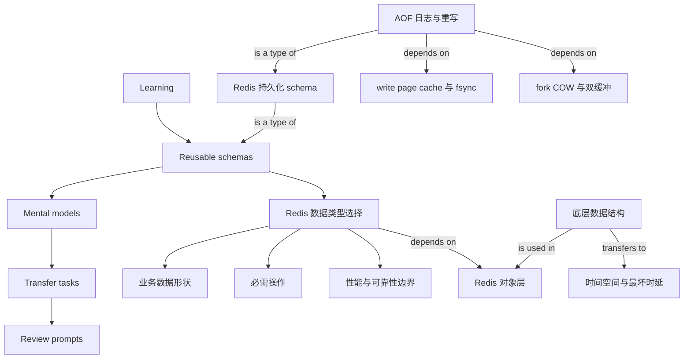

# Knowledge Map

Use Mermaid graphs only. Keep the global map compact and connected.

## Rules

- Add a node only when it helps future learning.
- Edges should mean depends on, builds on, is a type of, is part of, is used in, or transfers to.
- Avoid disconnected or decorative nodes.

<!-- study-agent-visual-contract:v1 -->
## Visual Contract

- This file is the global cross-topic and cross-chapter knowledge map.
- Use Mermaid for this global map.
- Keep chapter maps and concept-local diagrams canonical inside their notes; do not duplicate them here.
<!-- /study-agent-visual-contract:v1 -->
