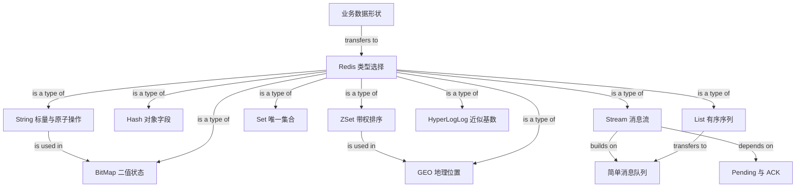

# Redis Data Types and Commands Knowledge Graph

## Edge Semantics

- `depends on`: target concept is a prerequisite.
- `builds on`: source extends the target into a stronger mechanism.
- `is a type of`: source is one concrete member of the target category.
- `is used in`: source structure implements the target feature.
- `transfers to`: source schema is applied to the target task.
