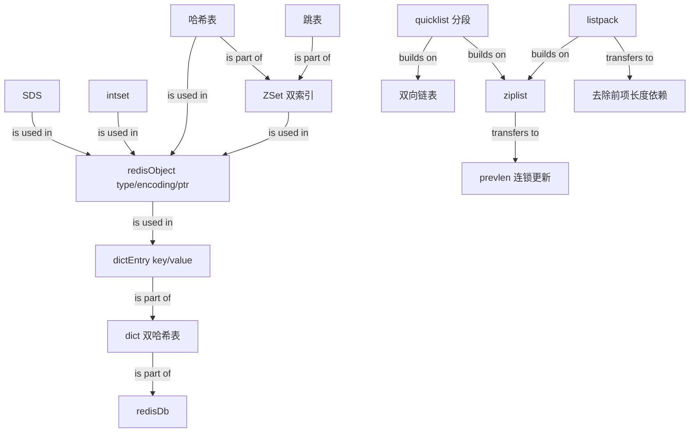

# Redis Data Structures Knowledge Graph

## Edge Semantics

- `is part of`: source is a component of the target.
- `is used in`: source representation is used by the target.
- `builds on`: source combines or improves the target structure.
- `transfers to`: source mechanism produces the target consequence.
