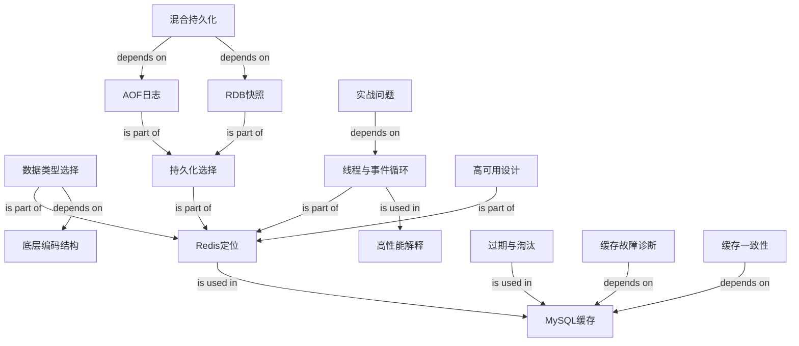

# Redis Interview Knowledge Graph

## Edge Semantics

- `depends on`: target concept is a prerequisite.
- `builds on`: source extends the target into a higher-level mechanism.
- `is part of`: source concept belongs inside the target concept.
- `is used in`: source concept is applied inside the target scenario.
