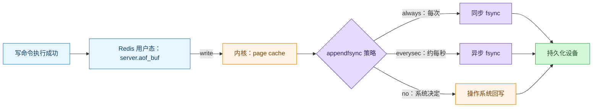
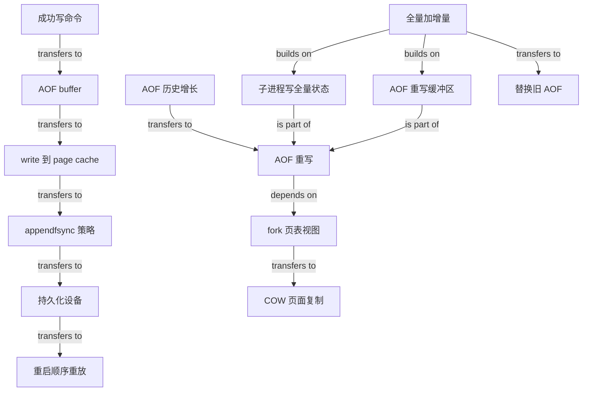

# Redis AOF 持久化

### 1. Topic Overview

- What this is about: AOF 如何把 Redis 的写命令变成可重放日志，如何在可靠性与性能之间选择刷盘策略，以及 AOF 文件过大时如何后台重写。
- Why it matters: AOF 的面试难点不在背 `always/everysec/no`，而在分清「命令已执行、数据进入 AOF buffer、`write()` 进入 page cache、`fsync()` 真正要求落盘」这几层，并解释重写期间如何同时保证继续服务和新文件完整。
- Difficulty level: 中等偏高。前半段是 I/O 时序，后半段涉及进程、页表、写时复制和双缓冲。
- Prerequisites: Redis 写命令、系统调用 `write()`、内核 page cache、`fsync()`、进程与 `fork`、虚拟内存/页表、写时复制 COW。
- Source: `materials/redis/storage/aof.md`。
- Source scope: 本笔记按文章中的经典「旧 AOF + 新 AOF + AOF 重写缓冲区」模型组织。具体配置默认值和文件组织可能随 Redis 版本变化，实际运维时应再核对目标版本文档。

Source-order roadmap:

1. AOF 日志记录什么，以及为什么先执行命令再记日志。
2. `aof_buf -> write -> page cache -> fsync -> disk` 与三种写回策略。
3. AOF 重写为什么读取当前数据库状态，而不是整理旧日志。
4. `bgrewriteaof` 如何通过 `fork + COW` 在后台得到一致视图。
5. 普通 AOF 缓冲区、AOF 重写缓冲区和最终替换如何闭环。

### 2. Core Concepts

#### Schema 1: 用“执行 -> 记日志”顺序诊断 AOF 的收益与风险

- Definition: AOF（Append Only File）只记录成功执行的写操作；Redis 重启时顺序重放这些命令以恢复数据。读命令不会改变状态，因此不记录。
- Intuition: AOF 像一份可重放的操作流水账，不保存 Redis 内存对象本身。
- Enablement: 按本文说明，AOF 默认未开启，需要在 `redis.conf` 中启用；具体配置默认值应以实际 Redis 版本为准。
- Log format: AOF 是可以直接查看的文件，但内容按 Redis 协议编码。文章以 `SET name xiaolin` 为例：`*3` 表示三个参数，`$3` 表示随后参数有 3 个字节。
- Execution order:
  1. Redis 先执行写命令，更新内存状态。
  2. 命令执行成功后，再把可重放命令追加到 AOF 路径。
- Benefits in the article:
  - 不会把执行失败的错误命令留在恢复日志中，避免为日志额外做一遍有效性检查。
  - 持久化动作不被放在当前命令执行之前。
- Risks:
  - 内存已经更新、日志还没可靠落盘时宕机，这次写入可能无法从 AOF 恢复。
  - AOF 追加和命令执行都由主进程推进；若 AOF I/O 很慢，当前命令执行完后的持久化工作会推迟后续命令。
- Example: `SET balance 100` 已在内存中成功，但对应日志还只在内存缓冲区或 page cache 中。此时断电，重启后重放的 AOF 可能没有这条命令。
- Common mistakes:
  - 认为 AOF 会记录 `GET` 等读操作。
  - 认为命令执行成功就等于日志已经落盘。
  - 只记住“先执行不阻塞当前命令”，却忘记慢 I/O 仍可能影响后续命令。

#### Schema 2: 用“用户缓冲区 -> page cache -> 磁盘”区分 `write()` 与 `fsync()`

- Definition: AOF 的正常写入链不是一步完成的，而是：

```text
写命令执行成功
-> 追加到 server.aof_buf
-> write() 写入 AOF 文件对应的内核 page cache
-> fsync() 或操作系统回写
-> 持久化设备
```

- Intuition: `write()` 更像把文件内容交给内核保管；`fsync()` 才要求内核把相关脏页推进到持久化设备并等待完成。
- Key boundary: `write()` 成功不等于数据已经安全落盘。宕机窗口由什么时候执行/完成 `fsync()` 或系统回写决定。
- Three `appendfsync` strategies:

| 策略 | Redis 如何控制 `fsync` | 可靠性 | 性能/阻塞代价 |
| --- | --- | --- | --- |
| `always` | 每次写入 AOF 后执行 | 三者中最高 | 每次都等待落盘，主进程性能代价最大 |
| `everysec` | 约每秒由异步任务执行一次 | 通常最多暴露约 1 秒日志窗口 | 常用折中，不让每条写命令都同步等待 |
| `no` | Redis 不主动调用，由操作系统决定回写时机 | 丢失窗口不可由 Redis 精确控制 | 三者中 Redis 主动刷盘开销最低 |

- Example: 1 秒内执行了 1,000 条写命令。`always` 追求每批写后都落盘；`everysec` 把多条写共享一次周期性刷盘；`no` 把时机交给操作系统。

#### Visual Model: `write()` 返回后，AOF 数据到底在哪一层？



- How to read: 从左向右追踪；`write` 返回时数据通常只到 page cache，只有沿所选写回路径到达持久化设备后，才完成本文讨论的可靠落盘。
- Source anchor: `materials/redis/storage/aof.md` 的“三种写回策略”，第 65-110 行。
- Boundary: 图刻意省略存储控制器等更底层细节；Redis 进程崩溃与整机掉电也不同，这里聚焦文章中的 `write`/`fsync` 分层。

- Tradeoff schema:

```text
更频繁 fsync
-> 更小的数据丢失窗口
-> 更多等待磁盘的机会
-> 更高的延迟/吞吐代价
```

- Common mistakes:
  - 把 `aof_buf` 和 page cache 当成同一个缓冲区。
  - 把 `write()` 当成 `fsync()`。
  - 说 `no` 永远不落盘；准确说法是 Redis 不主动 `fsync`，仍由操作系统回写。
  - 把 `everysec` 说成绝不丢数据；宕机仍可能丢最近约一秒的日志。

#### Schema 3: 用“当前状态替代完整历史”理解 AOF 重写

- Definition: AOF 文件持续追加后会越来越大，恢复时顺序重放也越来越慢。重写不是编辑、合并旧 AOF，而是扫描当前数据库状态，生成一份能重建相同状态的新 AOF。
- Trigger: 文件大小超过配置的重写阈值，或显式触发后台重写时开始；原文用 64 MB 作场景示例，不应把这个示例当成所有部署的固定值。
- Intuition: 旧流水账记录“先把 name 设为 A，再改成 B”；重写只需要表达“当前 name 是 B”。
- Example:

```text
旧 AOF:
SET name xiaolin
SET name xiaolincoding

当前状态:
name = xiaolincoding

重写后的等价表达:
SET name xiaolincoding
```

- Why it helps:
  - 消除被后续状态覆盖的历史命令。
  - 减少新文件体积和恢复时需要重放的命令数量。
- Why write a new file:
  - 如果直接改旧 AOF，重写中途失败会污染唯一可恢复文件。
  - 先生成新文件，失败时删除新文件即可；成功后再替换旧文件。
- Precise boundary: 文章用 String 演示“一个 key 一条命令”。更一般的可复用结论是“按当前状态生成更短的等价命令集合”；复杂集合不必机械地只用一条命令。
- Common mistakes:
  - 以为重写会读取旧 AOF、删除其中重复行。
  - 以为重写改变的是当前 Redis 数据；它改变的是状态的持久化表达。
  - 直接原地覆盖旧文件，忽略失败恢复边界。

#### Schema 4: 用 `fork + COW` 理解后台重写的一致视图

- Definition: `bgrewriteaof` 由后台子进程执行。主进程 `fork` 时复制页表而不是立刻复制全部物理内存，父子进程最初映射到相同物理页；之后发生写入时才复制相关页面，这就是 Copy On Write。
- Intuition: 子进程拿到的是“fork 时刻的数据库照片”，但照片一开始与主进程共用底片；主进程要改某一页时，操作系统才给它复制那一页。
- Mechanism:
  1. 主进程调用 `fork`，操作系统为子进程复制页表。
  2. 父子进程虚拟地址空间不同，但最初映射相同物理页，并以只读方式共享。
  3. 主进程继续处理写命令；写共享页时触发缺页异常。
  4. 操作系统复制被修改的物理页并更新映射，父子进程各自继续。
  5. 子进程只读自己的 fork 时刻视图，把数据库状态转成命令写入新 AOF。
- Why process instead of thread in the article: 子进程借助隔离地址空间和 COW 获得稳定视图，避免围绕共享可变数据加锁。
- Latency and memory costs:
  - `fork` 仍要复制页表；数据集越大、页表越大，主进程暂停可能越明显。
  - 重写期间主进程写共享页会触发页面复制；高写入量或修改 bigkey 可能增加延迟和额外内存。
  - 子进程写新 AOF 还会与主进程竞争 CPU、内存带宽和磁盘资源，即使它不是在主线程同步扫描。
- Common mistakes:
  - 认为 `fork` 会立刻完整复制 Redis 全部内存。
  - 认为 COW 一次复制整个数据库；它按被修改的内存页发生。
  - 认为“后台重写”意味着对主进程完全零影响。

#### Schema 5: 用“双缓冲所有权”解释重写期间为什么不丢增量

- Problem: 子进程只看到 fork 时刻的状态，但主进程在重写期间仍会接受新写入。只保存子进程结果，新 AOF 就会缺少这段增量。
- Rule: 重写期间，每条新写命令同时进入两个逻辑目的地：

| 缓冲区 | 服务对象 | 作用 |
| --- | --- | --- |
| 普通 AOF 缓冲区 | 仍在使用的旧 AOF | 让旧文件继续记录增量，在新文件接管前始终可用于恢复 |
| AOF 重写缓冲区 | 子进程生成的新 AOF | 子进程完成后，把 fork 之后的增量补到新文件末尾 |

- Completion flow:
  1. 子进程扫描 fork 时刻的数据库视图并写完新 AOF。
  2. 子进程向主进程发送完成信号。
  3. 主进程在信号处理阶段把 AOF 重写缓冲区追加到新 AOF。
  4. 新文件与当前状态对齐后，改名替换旧 AOF。
- Core equation:

```text
最终新 AOF
= fork 时刻的全量状态表达
+ fork 后、切换前的增量写命令
```

- Three main-process latency points across the full source:
  1. `fork` 时复制页表。
  2. 重写期间主进程写共享页触发 COW。
  3. 子进程完成后，主进程追加重写缓冲区并完成文件切换。
- Source-reading note: 文章中段先列出前两个阻塞阶段，末段又明确补充了信号处理函数阶段；完整回答应包含三者。
- Common mistakes:
  - 把两个缓冲区说成重复备份，却说不出各自保护旧文件还是新文件。
  - 让子进程直接读取主进程持续变化的数据，忽略 fork 快照边界。
  - 子进程一结束就立刻替换文件，漏掉增量追加。
  - 说后台重写全程不阻塞主进程。

### 3. Deep Understanding

#### 3.1 正常 AOF 写入链：可靠性取决于“最远走到哪一层”

```text
内存状态已改变
-> aof_buf 中有命令
-> page cache 中有命令
-> 持久化设备中有命令
```

- Redis 进程崩溃但操作系统仍正常：page cache 中的数据仍可能被系统写回。
- 整机掉电：只有已经完成持久化的前缀可靠。
- 因此不能只问“有没有写 AOF”，还要问“写到了用户缓冲、内核缓存，还是持久化设备”。

#### 3.2 AOF 同时解决两个不同问题

```text
正常追加
-> 决定最近写入可能丢多少
-> appendfsync 策略

后台重写
-> 决定日志会不会无限增长、恢复会不会越来越慢
-> 当前状态压缩 + fork/COW + 双缓冲切换
```

刷盘策略不能替代重写；重写也不能消除最近写入尚未刷盘的故障窗口。

#### 3.3 重写一致性来自“快照 + 增量”分工

- 子进程负责稳定的 fork 时刻全量状态。
- 主进程负责继续执行业务写入。
- COW 让两者看到各自需要的内存版本。
- 普通 AOF 缓冲区维持旧文件有效。
- AOF 重写缓冲区把增量补给新文件。
- 最终替换把恢复入口从旧文件原子地切到已补齐的新文件。

#### 3.4 为什么 AOF 恢复可能慢

- AOF 保存的是可重放命令；恢复需要按顺序执行这些命令。
- 文件越大、命令越多，重放时间越长。
- 重写减少冗余历史命令，因此既控制文件大小，也减少恢复工作量。

### 4. Minimal Working Example

场景：Redis 先后执行以下命令，随后在重写期间又发生一次更新。

```text
t1: SET name xiaolin
t2: SET name xiaolincoding
t3: SET visits 1
t4: INCR visits
t5: 触发 bgrewriteaof
t6: SET name redisbook       # 子进程重写期间发生
```

Reasoning flow:

1. 旧 AOF 保存了 `t1` 到 `t4` 的写历史。
2. `t5` 时 fork；子进程看到 `name=xiaolincoding, visits=2`。
3. 子进程基于当前状态生成更短的新 AOF，而不是整理旧 AOF 文本。
4. `t6` 由主进程执行，并同时进入普通 AOF 缓冲区与 AOF 重写缓冲区。
5. 旧 AOF 因普通缓冲区而继续可恢复到 `name=redisbook`。
6. 子进程完成后，主进程把 `SET name redisbook` 追加到新 AOF。
7. 新 AOF 补齐后替换旧文件；重放新 AOF 仍得到 `name=redisbook, visits=2`。

Failure diagnosis:

- 子进程失败：丢弃新文件，旧 AOF 仍在。
- 宕机发生在 `t6` 已执行但尚未按策略落盘：`t6` 可能无法恢复。
- 漏写 AOF 重写缓冲区：旧 AOF 正确，但新 AOF 接管后会退回 fork 时刻状态。

### 5. Chapter Knowledge Map



### 6. Self-Test Questions

Recall:

1. AOF 为什么只记录写命令，而且为什么是在命令执行成功后再记录？
2. `write()` 把数据送到哪里？它为什么不等于 `fsync()` 完成？
3. `always`、`everysec`、`no` 的刷盘控制权和丢失窗口分别有什么差异？

Application / transfer:

4. AOF 重写期间主进程执行了 `SET x 2`。请说明这条命令为什么要进入两个缓冲区，以及每个缓冲区保护哪个文件。
5. Redis 数据集很大且写入频繁，触发 `bgrewriteaof` 后出现延迟尖峰。请依次检查 `fork`、COW 和最终增量追加三个阶段。

Explain like I am 5:

6. 用“旧账本、抄写新账本、抄写期间的新交易”解释 AOF 重写为什么需要两个缓冲区。

### 7. Weak Point Detection

- 说“写进 AOF 文件就安全了”：没有区分 `aof_buf`、page cache 和磁盘。
- 只会背三种策略排序：没有形成“更频繁 `fsync` -> 更小丢失窗口 -> 更高等待成本”的因果链。
- 说重写是删除旧日志中的重复行：混淆历史整理和当前状态重建。
- 说 `fork` 会立刻复制全部 Redis 内存：缺少页表共享与按页 COW 前置。
- 说 COW 完全不影响主进程：忽略页面复制、bigkey 和额外内存压力。
- 说普通 AOF 缓冲区与重写缓冲区作用相同：没有分清旧文件连续有效与新文件补齐增量的所有权。
- 说 `bgrewriteaof` 全程零阻塞：漏掉 `fork`、COW 和最终追加/切换阶段。
- 只说 AOF 文件小了：没有连接到恢复时顺序重放命令更少、恢复更快。
