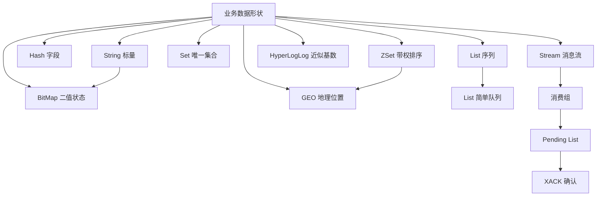

# Redis 常见数据类型、命令与应用场景

Source: `materials/redis/data_struct/command.md`

### 1. Topic Overview

- What this is about: 文章按 Redis 类型展开，依次讲 String、List、Hash、Set、ZSet、BitMap、HyperLogLog、GEO 和 Stream 的数据模型、底层实现、常用命令与应用场景。
- Why it matters: 面试题通常不会只问“Redis 有哪些类型”，而会给出购物车、排行榜、签到、UV、附近的人或消息队列等场景，要求从数据形状、所需操作和可靠性边界完成选型。
- Difficulty level: 中等。命令本身容易记，难点是区分相似类型、理解版本相关的底层编码，以及说清 List/Stream 作为消息队列时的可靠性边界。
- Prerequisites: key-value、哈希表、链表、集合运算、排序、位运算、消息队列的生产者/消费者/确认机制。
- Central lens: `业务数据形状 -> 必需操作 -> Redis 类型 -> 命令 -> 底层结构 -> 性能与可靠性边界`。

Source order roadmap:

1. String：标量值、SDS、`int/embstr/raw`、计数、锁和共享 Session。
2. List：有序序列、双端操作、阻塞读取和简单消息队列。
3. Hash：对象字段、局部更新和购物车。
4. Set：唯一成员、集合运算、点赞/共同关注/抽奖。
5. ZSet：`member + score`、排名、分数范围和字典序范围。
6. BitMap：海量二值状态、签到和位运算聚合。
7. HyperLogLog：固定小内存的近似去重计数。
8. GEO：经纬度编码、附近位置查询。
9. Stream：消息 ID、消费组、Pending List、ACK 和专业消息队列边界。

### 2. Core Concepts

#### Schema 1: 用“数据形状 + 必需操作”选择 Redis 类型

- Definition: 先识别业务数据是标量、字段集合、有序序列、唯一集合、带权排序、二值状态、近似基数、地理位置还是消息流，再选择对应类型。
- Intuition: 类型不是容器名称，而是一组已经设计好的操作能力。选择类型的关键是“接下来要高效做什么”。
- Example:
  - 原子计数：String。
  - 用户对象字段单独修改：Hash。
  - 从两端进出：List。
  - 去重、交并差：Set。
  - 排名和分数范围：ZSet。
  - 每个用户只有在线/离线两态：BitMap。
  - 百万级 UV 只需近似值：HyperLogLog。
  - 查找附近车辆：GEO。
  - 消费组和确认：Stream。
- Common mistakes:
  - 只按“能不能存”选型，不按“需要什么操作”选型。
  - 把 Set 的无序唯一与 ZSet 的带分排序混为一谈。
  - 用 List 做复杂队列，却忽略消息 ID、消费组和确认机制需要自行补齐。

#### Schema 2: 用“值形态 + 修改路径”判断 String 编码

- Definition: String 对外是一个标量 value，对内主要由整数或 SDS 保存；字符串对象的编码可为 `int`、`embstr` 或 `raw`。
- Intuition: 同一种 String API，可以根据值的形态和长度换一种更省空间的内部表示。
- Example:
  - 可由 `long` 表示的整数值：通常使用 `int` 编码。
  - 较短字符串：使用 `embstr`，`redisObject` 与 SDS 一次分配在连续内存中。
  - 较长字符串：使用 `raw`，对象头与 SDS 分两次分配。
  - 对 `embstr` 执行 `APPEND` 等修改时，会先转成 `raw` 再修改。
- Why SDS instead of C string:
  - 用 `len` 判断长度和结尾，能够保存包含 `\0` 的二进制数据。
  - 获取长度是 `O(1)`。
  - 扩容前检查空间，避免缓冲区溢出。
- Command families:
  - 基本读写：`SET`、`GET`、`EXISTS`、`STRLEN`、`DEL`。
  - 批量读写：`MSET`、`MGET`。
  - 原子计数：`INCR`、`INCRBY`、`DECR`、`DECRBY`。
  - 过期：`EXPIRE`、`TTL`、`SET ... EX`、`SETEX`。
  - 条件写入：`SETNX`，或把条件与 TTL 合在 `SET key value NX PX ttl` 中。
- Applications:
  - JSON 整体对象缓存，或把属性拆成多个 String key。
  - 阅读量、点赞数、库存等原子计数。
  - `SET lock_key unique_value NX PX 10000` 加锁，Lua 比较唯一值后删除来解锁。
  - 多台应用服务器共享 Session。
- Common mistakes:
  - 把 String 理解为只能保存文本；SDS 是二进制安全的。
  - 死记 `embstr` 长度阈值；文章明确指出阈值随 Redis 版本变化。
  - 认为 `embstr` 永远不变；它被修改时会转换为 `raw`。
  - 用 `SETNX` 和 `EXPIRE` 两条命令加锁，留下加锁成功但未设置 TTL 的故障窗口。

#### Schema 3: 用“序列两端操作 + 队列保障”理解 List

- Definition: List 是按插入顺序保存、允许重复的字符串序列，可从头尾插入或弹出。
- Intuition: List 像一条双端传送带；用哪端生产、哪端消费决定 FIFO 或 LIFO。
- Internal implementation:
  - 旧版本会在压缩列表与双向链表之间切换。
  - Redis 3.2 之后由 quicklist 实现，替代旧的双向链表/压缩列表组合。
- Command families:
  - 入队：`LPUSH`、`RPUSH`。
  - 出队：`LPOP`、`RPOP`。
  - 范围读取：`LRANGE`。
  - 阻塞出队：`BLPOP`、`BRPOP`。
  - 可靠性辅助：文章使用 `BRPOPLPUSH` 把取出的消息同时放入备份 List。
- Message-queue mapping:
  1. 保序：`LPUSH + RPOP`，或反向组合。
  2. 避免空轮询：用 `BRPOP` 阻塞等新消息。
  3. 去重：生产者自行生成全局唯一消息 ID，消费者记录已处理 ID。
  4. 处理失败后重试：`BRPOPLPUSH` 把消息转移到备份 List。
- Boundary: List 不原生生成消息 ID，也不支持消费组；一条消息弹出后，其他消费者不能再从原 List 读取它。
- Common mistakes:
  - 说 List 天然解决所有消息可靠性问题。
  - 用 `RPOP` 忙轮询而忽略 CPU 和网络开销。
  - 把“多个消费者竞争分担消息”误说成“多个消费组各自消费同一条消息”。

#### Schema 4: 用“对象 ID -> 字段 -> 值”理解 Hash

- Definition: Hash 在一个 Redis key 下保存多个 `field -> value`，天然对应对象 ID、属性名、属性值。
- Intuition: String + JSON 像把整份表单装进一个文件；Hash 像把每个字段放进可独立修改的格子。
- Internal implementation:
  - 旧版本小对象使用压缩列表，大对象使用哈希表。
  - Redis 7.0 已用 listpack 接替压缩列表。
- Command families:
  - 字段读写：`HSET`、`HGET`。
  - 批量字段：文章使用 `HMSET`、`HMGET`；现代写法可用一次 `HSET` 写多个字段。
  - 删除和统计：`HDEL`、`HLEN`。
  - 读取全部：`HGETALL`。
  - 数值字段累加：`HINCRBY`。
- Applications:
  - 对象缓存：整体读写常用 String + JSON；若部分属性频繁独立变化，可考虑 Hash。
  - 购物车：`cart:{userId}` 为 key，商品 ID 为 field，商品数量为 value。
- Common mistakes:
  - 看到对象就机械使用 Hash，不考虑是否总是整体序列化、读取和更新。
  - 购物车只存商品 ID 和数量，却误以为无需再查商品详情。
  - 对超大 Hash 直接 `HGETALL`，忽略响应体和主线程处理成本。

#### Schema 5: 用“唯一性 + 集合代数”理解 Set

- Definition: Set 保存无序且不重复的成员，并支持交集、并集、差集。
- Intuition: Set 的核心不是“没有顺序”，而是“成员唯一”和“可以比较多个集合的关系”。
- Internal implementation:
  - 成员全是整数且规模较小时使用整数集合 `intset`。
  - 否则使用哈希表。
- Command families:
  - 增删查：`SADD`、`SREM`、`SMEMBERS`、`SCARD`、`SISMEMBER`。
  - 随机但不删除：`SRANDMEMBER`。
  - 随机并删除：`SPOP`。
  - 集合运算：`SINTER`、`SUNION`、`SDIFF` 及对应的 `*STORE`。
- Applications:
  - 点赞：文章 ID -> 点赞用户 ID，天然去重。
  - 共同关注：两个关注集合做 `SINTER`。
  - 推荐差异项：`SDIFF uid:1 uid:2`。
  - 抽奖：允许后续重复抽到可用 `SRANDMEMBER`；不允许重复可用 `SPOP`。
- Boundary: 大集合的交并差计算成本高，可能阻塞 Redis 主线程；可在从库计算，或把数据交给客户端/离线系统聚合。
- Common mistakes:
  - 把 `SRANDMEMBER` 与 `SPOP` 的删除语义混淆。
  - 对大 Set 直接做聚合计算，不评估元素规模和阻塞风险。
  - 需要排名却选择 Set；Set 不保存 score。

#### Schema 6: 用“member 唯一 + score 排序”理解 ZSet

- Definition: ZSet 中 member 唯一，每个 member 绑定一个可重复的 score，并按 score 排序。
- Intuition: ZSet 是“集合成员 + 可更新排序键”；member 回答“是谁”，score 回答“排在哪里”。
- Internal implementation:
  - 旧版本小对象使用压缩列表，大对象使用跳表相关结构。
  - Redis 7.0 后小对象由 listpack 接替压缩列表。
- Command families:
  - 成员和分数：`ZADD`、`ZREM`、`ZSCORE`、`ZCARD`、`ZINCRBY`。
  - 按排名：`ZRANGE`、`ZREVRANGE`。
  - 按分数：`ZRANGEBYSCORE`。
  - 按字典序：`ZRANGEBYLEX`、`ZREVRANGEBYLEX`，前提是相关成员分数相同。
  - 聚合：`ZUNIONSTORE`、`ZINTERSTORE`；文章指出 ZSet 不像 Set 那样提供差集操作。
- Applications:
  - 排行榜：文章 ID 为 member，点赞数为 score；点赞用 `ZINCRBY`，Top N 用 `ZREVRANGE`。
  - 按分数范围查询：用 `ZRANGEBYSCORE`。
  - 电话或姓名字典序范围：所有成员使用相同 score，再用 `ZRANGEBYLEX`。
- Common mistakes:
  - 把 member 与 score 放反。
  - 忘记 member 唯一但 score 可以重复。
  - 在不同 score 的集合中使用 `ZRANGEBYLEX` 并期待可靠的全局字典序。
  - 文章示例先把 `article:4` 从 50 加到 51，随后 `ZSCORE` 却显示 50；这是示例不一致，正确结果应与更新后的 score 一致。

#### Schema 7: 区分精确二值统计与近似去重计数

- Definition: BitMap 用每一位精确表示一个对象的 0/1 状态；HyperLogLog 用概率算法估算不重复元素数量，不保存可枚举的完整成员集合。
- Intuition:
  - BitMap 像座位表：每个编号位置明确是 0 还是 1。
  - HyperLogLog 像一个只保留统计线索的计数器：知道大约有多少不同访客，但不能列出全部访客。
- BitMap facts:
  - 底层复用 String 的字节数组。
  - `SETBIT`、`GETBIT` 操作单个 offset。
  - `BITCOUNT` 统计 1 的数量；其 `start/end` 参数按字节而非 bit 计。
  - `BITOP AND|OR|XOR|NOT` 聚合多个位图；`BITPOS` 找第一个目标位。
- BitMap applications:
  - 每月签到：某用户每月一个 key，日期映射为 offset。
  - 登录态：用户 ID 映射为 offset。
  - 连续签到人数：每天一个 Bitmap，对多天做 AND，再 `BITCOUNT`。
- HyperLogLog facts:
  - `PFADD` 添加观察值，`PFCOUNT` 返回基数估计，`PFMERGE` 合并多个统计器。
  - 文章给出的标准误差约 0.81%，每个 key 典型内存约 12 KB，可估算极大基数。
  - 适合海量 UV 等允许误差的去重计数；需要精确成员或精确数量时用 Set/Hash 等。
- Common mistakes:
  - 把 BitMap 当成压缩后的任意整数数组；每个位只表示二值状态。
  - 忘记 offset 必须稳定映射到同一个对象。
  - 把 HyperLogLog 当 Set，试图枚举成员。
  - 原文标题写“UA 计数”，上下文实际描述的是去重用户数，通常应理解为 UV。
  - 原文“50000 万用户约 6 MB”数字不一致；约 5000 万 bit 才接近 6 MB。

#### Schema 8: 用“二维位置编码成一维 score”理解 GEO

- Definition: GEO 保存地理位置并支持位置、距离和附近范围查询；底层复用 Sorted Set。
- Intuition: GeoHash 把二维经纬度所在区域编码成可排序的一维值，再借用 ZSet 的有序范围能力寻找附近区域。
- Command families:
  - 写入位置：`GEOADD`。
  - 查询坐标：`GEOPOS`。
  - 两点距离：`GEODIST`。
  - 按中心与半径查询：文章使用 `GEORADIUS`。
- Application: 把车辆 ID 作为 member、车辆经纬度写入 `cars:locations`，按乘客坐标查询 5 km 内车辆。
- Common mistakes:
  - 认为 GEO 有一套完全独立的底层容器；它复用了 ZSet。
  - 把原始经纬度直接当作一个普通 score；中间需要 GeoHash 编码。
  - 认为一维近邻编码等价于没有误差的二维几何计算；附近查询仍受编码分区和距离计算规则约束。

#### Schema 9: 用“ID + 消费组 + Pending + ACK”理解 Stream

- Definition: Stream 是 Redis 5.0 为消息队列设计的数据类型，支持有序消息 ID、阻塞读取、消费组、待确认列表和消费确认。
- Intuition: List 只提供一条可从两端操作的序列；Stream 额外记住“消息是谁、发给了哪个组内消费者、是否已经确认”。
- Core commands:
  - 生产与长度：`XADD`、`XLEN`。
  - 读取与范围：`XREAD`、`XRANGE`。
  - 删除：`XDEL`，整个 key 可用 `DEL`。
  - 消费组：`XGROUP CREATE`、`XREADGROUP`。
  - 待确认与确认：`XPENDING`、`XACK`。
- Message ID:
  - `XADD key * ...` 自动生成 ID。
  - 文章示例 ID `1654254953808-0`：前半是毫秒时间，后半是同一毫秒内序号。
  - `XREAD STREAMS mymq <id>` 从给定 ID 之后的消息开始读；`$` 表示从当前最新位置等待后续新消息。
- Consumer-group semantics:
  - 同一消费组内，一条新消息只分配给其中一个消费者，用于分担负载。
  - 不同消费组可各自消费同一条消息，前提是各组从覆盖该消息的位置开始读取。
  - `>` 表示读取尚未投递给该消费组消费者的新消息。
- Reliability chain:
  1. 消费者用 `XREADGROUP` 读取后，消息进入该组的 Pending Entries List。
  2. 业务处理成功后执行 `XACK`。
  3. 未确认消息可由 `XPENDING` 查出，供故障恢复和重试流程使用。
- Correction to source wording: `XACK` 的作用是把消息从消费组的待确认列表中移除，并不等于从 Stream 主体删除消息；删除 Stream 中的消息需要 `XDEL` 或裁剪机制。
- Common mistakes:
  - 认为 ACK 前消息仍未投递；实际上它已投递但处于 pending。
  - 认为同组多个消费者会各自收到同一条新消息。
  - 认为不同消费组共享同一份消费进度。
  - 把 `XACK` 说成删除 Stream 消息。

#### Schema 10: 用“三段不丢 + 堆积介质”判断 Redis 能否做消息队列

- Definition: 判断队列是否合适，要分别检查生产者、队列中间件、消费者三个环节能否避免丢失，以及消息积压时存储介质能否承受。
- Intuition: Stream 提供队列语义，不等于 Redis 自动获得专业消息中间件的持久性和堆积能力。
- Three-stage analysis:
  - 生产者：检查写入返回值和异常；未收到成功响应时重试。
  - 消费者：业务成功后再 `XACK`，未确认消息留在 Pending List 中。
  - Redis 中间件：AOF `everysec` 有宕机丢失窗口，异步主从切换也可能丢未复制消息。
- Backlog boundary:
  - Stream 数据主要占内存；大量堆积会持续消耗内存并可能触发 OOM。
  - 限制最大长度会裁剪旧消息，控制内存的同时引入消息丢失。
  - Kafka/RabbitMQ 等专业队列通常更适合海量堆积和严格持久性要求。
- Pub/Sub boundary:
  - 不持久化，重启后历史消息不存在。
  - 订阅者离线期间的消息不能补读。
  - 慢消费者输出缓冲区超过限制时可能被断开。
- Decision:
  - 简单业务、可容忍少量丢失、积压概率低：Redis Stream 可以胜任。
  - 海量消息、积压概率高、不能接受丢失：选专业消息队列。
- Common mistakes:
  - 只因为有 `XACK` 就声称端到端绝不丢消息。
  - 只评估吞吐，不评估故障切换和消息堆积。
  - 用 Pub/Sub 承担需要离线补读和可靠持久化的任务。

### 3. Deep Understanding

#### 3.1 一条统一选型链

```text
单值/计数/锁/Session
-> String

对象字段独立更新
-> Hash

按插入顺序从两端操作
-> List

唯一成员 + 交并差
-> Set

唯一成员 + score 排序/范围
-> ZSet

稳定 ID -> 0/1 状态
-> BitMap

只求近似去重数量
-> HyperLogLog

经纬度与附近查询
-> GEO

消息 ID + 消费组 + ACK
-> Stream
```

#### 3.2 小数据省内存，大数据换专用结构

- Redis 对外类型不等于唯一底层结构。
- 小规模对象倾向使用连续紧凑的编码以降低指针和分配开销。
- 规模或元素长度超过阈值后，切换到哈希表、quicklist、跳表等更适合扩展和更新的结构。
- 具体阈值和编码会随版本变化，因此面试回答要同时给出“设计原则”和“版本边界”，不要只背旧数字。

#### 3.3 Set、ZSet、BitMap、HyperLogLog 的边界

| 需求 | 类型 | 精确性 | 能否列出成员 | 核心成本/边界 |
| --- | --- | --- | --- | --- |
| 唯一集合与交并差 | Set | 精确 | 能 | 大集合聚合可能阻塞 |
| 唯一成员排序 | ZSet | 精确 | 能 | 每个成员需维护 score 与排序结构 |
| 稠密 ID 的二值状态 | BitMap | 精确 | 可按 offset 查 | ID 很稀疏时会浪费位空间 |
| 海量去重计数 | HyperLogLog | 近似 | 不能 | 约 0.81% 标准误差，不能返回成员列表 |

#### 3.4 List 到 Stream 的队列能力升级

```text
List
-> 顺序 + 双端弹入弹出
-> BRPOP 解决空轮询
-> 业务自行生成消息 ID
-> 备份 List 补处理失败
-> 仍缺原生消费组

Stream
-> 自动消息 ID
-> XREAD BLOCK
-> 消费组分摊消息
-> Pending List 记录已投递未确认
-> XACK 完成确认
-> 仍受 Redis 持久化、异步复制和内存堆积边界限制
```

#### 3.5 原子命令不等于完整业务可靠性

- `INCR` 原子，适合单 key 计数，但跨多个业务对象的一致性仍需额外设计。
- `SET NX PX` 把抢锁与 TTL 合成一个原子命令，但锁超时、任务续约、主从切换仍是系统级问题。
- `XACK` 原子修改待确认状态，但端到端不丢还依赖生产者重试、Redis 持久化/复制和消费者幂等。

### 4. Minimal Working Example

场景：一个内容平台需要保存文章、计数、点赞、排行榜、每日签到、UV 和异步审核任务。

```text
文章整体缓存       -> String: SET article:42 '<json>'
文章字段频繁变更   -> Hash:   HSET article:42 title '...' status 'published'
阅读量             -> String: INCR article:42:views
点赞用户去重       -> Set:    SADD article:42:likers user:7
点赞排行榜         -> ZSet:   ZINCRBY article:ranking 1 article:42
每日签到           -> BitMap: SETBIT sign:20260710 7 1
页面近似 UV        -> HLL:    PFADD page:42:uv user:7
审核消息           -> Stream: XADD review:stream * article 42
```

Reasoning flow:

1. 先问数据是否需要唯一、排序、局部字段更新、二值状态或消息确认。
2. 再选类型和最小命令集。
3. 最后检查大集合计算、近似误差、阻塞命令、持久化和积压风险。

### 5. Knowledge Graph



### 6. Self-Test Questions

Recall:

1. String 为什么使用 SDS，而不是直接使用 C 字符串？
2. Set 和 ZSet 的核心数据模型差异是什么？
3. Stream 中 Pending List 与 `XACK` 分别负责什么？

Application / transfer:

4. 一个活动要求“每个用户只能中奖一次”，但下一轮活动仍允许再次参与，应选什么结构和命令？为什么？
5. 需要统计连续七天签到的用户数，应如何组织七个 Bitmap 并计算结果？

Explain like I am 5:

6. 用“排队领餐”的比喻解释 List 队列与 Stream 消费组有什么不同。

### 7. Weak Point Detection

- 只背九类名称，不能从业务操作反推类型：属于表面记忆。
- 把 String 说成只能保存文字，或说 `embstr` 可以原地修改：String 内部编码边界不稳。
- 把 Set、ZSet、BitMap、HyperLogLog 都说成“去重”：缺少精确性、排序、成员可枚举性和二值状态边界。
- 忘记 `ZRANGEBYLEX` 要求相关成员 score 相同：ZSet 两套排序语义混淆。
- 认为 `XACK` 会删除 Stream 消息：消费确认与消息存储混淆。
- 认为 Stream 有 Pending List 就绝不丢消息：忽略 Redis 持久化、异步复制和积压边界。
- 对大 Set 直接交并差、对大 Hash 直接 `HGETALL`：没有把命令复杂度与主线程阻塞联系起来。
