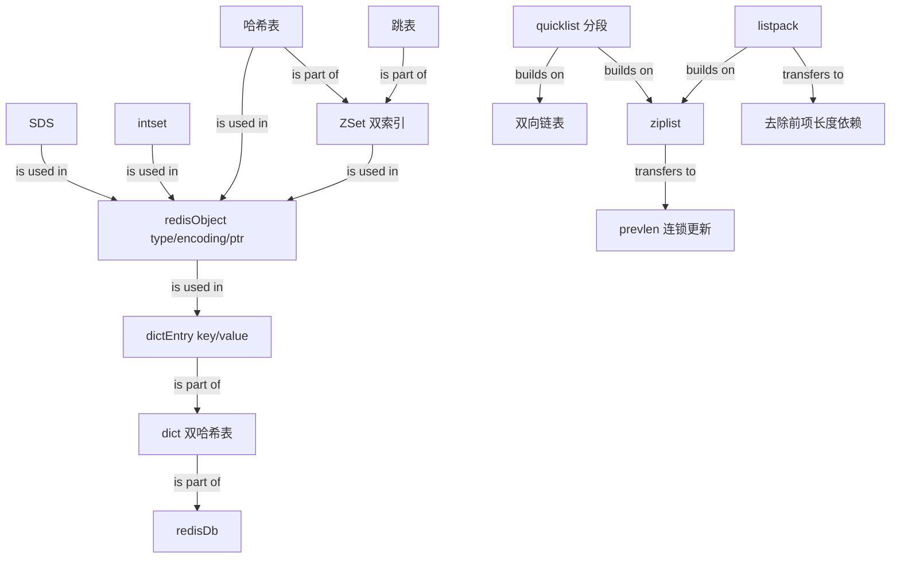

# Redis 数据结构

Source: `materials/redis/data_struct/data_struct.md`

### 1. Topic Overview

- What this is about: 文章区分 Redis 的「对外数据类型」与「对内底层数据结构」，再依次讲解 SDS、双向链表、压缩列表、哈希表、整数集合、跳表、quicklist 和 listpack。
- Why it matters: Redis 的快不只来自内存，也来自数据结构对查找速度、范围遍历、内存占用和最坏时延的取舍。
- Difficulty level: 中等偏上。难点是把「字段 -> 机制 -> 复杂度/内存 -> 边界」连起来，而不是背结构名称。
- Prerequisites: key-value、数组与链表、指针、哈希函数、时间复杂度、CPU 缓存局部性。
- Central lens: `Redis 对象 -> encoding -> 底层结构 -> 得到的能力 -> 付出的代价`。

Source order roadmap:

1. 键值存储全景：对象类型与底层编码。
2. SDS：O(1) 长度、二进制安全、安全扩容与内存节省。
3. 链表与压缩列表：指针灵活性与连续内存的取舍。
4. 哈希表：链式哈希、双表 rehash 与渐进迁移。
5. 整数集合：整体升级编码。
6. 跳表：多层有序链表与 ZSet 双索引。
7. quicklist：分段紧凑的折中。
8. listpack：去掉 `prevlen` 依赖，消除连锁更新。

Source/version cautions:

- 原文说「9 种」，但列出并展开的实为上述 8 种。
- 文中「最新代码尚未发布」与 Redis 6.2 的说法是成文时的版本背景；学习重点是演进动机，不把它当作永久的当前版本结论。
- 压缩列表依靠 `zltail` 偏移定位尾节点，`zllen` 记录节点数。原文「通过 zllen 长度直接定位首尾」的句子不严谨。

### 2. Core Concepts

#### Schema 1: 用「对象层 + 编码层」读懂 Redis 键值存储

- Definition: String、List、Hash、Set、ZSet 是 value 的逻辑数据类型；SDS、哈希表、跳表等是实现对象的底层数据结构。
- Intuition: 数据类型说「对 value 能做什么」；`encoding` 说「Redis 此刻怎么存它」。
- Storage chain: `redisDb -> dict -> dictht -> dictEntry -> redisObject -> ptr -> 底层数据结构`。
  - `redisDb` 持有数据库 dict；`dict` 内有两张哈希表，第二张主要在 rehash 使用。
  - `dictht.table` 是哈希桶数组，桶内持有 `dictEntry*`。
  - `dictEntry` 的 key 是 String 对象，value 可以是任一 Redis 对象。
  - `redisObject.type` 是逻辑类型，`encoding` 是内部表示，`ptr` 指向底层结构。
- Example: `HSET person name xiaolin age 18` 中，`person` 是 String key 对象，value 是 Hash 对象；Hash 当前用什么底层结构由 `encoding` 表示。
- Common mistakes: 把 String/Hash 和 SDS/hash table 放在同一层；认为一种 Redis 类型永远只有一种底层结构；把全局数据库 dict 和 Hash value 混为一件事。

#### Schema 2: 用长度与容量元数据理解 SDS

- Definition: SDS 是动态字节串，由 `len`、`alloc`、`flags`和 `buf[]` 组成。
- Intuition: C 字符串只给出起点并用 `\0` 找终点；SDS 额外记住已用长度和总容量。
- Mechanism:
  - `len` 让长度查询为 O(1)。
  - SDS API 依据 `len` 判断边界，可保存内含 `\0` 的二进制数据；尾部仍保留 `\0` 兼容部分 C API。
  - `alloc - len` 是剩余容量；不足时先扩容再写入，避免缓冲区溢出。
  - 按文中代码，新需求长度小于 1 MB 时翻倍预分配；达到阈值后额外加 1 MB，减少后续分配次数。
  - `sdshdr5/8/16/32/64` 用不同宽度的头字段；`__attribute__((packed))` 取消结构体对齐填充。文中 `char + int` 示例从 8 字节压到 5 字节。
- Common mistakes: 因尾部仍有 `\0` 就认为 SDS 不能保存内含 `\0` 的数据；只说「SDS 更快」，却不能用 `len/alloc` 解释。

#### Schema 3: 用「指针灵活性 vs 连续内存」对比链表与压缩列表

- Definition:
  - Redis 链表节点含 `prev/next/value`，外层 `list` 记录 `head/tail/len` 并提供复制、释放、比较回调。
  - ziplist 是一块连续内存，用变长编码保存整数或字符串。
- Intuition: 链表像分散房间用地址相连，灵活但指针成本高；ziplist 像紧密收纳箱，省空间但中间变大时可能整体挪动。
- Linked list: 已知节点时取前后节点 O(1)，取表头、表尾、长度也是 O(1)；但节点内存不连续，CPU cache 利用差，且每值都要支付节点头开销。
- Ziplist layout:
  - 表头是 `zlbytes` 总字节数、`zltail` 尾偏移、`zllen` 节点数；表尾 `zlend=0xFF`。
  - entry 是 `prevlen + encoding + data`。`prevlen` 支持反向遍历，`encoding` 记录当前数据类型和长度。
  - 前一 entry 长度 `<254` 字节时 `prevlen` 用 1 字节；`>=254` 时用 5 字节。
  - 首/尾可快速定位，中间元素仍顺序查找 O(N)，所以不适合元素多或大的数据。
- Cascade update: 表头插入大节点 -> e1 的 `prevlen` 从 1 扩到 5 字节 -> e1 越过 254 字节 -> e2 也被迫扩容，可一直传到表尾，引发多次内存重分配。
- Common mistakes: 认为链表首尾 O(1) 就意味着按索引找中间也 O(1)；把连锁更新说成数据值联动改变，而非 entry 长度字段的结构性扩容。

#### Schema 4: 用「冲突链 + 双表渐进迁移」理解哈希表

- Definition: `dictht` 是哈希桶数组，`dictEntry` 保存 key/value 及 `next`；`dict` 内准备两张 `dictht` 用于 rehash。
- Structure:
  - `dictht`: `table/size/sizemask/used`。`dictEntry`: key、联合体 value、`next`。
  - value 联合体可直接内嵌 64 位整数或 double，避免额外指针和分配。
  - 不同 key 落到同一桶就是哈希冲突；`next` 把同桶 entry 接成单链表。链越长，查找越接近 O(N)。
- Ordinary rehash: 为表 2 分配更大空间 -> 迁移表 1 -> 释放表 1 -> 表 2 升为新表 1。大表一次迁完会阻塞。
- Progressive rehash:
  - 每次新增、删除、查找或更新时，顺便迁移表 1 下一个索引桶的全部 entry，把巨额开销分摊到多次请求。
  - 迁移期间查找/删除/更新要考虑两张表；查找先表 1，未命中再表 2。
  - 新 key 只加入表 2，让表 1 只减不增。
- Trigger conditions in the article: `load factor = used / size`。负载因子 `>=1` 且未执行 RDB 快照/AOF 重写时可 rehash；`>=5` 时强制 rehash。
- Common mistakes: 把渐进 rehash 说成后台线程一次搬完；迁移期只查一张表；继续向旧表插入新 key。

#### Schema 5: 用「按最大整数宽度统一编码」理解 intset

- Definition: intset 是小规模、纯整数 Set 的紧凑实现；它在连续 `contents[]` 中按 `INT16/INT32/INT64` 之一统一编码并保持有序。
- Intuition: 整个数组使用能容纳当前最大值的最小宽度，而非每个数各用一种宽度。
- Upgrade example: 向三个 int16 元素的集合加入 `65535`，需扩成四个 int32 位置，转换旧元素并放到正确有序位置，再放入新元素。
- Benefit and boundary: 小数值不必一开始就支付 64 位空间；但只升级不降级，删除大数也不会把 int32 退回 int16。
- Common mistake: 认为 `contents` 声明成 `int8_t[]` 就真的按 8 位解释；实际视图由 `encoding` 决定。

#### Schema 6: 用「多层索引 + 底层有序链」理解跳表

- Definition: 跳表是带多层前向索引的有序链表，平均查找 O(logN)。ZSet 的大规模表示组合 `dict + zskiplist`。
- Dual-index intuition: dict 擅长用 member 做 O(1) 平均单点查询，如 `ZSCORE`；skiplist 擅长按 score 有序范围查询，如 `ZRANGEBYSCORE`。写入需更新两结构以保持一致。
- Node and table:
  - `ele` 是 SDS member，`score` 是权重，`backward` 便于倒序访问。
  - `level[]` 每层保存 `forward` 和 `span`。`forward` 用于跳跃；`span` 表示跨过的底层节点数，沿路径累加可计算排位。
  - `zskiplist` 记录 header/tail、length、当前最大层数。
- Search: 从头节点最高层开始。下一节点 score 更小则向前；score 相等时再比较 SDS member 字典序；不能向前就下沉一层。
- Level generation: 通过随机层高避免插删时强制维护严格 2:1；文中每升一层的概率为 25%。最大层数随版本变化：文中列 Redis 5.0 为 64，3.0/7.0 为 32。
- Why not balanced tree: 指针数可通过概率调节；找到范围起点后沿底层遍历即可；插删主要修改相邻指针，实现和扩展排名功能更简单。文中 p=1/4 时平均约 1.33 个前向指针。
- Common mistakes: 说「ZSet 就是跳表」而忽略 dict；把 `span` 当作查找步长而非排位信息；认为跳表严格维持相邻层 2:1。

#### Schema 7: 用 quicklist 的「分段紧凑」折中空间和更新成本

- Definition: 文章对 Redis 3.2 quicklist 的描述是「双向链表 + ziplist」；每个 `quicklistNode` 指向一个小型 ziplist。
- Intuition: 不为每个元素分配一个链表节点，也不把全部元素塞进一个巨大连续块；而是分成可控大小的紧凑块，再用双向链串起来。
- Structure: quicklist 记录 head/tail、总元素数 `count`、节点数 `len`；quicklistNode 记录 prev/next、`zl`、块字节数 `sz`、块内元素数 `count`。
- Insert and boundary: 目标块能容纳就就地写入，否则建新节点。控制每块大小可限制连锁更新的影响范围，但节点内仍是 ziplist，未从根本上消除问题。
- Common mistake: 只背「quicklist = 链表 + ziplist」，却不知道折中参数是每个紧凑块的字节数/元素数。

#### Schema 8: 用 listpack 的「只记当前项长度」消除连锁更新

- Definition: listpack 保留连续内存和变长编码，但 entry 不再保存前一 entry 的 `prevlen`。
- Layout: 头部记总字节数和元素数，尾部有结束标识；entry 是 `encoding + data + len`，`len` 记录当前 entry 的 `encoding + data` 总长度。
- Causal chain: 新 entry 不再改变后一节点的前项长度字段 -> 后续节点不会被迫扩大 -> 没有 ziplist 式多米诺连锁更新。
- Reverse traversal: 无 `prevlen` 不等于不能反向遍历；读者问答指出，可从当前项左侧反向解码前一项的 entry-len。
- Common mistake: 说 listpack 完全没有长度字段；它去掉的是对前一项长度的依赖，仍记当前项 `len`。

### 3. Deep Understanding

#### 3.1 时间、空间与最坏时延

1. 哪个操作必须快？SDS 的 `len` 把求长度变为 O(1)；哈希表给单点查找 O(1) 平均值；跳表给有序查找 O(logN) 平均值。
2. 为速度付出什么空间？链表、冲突链和跳表多层需要指针；SDS 预分配留空间；ZSet 维护 dict + skiplist 双索引。
3. 如何避免一次操作卡住主线程？渐进 rehash 分摊迁移；quicklist 分块限制重分配范围；listpack 去掉连锁长度依赖。

#### 3.2 连续内存与指针结构没有绝对优劣

- 连续内存（ziplist/listpack/intset）：元数据开销小、cache locality 好，适合小而紧凑的数据；但插入或扩容可能要整块搬移。
- 指针结构（linked list/hash chaining/skiplist）：扩展、插删和导航灵活，但每节点有指针开销且内存跳跃。
- 混合结构（quicklist、ZSet 的 dict + skiplist）是为了同时得到两类能力。

#### 3.3 演进链

`plain linked list / one large ziplist -> quicklist 分段折中 -> listpack 去除 prevlen 连锁依赖`。要回答的不是静态版本表，而是：旧结构的什么边界触发新结构，新结构保留什么优点、限制什么最坏情况。

### 4. Minimal Working Example

```redis
SET user:1:name "xiaolin"
ZADD leaderboard 100 user:1
ZSCORE leaderboard user:1
ZRANGEBYSCORE leaderboard 90 110
```

Reasoning flow:

1. 两个 key 都是 String 对象，存在数据库全局 dict 中。
2. `user:1:name` 的 value 是 String 对象，`ptr` 最终连到 SDS；`len=7` 让求长度无需扫描。
3. `leaderboard` 的 value 是 ZSet 对象。当它采用大规模 zset 表示时，dict 支撑 `ZSCORE` 单点查询，skiplist 支撑 `ZRANGEBYSCORE` 范围查询。
4. 数据库全局 dict 与 ZSet 内部 dict 是不同层次：前者用 key 找 Redis value 对象，后者用 member 找 score。
5. 全局 dict 扩容时，通过双表渐进 rehash 把迁移分摊给多次操作。

### 5. Knowledge Graph



### 6. Self-Test Questions

Recall:

1. `redisObject` 的 `type`、`encoding`、`ptr` 分别回答什么问题？
2. SDS 的 `len` 和 `alloc` 分别解决 C 字符串的哪个问题？
3. 渐进 rehash 期间，查找旧 key 和插入新 key 分别访问哪张表？

Application/transfer:

4. ZSet 为什么同时保留 dict 和 skiplist？只留一个时，哪类操作会变差？
5. ziplist 中连续多个 entry 都是 253 字节，表头插入 300 字节 entry，请描述连锁更新的前两步。

Explain-like-I-am-5:

6. 用收纳箱和货架的比喻，解释 quicklist 为什么不用一个巨大箱子，也不给每件小物品单独用一格。

### 7. Weak Point Detection

- 能背对象到结构的映射，但说不出 `type` 和 `encoding` 的层次差异。
- 能说 SDS 二进制安全，但无法用 `len` 解释内部 `\0` 为什么不截断数据。
- 说 ziplist 连锁更新时，没有说出 `prevlen: 1 -> 5 bytes` 和 254 字节边界。
- 知道渐进 rehash 是慢慢搬，但不知道为什么查两表、新 key 为什么只进表 2。
- 把 intset 整体升级说成单个大元素单独变宽，或误以为删掉大数会降级。
- 只说跳表 O(logN)，但无法解释 score 相同时的 member 比较、span 排名和 ZSet 的 dict。
- 把 quicklist 说成彻底消除连锁更新，或把 listpack 说成不支持反向遍历。
