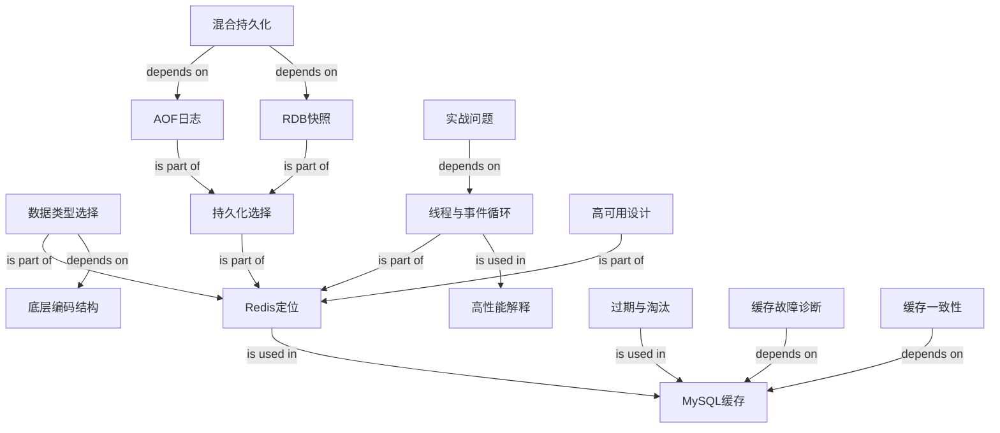

# Redis 常见面试题

Source: `materials/redis/base/redis_interview.md`

### 1. Topic Overview

- What this is about: 这篇文章把 Redis 面试高频问题串成一条主线：Redis 为什么快、能存什么、怎么持久化、怎么高可用、怎么控制内存、怎么设计缓存、以及几个实战模式。
- Why it matters: Redis 面试通常不是背定义，而是要求把「内存系统的性能」「缓存和数据库一致性」「故障恢复」「高并发工程风险」连成可解释的方案。
- Difficulty level: 中等偏高。单个知识点不难，难点在于边界多：单线程但不是整个程序单线程、AOF 丢失少但恢复慢、RDB 恢复快但丢失窗口大、Cache Aside 常用但不是绝对强一致。
- Prerequisites: 基本数据库读写、缓存命中/未命中、网络 I/O、进程/线程、文件刷盘、主从复制、哈希和有序集合。
- Source order roadmap:
  1. Redis 定位和 Redis vs Memcached。
  2. Redis 数据类型、使用场景和底层结构。
  3. 线程模型、事件循环、Redis 6.0 I/O 多线程边界。
  4. AOF 日志、写回策略、AOF 重写。
  5. RDB 快照、`bgsave`、COW。
  6. 混合持久化。
  7. 主从、哨兵、切片集群、脑裂。
  8. 过期删除、内存淘汰、LRU/LFU。
  9. 缓存雪崩/击穿/穿透、热点缓存、缓存更新策略。
  10. 延迟队列、大 key、Pipeline、事务、分布式锁。

### 2. Core Concepts

#### Schema 1: 用能力边界定位 Redis

- Definition: Redis 是基于内存的数据库，常用于缓存、消息队列、分布式锁等场景，提供多种数据类型、原子命令、持久化和集群能力。
- Intuition: 不要只说「Redis 很快」。面试回答要先定位它解决什么问题：把热点读写从磁盘数据库前移到内存系统，同时提供比普通 key-value cache 更丰富的数据结构和工程机制。
- Example: MySQL 中商品详情第一次读取较慢，放入 Redis 后，后续请求直接读内存；但 MySQL 变更后必须考虑缓存更新和双写一致性。
- Common mistakes:
  - 把 Redis 说成纯缓存，忽略消息队列、分布式锁、持久化、集群等能力。
  - 只说 Redis 比 MySQL 快，不说高并发场景下 Redis 能分担数据库压力。
  - 混淆 Redis 和 Memcached：Memcached 也快，但类型、持久化、集群原生能力和脚本/事务能力更弱。

#### Schema 2: 按「数据形状 -> 操作需求 -> 底层结构」选择数据类型

- Definition: Redis 类型不是为了背名称，而是为了把业务数据形状映射到合适操作：String、Hash、List、Set、ZSet，以及 BitMap、HyperLogLog、GEO、Stream。
- Intuition: 面试官问数据类型，实际在问你能否把「业务需求」落到「数据结构能力」上。
- Example:
  - 计数、共享 session、简单对象缓存：String。
  - 购物车或对象字段：Hash。
  - 简单队列：List，但要注意全局唯一 ID 和消费组能力不足。
  - 点赞、共同关注、抽奖：Set。
  - 排行榜、按分数排序：ZSet。
  - 签到状态：BitMap。
  - UV 粗略统计：HyperLogLog。
  - 地理位置：GEO。
  - 更完整的消息队列：Stream。
- Common mistakes:
  - 只背五大类型，不会说使用场景。
  - 用 List 做消息队列时忘记 Stream 解决了唯一消息 ID 和消费组问题。
  - 不知道 ZSet 适合排序类问题，而 Set 更适合集合运算。

#### Schema 3: 用底层结构解释类型性能和边界

- Definition: Redis 对外暴露数据类型，对内根据数据规模和版本选择 SDS、quicklist、listpack、哈希表、整数集合、跳表等结构。
- Intuition: 对外类型是「API」，底层结构是「为什么它快、什么时候会变重」。
- Example:
  - String 主要用 SDS，SDS 记录长度、二进制安全、拼接前会扩容检查。
  - List 在 Redis 3.2 后由 quicklist 实现。
  - Hash 在小规模时可用压缩结构，Redis 7.0 后由 listpack 替代 ziplist；规模变大后用哈希表。
  - Set 小整数集合可用 intset，否则用哈希表。
  - ZSet 小规模可用压缩结构，规模变大后用跳表；Redis 7.0 后压缩列表由 listpack 接替。
- Common mistakes:
  - 把 Redis 7.0 仍说成大量使用 ziplist。
  - 只说「ZSet 用跳表」，忘记小规模编码和版本差异。
  - 不知道 SDS 为什么比 C 字符串适合 Redis。

#### Schema 4: 解释 Redis 快的主链路

- Definition: Redis 快主要来自内存操作、高效数据结构、单线程命令执行减少并发成本、I/O 多路复用处理大量 socket，以及后台线程处理耗时任务。
- Intuition: 「单线程」不是弱点，而是 Redis 把 CPU 竞争和锁复杂度降下来的设计；前提是大多数操作在内存中，瓶颈更多是内存或网络。
- Example: Redis 6.0 前，主线程负责网络 I/O 和命令执行；事件循环用 epoll 接收连接、读请求、执行命令、把结果放到发送缓冲区。Redis 6.0 后可用 I/O 多线程分担网络读写，但命令执行仍由主线程完成。
- Common mistakes:
  - 说 Redis 完全单线程，忽略 BIO 后台线程、lazyfree 和 Redis 6.0 I/O 线程。
  - 说 Redis 6.0 多线程后命令也并发执行。
  - 忘记大 key、慢命令、同步删除会阻塞主线程。

#### Schema 5: 解释 AOF 日志、写回策略与重写

- Definition: AOF 是 Append Only File。Redis 每执行完一条写命令，就把这条命令追加到 AOF 日志；重启时重放这些命令恢复数据。
- Intuition: AOF 像「操作流水账」。流水账越勤写到磁盘，越不容易丢；但刷盘越频繁，写入成本越高。流水账太长时，需要重写成一份更短的新流水账。
- Example:
  - 命令记录：执行 `SET name xiaolin` 后，AOF 记录的是可重放的 Redis 协议格式命令，不是内存对象本身。
  - 先执行再写日志：能避免把语法错误命令写进恢复日志，也不阻塞当前命令执行；代价是执行成功到写入磁盘之间有丢失窗口。
  - 写回链路：写命令 -> AOF buffer -> `write()` 到 page cache -> `fsync` 落盘。
  - `appendfsync always`：每条写命令都刷盘，丢失风险最低，性能最差。
  - `appendfsync everysec`：每秒刷盘一次，常用折中，最坏大约丢 1 秒。
  - `appendfsync no`：刷盘时机交给操作系统，Redis 不控制丢失窗口。
  - AOF 重写：`bgrewriteaof` 子进程扫描当前数据库，把当前键值对转成更短的新 AOF；主进程继续服务，并把重写期间的新写命令同时写入 AOF 缓冲区和 AOF 重写缓冲区；子进程完成后，主进程把重写缓冲区追加到新 AOF，再 rename 覆盖旧 AOF。
- Common mistakes:
  - 把 `write()` 到 page cache 误认为已经真正落盘。
  - 只背 AOF 丢数据少，不会说明 `always/everysec/no` 的丢失窗口和性能取舍。
  - 忘记 AOF 是先执行命令再写日志，因此执行成功后、日志落盘前仍可能宕机丢失。
  - 以为 AOF 重写会阻塞主进程，或忘记 AOF 重写缓冲区用于补齐重写期间的新写命令。

#### Schema 6: 解释 RDB 快照、bgsave 与 COW

- Definition: RDB 是 Redis Database 快照。它把某一时刻的内存数据以二进制快照写入磁盘；重启时直接加载快照恢复数据。
- Intuition: RDB 像「拍照片」。照片恢复很快，但照片拍完之后到下一次拍照之间的新变化，如果宕机就可能丢。
- Example:
  - `save`：在主线程生成 RDB，写入时间长会阻塞 Redis。
  - `bgsave`：fork 子进程生成 RDB，主线程继续处理请求。
  - 自动快照配置里的 `save 900 1 / save 300 10 / save 60 10000` 名字叫 save，但实际触发的是 `bgsave`。
  - RDB 是全量快照。频率太高会增加 fork、写磁盘和 COW 成本；频率太低会扩大宕机丢失窗口。
  - COW：fork 后父子进程共享内存页；主进程写某个页时，操作系统复制新页给主进程修改，子进程继续看到 fork 时刻的旧页，用旧页写 RDB。
- Common mistakes:
  - 以为 `bgsave` 会阻塞主线程；真正阻塞风险更明显的是 `save`。
  - 以为 `bgsave` 期间不能写数据；实际主线程可以继续处理写命令。
  - 以为 RDB 是增量快照；文章强调 Redis 快照是全量快照。
  - 忘记 COW 会带来额外内存压力：写入越多，被复制的页越多。

#### Schema 7: 用混合持久化折中 AOF 和 RDB

- Definition: 混合持久化是 Redis 4.0 引入的持久化方式，工作在 AOF 重写过程中：新的 AOF 文件前半部分写入 RDB 格式的全量数据，后半部分写入 AOF 格式的增量命令。
- Intuition: 混合持久化把 RDB 的「启动恢复快」和 AOF 的「丢失更少」合在一个文件里。
- Example:
  - 开启混合持久化后，AOF 重写子进程先把当前内存数据按 RDB 格式写入新的 AOF 文件。
  - 重写期间主进程执行的新写命令进入 AOF 重写缓冲区。
  - 子进程完成后，主进程把重写缓冲区里的增量命令按 AOF 格式追加到新文件末尾。
  - Redis 重启时先加载前半段 RDB，速度快；再重放后半段 AOF 增量，降低数据丢失。
- Common mistakes:
  - 以为混合持久化是同时维护一个 RDB 文件和一个 AOF 文件；这里讲的是 AOF 文件内部前半段 RDB、后半段 AOF。
  - 只说混合持久化全是优点，忘记它让 AOF 可读性变差，并且不兼容 Redis 4.0 之前版本。
  - 忽略混合持久化发生在 AOF 重写过程，不是普通写命令路径上的每次操作。

#### Schema 8: 用高可用层次回答 Redis 集群问题

- Definition: Redis 高可用从主从复制开始，用哨兵做故障转移，用切片集群解决单机容量和吞吐限制。
- Intuition: 三层不是同一个问题：主从解决数据副本，哨兵解决主库故障发现和切换，Cluster 解决数据分片和扩展。
- Example:
  - 主从复制是一主多从、读写分离，但命令复制是异步的，不能保证强一致。
  - 哨兵监控主从并完成故障转移。
  - Cluster 用 16384 个哈希槽映射 key 到节点，key 经 CRC16 后对 16384 取模得到 slot。
- Common mistakes:
  - 说有主从就高可用，忽略主库故障需要自动切换。
  - 认为主从同步是强一致。
  - 不知道手动分配哈希槽必须覆盖所有 16384 个槽。

#### Schema 9: 用写入限制解释脑裂数据丢失

- Definition: 脑裂是旧主库和新主库在网络分区后同时接受写入；网络恢复后旧主被降为从库并全量同步，旧主上的未同步写入会丢失。
- Intuition: 脑裂的核心不是「出现两个主」本身，而是「旧主还能接收客户端写入但不能同步给从库」。
- Example: 原主库和从库断联，但还能服务客户端；哨兵选出新主。网络恢复后旧主同步新主，清空本地数据，旧主隔离期间写入的数据丢失。可用 `min-slaves-to-write` 和 `min-slaves-max-lag` 限制旧主在从库数量或复制延迟不满足条件时继续写入。
- Common mistakes:
  - 只说脑裂是网络问题，不说数据丢失发生在旧主重新作为从库全量同步时。
  - 只记参数名，不会解释参数组合限制的是「旧主继续写」。

#### Schema 10: 区分过期删除和内存淘汰

- Definition: 过期删除处理设置 TTL 的 key；内存淘汰处理 Redis 达到 `maxmemory` 后如何释放空间。
- Intuition: 过期删除回答「到期了怎么删」，内存淘汰回答「内存满了删谁」。
- Example:
  - 过期删除：Redis 用过期字典保存过期时间；查询时惰性删除，后台定期随机抽样删除。
  - 定期删除：随机抽 20 个 key，如果过期比例超过 25% 就继续，且有时间上限，默认不超过 25ms。
  - 内存淘汰：`noeviction` 直接返回错误；`volatile-*` 只淘汰设置 TTL 的 key；`allkeys-*` 在全量 key 中淘汰。
- Common mistakes:
  - 把过期删除策略和内存淘汰策略混为一谈。
  - 以为从库会主动过期扫描；从库主要依赖主库同步 DEL。
  - 不会区分 LRU 淘汰最近最少使用、LFU 淘汰最近最不常用。

#### Schema 11: 用访问模式诊断缓存三大故障

- Definition: 缓存雪崩、击穿、穿透都是缓存挡不住流量导致数据库承压，但触发条件不同。
- Intuition: 诊断时先问：是很多 key 同时失效？一个热点 key 失效？还是数据根本不存在？
- Example:
  - 雪崩：大量缓存同一时间过期，方案是 TTL 加随机值或后台更新不过期缓存。
  - 击穿：单个热点 key 过期，大量请求打到数据库，方案是互斥锁或热点不过期/提前刷新。
  - 穿透：缓存和数据库都没有，方案是入口参数校验、缓存空值、布隆过滤器。
- Common mistakes:
  - 把击穿和穿透混在一起：击穿的数据在数据库中存在，穿透的数据不存在。
  - 只说加锁，不说未拿到锁的请求如何等待、返回默认值或重试。
  - 忘记空值缓存也要设置合理过期时间，避免缓存污染。

#### Schema 12: 用 Cache Aside 解释缓存和数据库一致性

- Definition: Cache Aside 是应用直接维护数据库和缓存：读时先查缓存，未命中查 DB 并回填；写时先更新 DB，再删除缓存。
- Intuition: 删除缓存比更新缓存更适合作为通用策略，因为下一次读取会从 DB 重建新缓存；但并发下仍只能做到较高概率一致，而不是绝对强一致。
- Example: 如果先删缓存再更新 DB，读请求可能在中间读到旧 DB 并回填旧缓存，导致 DB 新、缓存旧。先更新 DB 再删除缓存也存在极小并发窗口，但实际出现概率较低，因为缓存写入通常快于数据库写入。
- Applicability: Cache Aside 适合读多写少。写请求频繁时，缓存会被频繁删除，命中率下降。
- Source alternatives when hit rate is strict:
  - 更新数据时同时更新缓存，但更新缓存前加分布式锁，串行化并发更新；代价是写性能下降。
  - 更新数据时同时更新缓存，并给缓存较短 TTL；允许短暂不一致，但旧值会较快过期。
- Common mistakes:
  - 把 Cache Aside 说成强一致方案。
  - 只背「先更新数据库再删除缓存」，不会画出并发读写时序。
  - 在写多场景仍机械使用 Cache Aside，忽略命中率下降。
  - 把缓存删除失败重试、binlog 订阅等扩展工程方案误说成本文这一节已经展开的正文内容。

#### Schema 13: 用责任归属和落库时机区分缓存更新策略

- Definition:
  - Cache Aside: 应用同时访问缓存和数据库，并负责缓存维护。
  - Read/Write Through: 应用只访问缓存，由缓存组件负责加载或同步更新数据库。
  - Write Back: 写请求只更新缓存并标记脏数据，随后异步批量更新数据库。
- Intuition: 区分三种策略时只问两件事：谁负责和数据库交互？数据库是在请求返回前同步更新，还是返回后异步更新？
- Example:
  - Read Through: cache miss 后，不是应用查 DB，而是缓存组件查 DB、回填并返回。
  - Write Through: cache hit 时更新缓存，再由缓存组件同步更新 DB；cache miss 时直接更新 DB。
  - Write Back: 更新缓存后立即返回，脏数据稍后批量落库，适合写多但有掉电丢数据风险。
- Boundary: Redis 和 Memcached 本身不提供自动加载数据库、同步写数据库或异步批量落库能力，因此实际 Redis + MySQL 开发最常见的是 Cache Aside；Read/Write Through 更适合有相应能力的缓存组件，Write Back 常见于 CPU cache 和文件系统 Page Cache。
- Common mistakes:
  - 把 Read Through 说成应用在 cache miss 后亲自查询 DB；那仍是 Cache Aside 的责任边界。
  - 混淆 Write Through 的同步落库和 Write Back 的异步落库。
  - 只记 Write Back 写入快，忽略它不保证强一致且缓存掉电时可能丢失脏数据。

#### Schema 14: 用 ZSet 的时间分数实现延迟队列

- Definition: 延迟队列把任务保存起来，到指定时间后再执行。Redis 可以用 ZSet 存放延迟任务，把执行时间放在 `score`，把任务内容或任务 ID 放在 `member`。
- Intuition: ZSet 会按 `score` 排序，因此任务天然按执行时间排列；消费者只需要不断查询 `score <= 当前时间` 的成员。
- Example:
  - 生产任务：用 `ZADD delay_queue execute_timestamp task_id` 写入订单取消任务。
  - 消费任务：用 `ZRANGEBYSCORE delay_queue -inf now` 找出已经到期的任务，循环执行并从集合移除。
  - 场景：订单超过付款期限自动取消、打车超时取消、商家超时未接单取消。
- Boundary: 本文给出的是 ZSet 延迟队列的核心思路。工程实现还要额外处理重复消费、多个消费者竞争、任务执行失败和查询轮询频率，但这些不是这一小节展开的重点。
- Common mistakes:
  - 把任务 ID 放进 `score`，把执行时间放进 `member`，导致无法按到期时间范围查询。
  - 查询所有任务后在应用内排序，浪费 ZSet 已经提供的有序能力。

#### Schema 15: 用「发现 -> 风险 -> 删除方式」处理大 key

- Definition: 大 key 指 value 很大，不是 key 名很长；常见判断是 String 大于 10KB，集合元素数超过 5000。
- Prerequisite bridge: 可以把 Redis 数据库先理解成一张 `key -> value 对象` 的字典。「解除 key 的关联」就是删除这条字典映射：之后 `GET key` 已经找不到 value；但 value 原来占用的内存可以同步释放，也可以交给后台线程稍后释放。
- Intuition: 大 key 的本质风险是单线程 Redis 处理大对象时出现计算、释放内存、网络传输、集群倾斜等阻塞或放大效应。
- Four source risks:
  - 客户端超时阻塞：主线程处理大对象耗时，客户端长时间得不到响应。
  - 网络阻塞：读取大 value 会放大网络流量；例如 1MB value 每秒访问 1000 次，会产生约 1000MB/s 流量。
  - 工作线程阻塞：直接 `DEL` 大 key 时，大量内存释放工作会阻塞 Redis 主线程。
  - 内存分布不均：Cluster 的 slot 数量可能均匀，但大 key 仍会造成节点内存、流量和 QPS 倾斜。
- Example:
  - `redis-cli --bigkeys`: 最好在从节点或业务低峰执行，可用 `-i` 控制扫描间隔；它只返回每种类型最大的 key，且集合只按元素个数统计，不等于实际内存大小。
  - `SCAN`: 逐步扫描 key；String 用 `STRLEN`，集合用 `HLEN/LLEN/SCARD/ZCARD` 估算元素数，不知道元素平均大小时可用 Redis 4.0+ 的 `MEMORY USAGE`。
  - RdbTools: 离线解析 RDB 文件并输出超过阈值的大 key。
  - 分批删除：Hash 用 `HSCAN + HDEL`，List 用 `LTRIM`，Set 用 `SSCAN + SREM`，ZSet 用 `ZREMRANGEBYRANK`。
  - 异步删除：Redis 4.0+ 用 `UNLINK` 代替 `DEL`；主线程先删除 `key -> value` 映射，使 key 立即不可访问，再把 value 的实际内存释放交给后台线程。
  - lazyfree 配置：`lazyfree-lazy-eviction`、`lazyfree-lazy-expire`、`lazyfree-lazy-server-del` 和从节点全量同步清理相关的 `replica/slave-lazy-flush`，用于在对应场景异步释放内存。
- Common mistakes:
  - 直接 `DEL` 大 key，导致主线程阻塞。
  - 在主节点高峰期跑全量 bigkeys 扫描。
  - 只看集合元素个数，不估算实际内存。
  - 认为 Cluster 的 slot 分布均匀就代表实际内存和访问流量一定均匀。

#### Schema 16: 用网络往返解释 Pipeline 的收益与边界

- Definition: Pipeline 是客户端批处理技术，把多条 Redis 命令一次发送给服务端处理，再统一读取响应。
- Intuition: Pipeline 主要减少的是逐条命令之间的网络等待，而不是让单条 Redis 命令本身执行得更快。
- Example: 普通模式执行 100 条命令通常需要反复经历「发送 -> 等待响应」；Pipeline 把 100 条命令组合发送，可以显著减少网络往返次数。
- Boundary:
  - Pipeline 是客户端功能，不是 Redis 服务端事务。
  - Pipeline 中的命令不会因此获得“全部成功或全部失败”的原子性。
  - 单个管道命令过多或数据过大，可能造成网络阻塞和客户端/服务端缓冲区压力。
- Common mistakes:
  - 认为 Pipeline 优化的是命令算法或服务器执行时间。
  - 把 Pipeline 当成 Redis 事务。
  - 不限制批次大小，把大量命令和响应一次堆入管道。

#### Schema 17: 区分放弃命令队列与事务回滚

- Definition: Redis 事务用 `MULTI` 暂存命令、`EXEC` 执行队列；`DISCARD` 只能在执行前清空队列，不能撤销已经执行的命令。
- Intuition: Redis 没有 MySQL 那样的运行时错误回滚。事务提交后，一条命令执行失败，其他合法命令仍可能成功。
- Example: `SET name xiaolincoding` 成功，随后 `EXPIRE name 10s` 因参数错误失败，`SET` 的结果不会自动恢复。
- Boundary: 本文所说“不支持回滚”主要指事务运行时错误不会撤销已经成功的命令；`DISCARD` 放弃的是尚未执行的队列。
- Common mistakes:
  - 把 `DISCARD` 说成回滚。
  - 认为 Redis 事务一定满足“全部成功或全部失败”。
  - 忽略命令入队错误与 `EXEC` 后运行时错误的阶段差异。

#### Schema 18: 用原子命令和唯一值设计分布式锁

- Prerequisite bridge:
  - 普通锁解决单个进程内部多个线程争用同一资源的问题；线程共享同一进程内存，所以可以共同看到一个 mutex/lock 对象。
  - 分布式锁解决多个进程、多个服务实例甚至多台机器争用同一资源的问题；它们不共享本地内存，因此需要 Redis 这类所有实例都能访问的外部系统充当共同的锁状态。
  - 两者目标相同，都是互斥：同一时刻只允许一个执行者使用共享资源。分布式锁额外面对进程崩溃、网络异常和锁过期等故障。
- Definition: Redis 单节点分布式锁的核心是 `SET lock_key unique_value NX PX timeout` 加锁，Lua 脚本校验唯一值后删除解锁。
- Intuition: 安全锁必须同时满足三件事：抢锁是原子的，锁会超时释放，释放者必须是持锁者。
- Example:
  - `NX` 保证 key 不存在才插入。
  - `PX 10000` 防止客户端崩溃后锁永远不释放。
  - `unique_value` 防止客户端 A 的锁过期后被客户端 B 持有，A 又误删 B 的锁。
  - Lua 保证「先比较 value 再删除」这两个步骤原子执行。
- Reliability boundaries:
  - TTL 太短时，业务未完成锁就过期，其他客户端会再次进入临界区；可用守护线程在确认 token 仍属于自己时续约。
  - 主从异步复制时，锁可能在同步到从节点前随主节点故障而丢失；从节点升主后，另一个客户端可能再次获得同一把锁。
  - Redlock prerequisite: 单节点方案把一个 Redis 当成唯一的“锁裁判”；Redlock 改为同时询问多个相互独立、彼此没有主从复制关系的 Redis 主节点。客户端只有拿到多数节点的同意，才把自己视为持锁者。
  - Redlock 成功必须同时满足：在超过半数节点上加锁成功；获取多数锁的总耗时小于锁的过期时间。
  - 成功后的剩余有效时间约为「原 TTL - 获取多数锁耗时」；若剩余时间不足以完成业务，应释放锁。
- Common mistakes:
  - 用 `SETNX` 后单独 `EXPIRE`，中间失败会留下死锁风险。
  - 解锁时直接 `DEL lock_key`，可能误删别人的锁。
  - 忽略主从异步复制导致主节点宕机后锁可靠性下降；Redlock 通过多个独立主节点和多数派降低风险，但实现复杂。

### 3. Deep Understanding

#### Main causal chains

1. Redis 作为缓存的价值链：
   - MySQL 磁盘访问慢、并发承载较低。
   - Redis 把热点数据放在内存中，单机 QPS 通常远高于 MySQL。
   - 代价是引入缓存一致性、过期、淘汰、热点和穿透问题。

2. Redis 快的机制链：
   - 大多数操作在内存完成。
   - 类型背后有专门结构，如 SDS、quicklist、hash table、skiplist。
   - 命令执行主线程避免锁竞争和上下文切换。
   - I/O 多路复用让一个线程管理大量连接。
   - 关闭文件、AOF fsync、lazyfree 等耗时任务交给后台线程。
   - Redis 6.0 后 I/O 可多线程，但命令执行仍保持单线程边界。

3. AOF 持久化链：
   - 写命令先执行，再追加到 AOF buffer。
   - `write()` 进入 page cache，不等于真正落盘。
   - `appendfsync` 决定落盘频率：always、everysec、no。
   - AOF 越来越大时触发重写。
   - 子进程重写当前数据，主进程继续服务并把新写命令写入 AOF 重写缓冲区。
   - 子进程结束后，主进程追加重写缓冲区并替换旧 AOF。

   AOF 重写过程图示：

   ```mermaid
   graph TD
       Trigger[AOF 文件过大触发重写] --> Fork[主进程 fork bgrewriteaof 子进程]
       Fork --> ChildScan[子进程扫描当前数据库快照]
       ChildScan --> NewAOF[把当前键值对转成命令写入新的 AOF 文件]
       Fork --> MainWork[主进程继续处理客户端写命令]
       MainWork --> AOFBuffer[追加到 AOF 缓冲区]
       AOFBuffer --> OldAOF[旧 AOF 继续追加增量命令]
       MainWork --> RewriteBuffer[同时追加到 AOF 重写缓冲区]
       NewAOF --> ChildDone[子进程完成重写并通知主进程]
       ChildDone --> AppendRewrite[主进程把重写缓冲区追加到新 AOF]
       RewriteBuffer --> AppendRewrite
       NewAOF --> AppendRewrite
       AppendRewrite --> Rename[rename 新 AOF 覆盖旧 AOF]
       Rename --> Continue[主进程继续正常处理命令]
   ```

   图中最容易漏的是两条缓冲区：普通 AOF 缓冲区保证旧 AOF 仍继续记录重写期间的写命令；AOF 重写缓冲区保证新的 AOF 文件在替换旧文件前也补上这些增量命令。

4. RDB/COW 链：
   - `save` 在主线程生成 RDB，会阻塞。
   - `bgsave` fork 子进程生成 RDB。
   - fork 后父子进程共享物理页。
   - 主进程写入时触发 COW，子进程继续看到快照时刻的数据。
   - RDB 恢复快，但快照间隔内的数据可能丢失。

   RDB `bgsave` 与 COW 图示：

   ```mermaid
   graph TD
       Bgsave[执行 bgsave] --> ForkRDB[fork RDB 子进程]
       ForkRDB --> Shared[父子进程共享 fork 时刻的内存页]
       Shared --> ChildDump[子进程读取旧页并写 RDB 文件]
       Shared --> MainWrite[主进程继续处理写命令]
       MainWrite --> COW[写到共享页时触发 COW]
       COW --> ParentNew[主进程复制新页并写入新值]
       COW --> ChildOld[子进程仍看到旧页]
       ChildOld --> Snapshot[RDB 保持 fork 时刻快照]
   ```

   这个图的边界是：`bgsave` 不是不让主线程写，而是通过 COW 让子进程看到稳定快照。写入越多，COW 复制页越多，额外内存压力越大。

5. 混合持久化链：
   - RDB 恢复快，但快照频率难以兼顾性能和丢失窗口。
   - AOF 丢数据少，但日志长时重放慢。
   - Redis 4.0 的混合持久化工作在 AOF 重写过程中。
   - 新 AOF 文件前半段写 RDB 格式全量数据。
   - 重写期间的增量命令从 AOF 重写缓冲区追加到文件后半段。
   - 重启时先加载 RDB 全量，再重放 AOF 增量。
   - 代价是 AOF 可读性变差，且不兼容 Redis 4.0 之前版本。

   混合持久化文件结构：

   ```text
   new appendonly.aof
   ┌───────────────────────────────┬─────────────────────────────┐
   │ RDB 格式的全量快照             │ AOF 格式的增量写命令          │
   └───────────────────────────────┴─────────────────────────────┘
   启动恢复：先快速加载 RDB，再重放增量 AOF
   ```

6. 高可用和脑裂链：
   - 主从复制提供副本，但异步复制不能强一致。
   - 哨兵在主库疑似故障时选出新主。
   - 如果旧主与从库断联但仍与客户端相通，就会继续接收写入。
   - 网络恢复后旧主被降级并全量同步新主，旧写入丢失。
   - `min-slaves-to-write` + `min-slaves-max-lag` 限制旧主在复制健康度不足时继续写。

7. 内存控制链：
   - TTL key 记录在过期字典中。
   - 惰性删除节省 CPU，但可能浪费内存。
   - 定期删除回收部分过期 key，但受频率和时间上限约束。
   - 内存达到 `maxmemory` 后进入淘汰策略。
   - LRU 关注最近访问时间；LFU 关注访问频次，能缓解一次性批量读取造成的缓存污染。

8. 缓存一致性链：
   - 读：cache hit 直接返回，miss 查 DB 并回填。
   - 写：更新 DB 后删除缓存。
   - 先删缓存再更新 DB 的典型错误是读请求夹在中间，把旧 DB 值写回缓存。
   - 先更新 DB 再删除缓存仍有小概率窗口，但实际较少发生。
   - 写多时频繁删缓存会降低命中率；原文给出的高命中率方案是「更新缓存前加分布式锁」或「更新缓存并设置较短 TTL」。
   - Supplemental boundary: 延迟双删、删除失败重试、消息队列、binlog 订阅和业务补偿是常见扩展工程方案，但本地原文这一节没有展开它们。

9. 缓存更新策略责任链：
   - Cache Aside: 应用负责 cache miss 回源、回填以及写时缓存失效。
   - Read/Write Through: 应用只和缓存组件交互，缓存组件同步负责 DB 读写。
   - Write Back: 应用写缓存后立即返回，缓存组件异步批量落库。
   - 三者的核心区别是数据库交互的责任归属，以及同步落库还是异步落库。

10. 延迟队列执行链：
   - 生产者把任务执行时间作为 ZSet `score`，任务 ID 作为 `member`。
   - ZSet 按执行时间自动排序。
   - 消费者按当前时间范围查询已到期任务。
   - 消费者执行任务并从 ZSet 移除成员。

11. Pipeline 网络收益链：
   - 普通模式每条命令都要经历一次发送和等待响应。
   - Pipeline 由客户端把多条命令组合发送，再统一读取响应。
   - 收益来自减少网络往返等待，不是提高单条命令执行速度。
   - 批次过大仍可能造成网络和缓冲区压力，而且 Pipeline 不提供事务原子性。

12. Redis 事务错误边界：
   - `MULTI` 后命令先进入队列，`EXEC` 才开始执行。
   - `DISCARD` 只能清空尚未执行的队列。
   - `EXEC` 后发生运行时错误时，其他正确命令仍可成功，已成功命令不会回滚。

13. 分布式锁安全链：
   - 加锁必须原子：`SET key value NX PX ttl`。
   - 锁值必须唯一：释放时识别持锁者。
   - 解锁必须原子：Lua 比较 value 后删除。
   - 业务执行时间可能超过 TTL，因此需要合理 TTL 或续约。
   - 主从异步复制可能让单节点锁在主故障时失效；Redlock 用多个独立节点和多数派判断降低此风险。
   - Redlock 还要求获取多数锁的总耗时小于 TTL，并用 TTL 减去加锁耗时计算剩余有效时间。

#### Tradeoffs and boundaries

- Redis 单线程: 指命令执行主链路主要单线程，不代表没有后台线程或 I/O 线程。
- AOF vs RDB: AOF 丢失少但恢复慢；RDB 恢复快但快照间隔内可能丢失；混合持久化折中但文件可读性和兼容性变差。
- 过期删除 vs 内存淘汰: 前者由 TTL 触发，后者由 `maxmemory` 触发。
- 雪崩 vs 击穿 vs 穿透: 多 key 同时失效、单热点 key 失效、不存在数据穿过缓存和数据库。
- Cache Aside: 常用但不是强一致；适合读多写少，写多会影响命中率。
- Redis 事务: `DISCARD` 只能放弃未执行队列；运行时错误不会自动回滚已成功命令。
- Pipeline: 减少网络等待，不是服务器端事务；管道过大可能造成网络阻塞。

### 4. Minimal Working Example

#### Example A: 面试回答「为什么 Redis 快」

Reasoning flow:

1. 先定位 Redis 的主要操作在内存中完成，避免磁盘 I/O。
2. 再说明它为不同类型使用高效结构，如 SDS、quicklist、哈希表、跳表。
3. 说明命令执行主线程避免锁竞争、线程切换和死锁。
4. 说明 I/O 多路复用让一个线程同时监听大量 socket。
5. 补上边界：Redis 程序不是完全单线程，后台线程处理关闭文件、AOF fsync、lazyfree；Redis 6.0 可用 I/O 多线程分担读写网络数据，但命令执行仍是主线程。
6. 最后说风险：大 key、慢命令、同步删除等仍会阻塞主线程。

#### Example B: Cache Aside 的并发时序

Scenario: 用户年龄从 20 更新为 21。

错误顺序：先删缓存，再更新 DB。

1. 请求 A 删除缓存。
2. 请求 B 读取缓存未命中。
3. 请求 B 从 DB 读到旧值 20，并写回缓存。
4. 请求 A 更新 DB 为 21。
5. 结果：DB 是 21，缓存是 20。

常用顺序：先更新 DB，再删除缓存。

1. 请求 A 更新 DB 为 21。
2. 请求 A 删除缓存。
3. 后续读请求未命中后从 DB 读到 21 并回填。

极小概率的残余时序：

1. 请求 B 缓存未命中，从 DB 读到 20，但暂未写缓存。
2. 请求 A 更新 DB 为 21，并删除缓存。
3. 请求 B 恢复执行，把旧值 20 写入缓存。
4. 结果：DB 是 21，缓存是 20。

Boundary: 这个策略降低不一致概率，但不是严格强一致。上述残余时序要求一次缓存写入慢到跨过数据库更新和缓存删除；通常缓存写入远快于数据库写入，所以实际概率较低。

#### Example C: AOF 重写如何不丢增量命令

Scenario: 旧 AOF 已经很大，Redis 触发 `bgrewriteaof`。

Reasoning flow:

1. 主进程 fork 出重写子进程。
2. 子进程根据 fork 时刻的数据库快照，把当前键值对写成更短的新 AOF。
3. 主进程不停止服务，继续执行客户端写命令。
4. 每个新写命令会同时进入普通 AOF 缓冲区和 AOF 重写缓冲区。
5. 子进程完成后通知主进程。
6. 主进程把 AOF 重写缓冲区追加到新 AOF 文件末尾。
7. 新 AOF 文件 rename 覆盖旧 AOF 文件。

Boundary: AOF 重写压缩的是历史命令；AOF 重写缓冲区补的是重写期间发生的增量命令。

#### Example D: RDB bgsave 如何保持快照一致

Scenario: `bgsave` 开始时 `name = xiaolin`，随后客户端执行 `SET name xiaolincoding`。

Reasoning flow:

1. Redis fork 出 RDB 子进程。
2. 子进程准备把 fork 时刻的内存状态写入 RDB。
3. 主线程继续执行客户端写命令。
4. 主线程修改 `name` 所在内存页时触发 COW。
5. 主进程复制出新页，并在新页上写 `xiaolincoding`。
6. 子进程仍读取旧页，所以 RDB 中的 `name` 仍是 fork 时刻的 `xiaolin`。

Boundary: COW 保证的是快照一致性，不是零成本。写入越多，被复制的内存页越多。

#### Example E: 混合持久化为什么能兼顾恢复速度和丢失窗口

Scenario: Redis 开启混合持久化并触发 AOF 重写。

Reasoning flow:

1. 重写子进程先把当前内存数据按 RDB 格式写到新 AOF 文件前半段。
2. 主进程继续处理写命令，并把这些增量命令放入 AOF 重写缓冲区。
3. 子进程写完 RDB 全量后，主进程把重写缓冲区里的增量命令追加到新 AOF 文件后半段。
4. 新 AOF 覆盖旧 AOF。
5. Redis 重启时，先加载 RDB 全量，速度快；再重放 AOF 增量，减少重写期间的数据丢失。

Boundary: 混合持久化不是新的第四类日志，而是 AOF 重写后形成的混合格式 AOF 文件。

#### Example F: 大 key 删除策略

Scenario: 一个 `Hash` 有几十万个字段。

Reasoning flow:

1. 不能直接 `DEL`，因为释放大量内存会阻塞主线程。
2. 用 `HSCAN` 分批扫描，比如每次 100 个字段。
3. 每批用 `HDEL` 删除少量字段。
4. Redis 4.0+ 可优先考虑 `UNLINK`，把释放内存交给 lazyfree 后台线程。
5. 删除前最好在低峰或从节点分析，避免扫描本身影响主节点。

#### Example G: Pipeline 减少网络等待

Scenario: 客户端需要连续发送 100 条独立的 `SET` 命令。

Reasoning flow:

1. 普通模式每发送一条命令都等待一次响应，累计大量网络往返时间。
2. Pipeline 把多条命令先写入客户端缓冲区，再组合发送。
3. 服务端仍逐条执行命令，但客户端不再为每一条命令单独等待一个往返。
4. 客户端统一读取响应。
5. Pipeline 只优化交互，不保证 100 条命令全部成功或全部失败。

#### Example H: Redis 事务运行时错误

1. `MULTI` 开启事务。
2. `SET name xiaolincoding` 和错误的 `EXPIRE name 10s` 都进入队列。
3. `EXEC` 后 `SET` 成功，`EXPIRE` 报错。
4. `name` 保留新值，Redis 不会回滚已经成功的 `SET`。

#### Example I: Redis 单节点分布式锁

加锁:

```redis
SET lock_key unique_value NX PX 10000
```

解锁:

```lua
if redis.call("get", KEYS[1]) == ARGV[1] then
    return redis.call("del", KEYS[1])
else
    return 0
end
```

Reasoning flow:

1. `NX` 保证只有一个客户端能创建锁。
2. `PX` 给锁设置过期时间，避免客户端崩溃造成死锁。
3. `unique_value` 标识持锁者，避免误删别人的锁。
4. Lua 保证检查和删除是一个原子过程。
5. 如果业务可能超过 TTL，需要续约机制。

### 5. Knowledge Graph



### 6. Self-Test Questions

Recall:

1. Redis 常说的「单线程」具体指哪条执行链路？哪些任务并不是主线程同步完成的？
2. AOF 的 `always/everysec/no` 三种写回策略分别牺牲和换取什么？
3. AOF 重写期间，为什么要同时写入 AOF 缓冲区和 AOF 重写缓冲区？
4. `save` 和 `bgsave` 的区别是什么？`bgsave` 为什么还能让主线程继续写？
5. 混合持久化文件的前半部分和后半部分分别是什么格式？
6. 过期删除和内存淘汰分别由什么条件触发？

Application / Transfer:

1. 一个热点商品 key 过期后，大量请求打到数据库。这是雪崩、击穿还是穿透？你会用哪两类方案处理？
2. 如果要缓存排行榜、用户签到、UV 粗略统计、购物车字段，分别应该优先考虑哪些 Redis 类型？
3. Cache Aside、Read/Write Through、Write Back 中，分别是谁负责访问数据库，数据库更新发生在什么时候？
4. 用 ZSet 实现订单超时取消时，`score` 和 `member` 应该分别保存什么？消费者按什么条件取任务？

Explain-like-I-am-5:

1. 用一个生活类比解释：为什么 Redis 持久化要同时有 AOF 和 RDB 两种思路？

### 7. Weak Point Detection

- Failure pattern: 只背 Redis 很快。
  - Detection: 不能说出内存、数据结构、单线程、I/O 多路复用、后台线程边界。
  - Repair: 用「快的主链路」schema 重新组织。

- Failure pattern: 把单线程绝对化。
  - Detection: 认为 Redis 没有后台线程，或 Redis 6.0 后命令并发执行。
  - Repair: 对比「命令执行主线程」和「后台/I/O 线程」。

- Failure pattern: 缓存问题三分类混乱。
  - Detection: 把击穿说成穿透，或把雪崩只说成缓存挂了。
  - Repair: 用「多 key / 单热点 / 数据不存在」三问定位。

- Failure pattern: 缓存一致性只背结论。
  - Detection: 只说先更新 DB 再删缓存，不能解释先删缓存的问题时序。
  - Repair: 画出并发读写顺序，检查旧值写回缓存的窗口。

- Failure pattern: 缓存更新策略责任边界混乱。
  - Detection: 把 Read Through 说成应用回源 DB，或把 Write Through 和 Write Back 都说成异步写库。
  - Repair: 固定使用「谁访问 DB + 同步还是异步落库」两问比较三种策略。

- Failure pattern: 持久化只背 AOF/RDB。
  - Detection: 不会说 page cache、fsync 策略、AOF 重写缓冲区、`save/bgsave` 区别、COW、混合持久化文件结构。
  - Repair: 拆成 AOF 日志链路、RDB 快照链路、混合持久化折中链路分别练习。

- Failure pattern: 大 key 处理危险。
  - Detection: 建议直接 `DEL`，或在主节点高峰跑扫描。
  - Repair: 强化「发现 -> 风险 -> 分批/异步删除」流程。

- Failure pattern: 分布式锁误释放。
  - Detection: 用 `SETNX` 加锁后单独 `EXPIRE`，或解锁直接 `DEL`。
  - Repair: 固定记忆 `SET key unique NX PX ttl` + Lua compare-and-delete。
